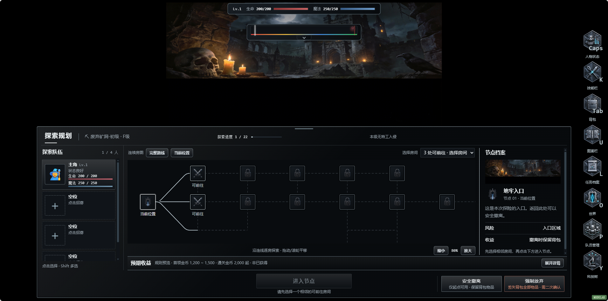

# 地牢路径选择：1080p 展示结构审计与优化

日期：2026-08-30。范围：现有 `mapLayout: exploration` 路线探索台。

## 证据与边界

用户指定1080p屏幕并提供以下完整截图。文件本身为1912×948，按实际客户区适配，不将屏幕标称1920×1080等同于可用UI面积。原截图原样复制并重新查看；没有裁切、重绘或生成替代证据。

这是本次唯一的画面证据。以下可见问题来自该截图；源码只用来确定修改入口及已有契约。没有启动浏览器、游戏、测试或构建，也没有优化后的运行截图。

## 审计步骤与发现

1. **打开路径选择：空间利用需要调整。** 截图中探索台约从y=398开始，场景背景约在y=248结束，中间约150px纯黑留白；同时第4个队伍槽已被列表下沿裁切。路线窗口约264px高，三列模块本身合理，但可用高度不足。保留冷钢炭黑、银白、低饱和语义色以及左右HUD安全区，把默认台面上移。
2. **辨认可走房间：存在明显风险。** 下拉框说明有3处可前往，地图只完整显示2个战斗房间，第三条亮线在下方没有可见徽记。截图不能证明该房间实际不可达，问题是画面缺少说明。默认聚焦当前点及真实可走邻居；保留可读缩放下限，不能容纳时明确显示视野外可走房间数量，让上方列表承担定位入口。
3. **查看节点档案：层级可以更直接。** 右侧重复上方环境缩略图，正文区同时出现滚动条；装饰占用了房间类型、风险和收益的阅读空间。去掉该局部缩略图，保留正式场景背景与节点徽记，用节点标题、编号、状态、说明、风险/收益、操作提示组织档案。
4. **选择后进入：初始状态可见，后续状态未取证。** 截图的“进入节点”为禁用态，说明文字位于下方且偏弱。当前/可走节点主要靠相近亮边与小标签区分。使用原生按钮的编号、选中框、状态文案共同区分；选中后主按钮显示“进入 · 房间类型”，下方显示目标编号和风险。不自动替用户选路，不改变先选择再进入的流程。选中后的画面与点击结果待用户验证。
5. **撤离与收益：保留现有优点。** 截图明确区分规则预览与已获得，安全撤离和强制放弃在右侧分开，丢失背包有风险色提示。保留收益折叠、原奖励计算、撤离条件和放弃二次确认。确认弹窗与结算步骤未提供截图，本轮不作通过判断。

## 已实施内容

- 继续使用原有“上方环境 / 下方冷钢台面、左队伍 / 中路线 / 右档案、底部主操作”的结构，不新建网站或额外UI模式。
- 默认上沿改为 `min(30vh, (视口宽 - 232px) / 5.6 + 8px)`，仍受原拖动上下限约束。按公式，1920×1080约从430px上移至309px；1912×948约从398px上移至284px。这里只是尺寸预算，并非实机测量。用户手动拖动优先，双击恢复新默认值。
- 队员卡最小高度96px，保留64px头像和完整血魔数值。通过增加台面高度容纳四槽，不隐藏滚动条或削减队伍；极矮窗口、手动大幅下拉、长数值换行仍允许滚动。
- 去掉档案重复装饰图；调整标题、说明、状态、数值的对比及间距。未删除素材或更换地牢背景。
- 房间徽记新增与下拉列表/档案同源的编号；当前位置使用双边、未侦察使用虚边、选中使用强化底色和编号。原正式PNG及48px常规点击尺寸不变，缩远仍按原机制缩放。
- “当前位置”围绕当前节点和 `getAvailableNodes()` 的边界定位；手动恢复可读视角使用80%～100%，战斗后返回保留已有缩放。完整路线仍是同一张全图，不恢复分段页面，不重排房间。
- 视野外可走数量通过已有渲染变化节拍更新；提示在窄窗换行，不新增定时器。下拉选点、可达检查、进入入口及危险确认沿用原实现。
- 主按钮显示具体目标类型，禁用原因连接 `aria-describedby`；保留键盘焦点环，地图使用统一冷钢拖动手型。

## 修改范围与回退

- `src/ui/dungeon-exploration-console.js`：探索台结构、节点编号、状态文案与视野外提示。
- `src/world/dungeon-map-system.js`：探索模式默认聚焦及背景高度回退；未修改生成、战斗、迷雾、奖励、存档或退出流程。
- `ui/panel-theme-backpack.css`：仅维护既有探索台v9/v10/v11块内的样式，没有追加整套覆盖层。
- `docs/ui-cold-steel-design-system.md`、`skill/10-ui-party.md`、`docs/dungeon-exploration-console-v9.md`、`CHANGELOG.md`：同步当前展示合同与交付记录。

修改前六个相关文件保存在系统临时目录 `C:/Users/allan/AppData/Local/Temp/codex-route-ui-1080p-20260830-204341/`，仅用于本轮逐段比对。回退时仅撤销本轮对应块，不能整文件覆盖其他会话的改动。原截图保存在本报告旁。

## 限制与用户验收

已查看本轮真实差异并核对局部展示调用链。**未运行测试或运行时验证，按约定由用户测试；未构建、未同步或触碰固定EXE。** 本报告不声称优化后通过视觉验收或完整无障碍验收。

请重点查看实际1080p及窗口化高度下的四人槽位、三路/多路分岔、选点与主按钮对应关系、缩远后当前位置恢复、拖动上沿/展开收益后的视角保持。极端密集路线仍可能需要平移；不可达点只能查看档案，不能进入。键盘顺序、屏幕阅读器、实际对比度和模态切换尚未实测。
