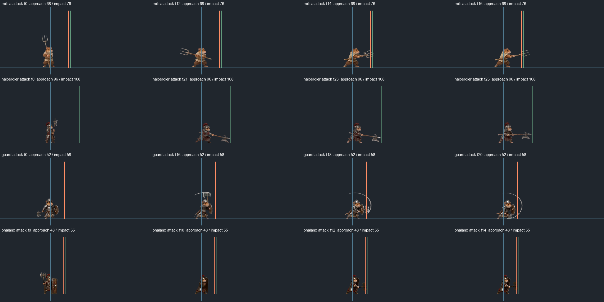
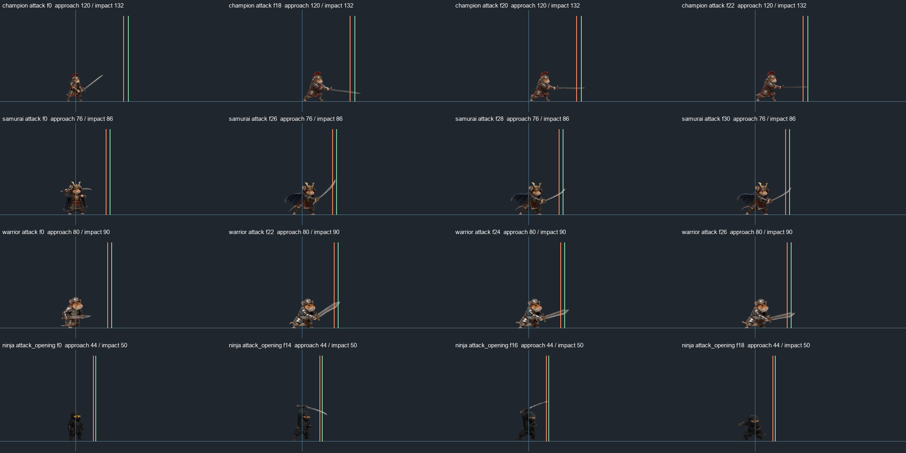
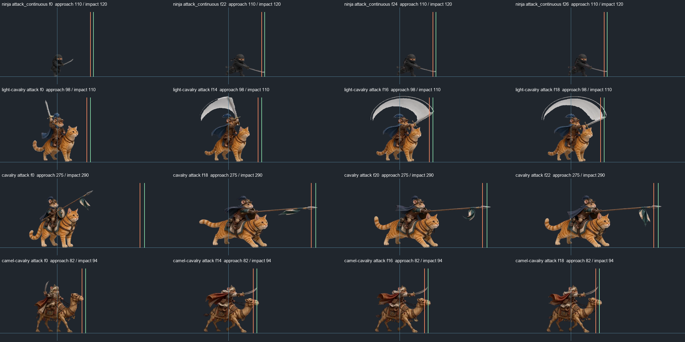
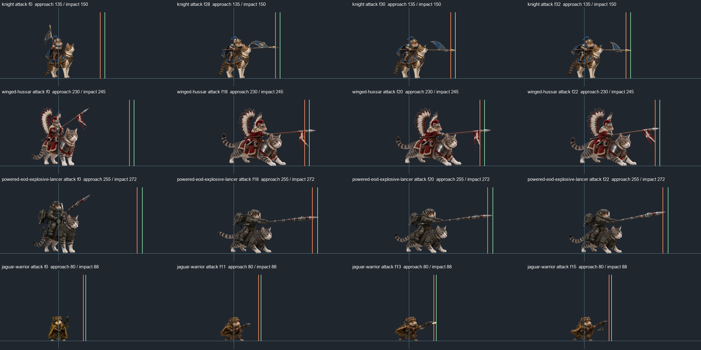

# 仓鼠士兵攻击距离与攻击节奏复查（2026-08-31）

> 发布边界：下文为本地工作区实现记录。完整运行时代码依赖尚未合入的炮组与公共战斗接口，本次Git仅发布文档、证据和知识；详见[整理与发布范围](hamster-cleanup-and-publication-2026-08-31.md)。

本次补查覆盖36个标准兵种及美洲豹战士、丛林祭司、沙漠僧侣，共39个单位配置。调整31份配置及已有的public副本；对15种近战单位的16段普攻源动画按当前显示缩放检查接触帧，并修复攻击距离、动画播放和伤害时钟不一致的问题。矿工、探险家不增加战斗能力。

这是静态代码与源素材检查后的实现交付，**未运行测试或运行时验证，按约定由用户测试**。没有运行lint、类型检查、构建、浏览器或游戏，也没有把源帧联系图当作实机接触验收。

## 历史依据

- 查看近期Git记录及相关路径历史。已提交的`aa7b8f40`（2026-08-25，`feat: align enemy melee hits with animation frames`；原记录`5db46a21`）建立了怪物接近距离、接触帧、命中快照分离的做法。
- 用户提到的最新提速记录是工作区中的[怪物攻击出手提速](../monster-attack-tempo-2026-08-30.md)和[逐怪攻击节奏复查](../monster-individual-combat-review-2026-08-30.md)。查阅时这两份文档尚未提交，不能误称为已进入Git历史的提速提交。
- 本轮沿用其游戏性原则：过长前摇连同动画提速，过多空等适度缩短，命中/出膛与帧序同步；不改素材帧序、弹丸飞行速度或特殊机制的控制时间。没有再次修改怪物配置。

## 修复内容

### 动画、命中与攻速统一

新增`src/combat/friendly-attack-timing.js`，由AI推进动作时钟，画面读取同一个时钟。近战命中、枪弹/箭矢释放、机枪连射与炮组逐帧事件均按相同动作时间推进。实际弹丸飞行仍使用真实dt，不能随动画提速而飞得更快。

当升级后的攻击间隔短于整段攻击动作时，在起手时固定本次播放倍率，将动作完整压入间隔；避免“面板攻速提高，实际仍卡在旧动画长度”的隐藏下限。不会因攻击中途升级让当前帧突然跳速。火箭与支援施法使用各自节奏，不强行压进普通冲锋枪间隔。炮组原有逐帧时长、释放帧、音效和自定义渲染仍沿同一时钟执行。

长弓旧动作5.083秒，另有动作收尾，已超过4.8秒的攻击间隔；榴弹炮旧动作11.042秒也超过10秒间隔。两者此前既有长前摇，也有实际循环被动画拖慢的问题。本轮同时修正基础节奏和升级后的动作约束，后台军事估算去掉对应旧动画下限。

仓鼠战士、美洲豹战士原先起手就扣血，动画独立播放，不能只加快FPS。本轮改为起手锁定目标，在选定接触帧结算一次伤害；保留战士原有起手帧与连续攻击帧段，以及两者专属伤害/状态机制。

### 近战距离与源图匹配

新增`src/combat/friendly-melee.js`，复用现有近战几何：地面投影、目标碰撞轮廓、同层和墙体门禁。接近时使用起手距离，挥击开始时锁定原目标和方向，接触时按命中距离重新检查。不会在挥击中途转向新目标或仅凭原先距离隔墙扣血。Companion提供对应接近配置，使移动停点与AI起手使用相同口径。

距离根据当前displaySize、脚点和攻击帧视觉缩放校准；翼骑兵及继承其攻击缩放的动力爆矛重骑兵使用实际的逐帧缩放。源图只用透明范围作为辅助，结合武器姿态选择保守接触距离，没有按整张透明画布宽度推导武器长度，也没有修改碰撞身体或整体美术尺寸。

长枪骑兵原来只有约55–78的基础近战距离，容易冲到很近后长枪穿过敌人；按源帧分别调整。方阵与忍者开场动作则缩短距离，避免武器未伸到却命中。忍者开场原第23帧（0起算f22）已将武器收至身后，改在第17帧（f16）结算；开场和连续斩分别使用50与120的命中距离。

下表旧值为旧`attackRange`，新值区分接近与命中；单位为游戏地面坐标，不是目标中心的简单欧氏距离，目标碰撞轮廓仍参与判断。

| 单位 | 旧距离 | 新起手距离 | 新命中距离 | 判定宽度 |
| --- | ---: | ---: | ---: | ---: |
| 骆驼骑兵 | 55 | 82 | 94 | 64 |
| 仓鼠骑兵 | 68 | 275 | 290 | 40 |
| 仓鼠冠军 | 75 | 120 | 132 | 48 |
| 仓鼠盾卫 | 55 | 52 | 58 | 60 |
| 仓鼠长戟 | 92 | 96 | 108 | 38 |
| 仓鼠骑士 | 55 | 135 | 150 | 40 |
| 仓鼠轻骑 | 55 | 98 | 110 | 68 |
| 仓鼠民兵 | 55 | 68 | 76 | 38 |
| 仓鼠忍者 | 58 | 44 | 50 | 60 |
| 仓鼠方阵 | 68 | 48 | 55 | 38 |
| 仓鼠动力爆矛重骑兵 | 78 | 255 | 272 | 44 |
| 仓鼠武士 | 62 | 76 | 86 | 64 |
| 仓鼠战士 | 55 | 80 | 90 | 68 |
| 仓鼠翼骑兵 | 72 | 230 | 245 | 40 |
| 美洲豹战士 | 58 | 80 | 88 | 58 |

忍者表中为开场斩，连续斩另设起手110、命中120。已有冲锋的移动距离、冲锋命中范围和控制时长保持原值；本表校准的是普攻，不宣称冲锋全轨迹已完成实机贴图验收。

## 39单位逐项节奏记录

以下均为**配置推导的秒数**，从本次攻击/施法动作起手计时，不包含接敌、寻路、AI决策等待、弹丸飞行或能力冷却。动画列为基础完整片段（不含部分AI额外60ms收尾）；升级时会按共享时钟压缩。间隔列是配置值，并不承诺实机严格每隔该时间必定命中。

| 单位 | 出手/释放：旧→新 | 动画时长：旧→新 | 攻击间隔：旧→新 | 处理 |
| --- | ---: | ---: | ---: | --- |
| 仓鼠反载 | 0.400→0.333 | 0.650→0.542 | 0.65→0.65 | 调整；保留单次伤害与专属机制 |
| 仓鼠大主教 | 2.500→0.833 | 5.083→1.694 | 8.00→8.00 | 调整；保留单次伤害与专属机制 |
| 仓鼠突击 | 0.875→0.700 | 1.708→1.367 | 1.80→1.60 | 调整；保留单次伤害与专属机制 |
| 仓鼠主教 | 2.500→0.833 | 5.083→1.694 | 9.00→9.00 | 调整；保留单次伤害与专属机制 |
| 仓鼠赏金猎人 | 0.769→0.769 | 1.202→1.202 | 1.25→1.25 | 保留基础参数；战斗单位接入同步时钟 |
| 骆驼骑兵 | 0.667→0.533 | 1.292→1.033 | 2.00→1.80 | 调整；保留单次伤害与专属机制 |
| 仓鼠投石组 | 1.750→1.355 | 5.167→4.000 | 6.50→5.50 | 调整；保留单次伤害与专属机制 |
| 仓鼠骑兵 | 0.833→0.667 | 1.625→1.300 | 2.00→1.80 | 调整；保留单次伤害与专属机制 |
| 仓鼠冠军 | 0.833→0.667 | 1.958→1.567 | 2.30→2.10 | 调整；保留单次伤害与专属机制 |
| 仓鼠弩手 | 3.000→1.000 | 5.083→1.694 | 5.20→3.40 | 调整；保留单次伤害与专属机制 |
| 仓鼠探险家 | — | — | — | 经济/探索单位，不调整战斗节奏 |
| 仓鼠野战炮组 | 2.292→1.508 | 5.167→3.400 | 8.00→6.50 | 调整；保留单次伤害与专属机制 |
| 仓鼠盾卫 | 0.750→0.600 | 0.958→0.767 | 2.00→1.80 | 调整；保留单次伤害与专属机制 |
| 仓鼠长戟 | 0.958→0.719 | 1.625→1.219 | 2.20→2.00 | 调整；保留单次伤害与专属机制 |
| 仓鼠重机枪 | 0.917→0.688 | 2.542→1.906 | 3.40→2.80 | 调整；保留单次伤害与专属机制 |
| 仓鼠榴弹炮组 | 2.250→1.630 | 11.042→8.000 | 10.00→8.50 | 调整；保留单次伤害与专属机制 |
| 仓鼠骑士 | 0.726→0.726 | 1.476→1.476 | 2.00→2.00 | 原出手已较快，只校正距离 |
| 仓鼠轻骑 | 0.667→0.533 | 0.958→0.767 | 2.00→1.80 | 调整；保留单次伤害与专属机制 |
| 仓鼠长弓 | 3.667→1.100 | 5.083→1.525 | 4.80→3.20 | 调整；保留单次伤害与专属机制 |
| 仓鼠民兵 | 0.583→0.467 | 1.208→0.967 | 2.00→1.80 | 调整；保留单次伤害与专属机制 |
| 仓鼠矿工 | — | — | 2.00→2.00 | 经济/探索单位，不调整战斗节奏 |
| 仓鼠火枪 | 0.750→0.600 | 1.708→1.367 | 2.50→2.20 | 调整；保留单次伤害与专属机制 |
| 仓鼠忍者 | 0.917→0.500 | 1.458→1.094 | 1.50→1.35 | 调整；保留单次伤害与专属机制 |
| 仓鼠方阵 | 0.500→0.400 | 1.708→1.367 | 2.40→2.20 | 调整；保留单次伤害与专属机制 |
| 仓鼠动力爆矛重骑兵 | 0.833→0.667 | 1.625→1.300 | 2.30→2.10 | 调整；保留单次伤害与专属机制 |
| 仓鼠牧师 | 0.583→0.583 | 1.375→1.375 | — | 保留基础参数；战斗单位接入同步时钟 |
| 仓鼠游侠 | 0.200→0.200 | 0.500→0.500 | 2.20→1.90 | 动作已短，仅减少空等 |
| 仓鼠防暴队 | 0.667→0.533 | 1.708→1.367 | 2.60→2.30 | 调整；保留单次伤害与专属机制 |
| 仓鼠武士 | 1.167→0.778 | 1.792→1.194 | 1.80→1.60 | 调整；保留单次伤害与专属机制 |
| 仓鼠斥候 | 0.833→0.667 | 1.458→1.167 | 2.50→2.20 | 调整；保留单次伤害与专属机制 |
| 仓鼠侦察游骑兵 | 0.292→0.292 | 1.208→1.208 | 2.20→2.20 | 保留基础参数；战斗单位接入同步时钟 |
| 仓鼠射手 | 0.750→0.600 | 1.042→0.833 | 2.00→1.80 | 调整；保留单次伤害与专属机制 |
| 仓鼠狙击手 | 0.667→0.667 | 1.625→1.625 | 4.00→4.00 | 保留基础参数；战斗单位接入同步时钟 |
| 仓鼠特战 | 0.667→0.533 | 1.708→1.367 | 2.70→2.40 | 调整；保留单次伤害与专属机制 |
| 仓鼠战士 | 立即扣血→0.750 | 1.958→1.469 | 2.00→1.80 | 调整；保留单次伤害与专属机制 |
| 仓鼠翼骑兵 | 0.833→0.667 | 1.625→1.300 | 2.00→1.80 | 调整；保留单次伤害与专属机制 |
| 美洲豹战士 | 立即扣血→0.650 | 1.450→0.900 | 1.45→1.45 | 调整；保留单次伤害与专属机制 |
| 丛林祭司 | 0.583→0.583 | 1.417→1.417 | 2.80→2.80 | 保留基础参数；战斗单位接入同步时钟 |
| 沙漠僧侣 | 0.417→0.417 | 1.417→1.417 | 2.80→2.80 | 保留基础参数；战斗单位接入同步时钟 |

- 忍者表列开场；连续斩出手1.000→0.750秒，隐身、重新开场条件和技能冷却保留。
- 反载表列冲锋枪，FPS20→24；火箭动作另由24→30FPS，释放与弃筒同时提前，火箭冷却、回收等待和弹速不变。
- 主教/大主教调整施法FPS12→36；不缩短技能本身的冷却。牧师、丛林祭司、沙漠僧侣的原始施法节奏已经较快，保持参数。
- 战士表列首次起手片段；保留原始起手0–46及循环10–47的帧序，循环片段基础时长为1.188秒。美洲豹战士整段18帧改为20FPS，接触位于f13。
- 侦察游骑兵表列站立射击，移动射击原0.542秒不变；赏金猎人、狙击手保留原有兵种节奏。游侠动作已经只有0.5秒，仅缩短两次攻击之间的空等。
- 投石/野战炮/榴弹炮完整动作分别缩至4.0/3.4/8.0秒；保留逐帧时间比例与释放帧，榴弹炮的退壳和装填音效时间同步缩放。

## 源素材证据与文件范围

离线抽帧工具：[hamster-attack-source-review.py](../../tools/hamster-attack-source-review.py)。它只读取本次冻结的最小标定输入和PNG生成联系图，不启动游戏；`--before`读取修改前标定，默认读取修改后标定，均不受后来兵种配置变化影响。源PNG须与记录中的布局对应，缺失时不得替换其他版本。没有生成、替换或重排任何正式动画PNG。旧导出GIF仍代表其制作时速度，不能代替本次运行时播放速度。

证据目录：[hamster-attack-tempo-2026-08-31](hamster-attack-tempo-2026-08-31/)。保留最小标定输入、逐字段差异、4张最终after联系图及before/after透明轮廓参考数据。重复的逐帧浏览图、before联系图、已并入正文的表格和完整配置副本已清理，见目录内cleanup.json。联系图蓝线为单位中心/脚线，橙线为起手距离，绿线为命中距离；每行展示起始帧和接触帧附近姿态。

修改范围：

- 数据：上述31个单位的`data/*-config.json`及原本已存在的对应`public/data`副本。完整字段清单见[parameter-delta.json](hamster-attack-tempo-2026-08-31/parameter-delta.json)。不改单位伤害、血量、移动速度、费用、人口或升级价格。
- 公共战斗：新增`src/combat/friendly-attack-timing.js`、`src/combat/friendly-melee.js`。
- AI：`src/ai/hamster-{militia,guard,warrior,samurai,ninja,knight,shooter,scout,musketeer,scout-rifle-skirmisher,riot-squad,heavy-machine-gunner,anti-vehicle,catapult-crew,priest}-ai.js`及`src/ai/jungle-priest-ai.js`；继承单位复用这些修改。
- 接近与画面：`src/entities/companion.js`、`src/phaser/scenes/GameScene.js`。
- 后台档案：`src/world/producer-building-system.js`和`src/world/world122-sim.js`内军事单位DPS估算局部；保留这些文件中其他会话的改动。

## 交付边界与用户验收重点

已阅读本轮真实差异，核对局部动作调用链、配置字段、共享时钟、继承关系和源素材帧；没有将代码审计视为测试授权。**未运行测试或运行时验证，按约定由用户测试。**实现交付阶段未提交Git、未构建或同步EXE；后续Git文档归档见顶部发布说明，EXE同步另由已授权的发布任务处理。

攻击间隔缩短会提高实际持续输出，这是本次游戏性调整的直接影响。长枪距离提高会扩大其普攻接敌范围，需要重点体感确认与数值平衡验收。战士/美洲豹战士由立即扣血变为接触帧扣血，首击会有可见前摇，但避免挥到之前先伤害。

重点由用户验收近战贴身/远端/斜向接触、大小敌人体型、墙边/高低台、连续改令与控制中断、满攻速升级、低帧率大dt、离场/返场后的动作和后台产出。侧向2D贴图无法仅凭静态抽帧证明任意朝向、任意敌人轮廓都像素级贴合；本次没有作这种保证。

远程射程、炮弹落点和弹速保持兵种原设计，发射动作与计时已经同步；没有重新逐枪标定枪口像素，也没有将远程攻击距离缩成枪管的贴图长度。冲锋全轨迹、实机命中画面和总体战力仍属于上述用户验收范围。
