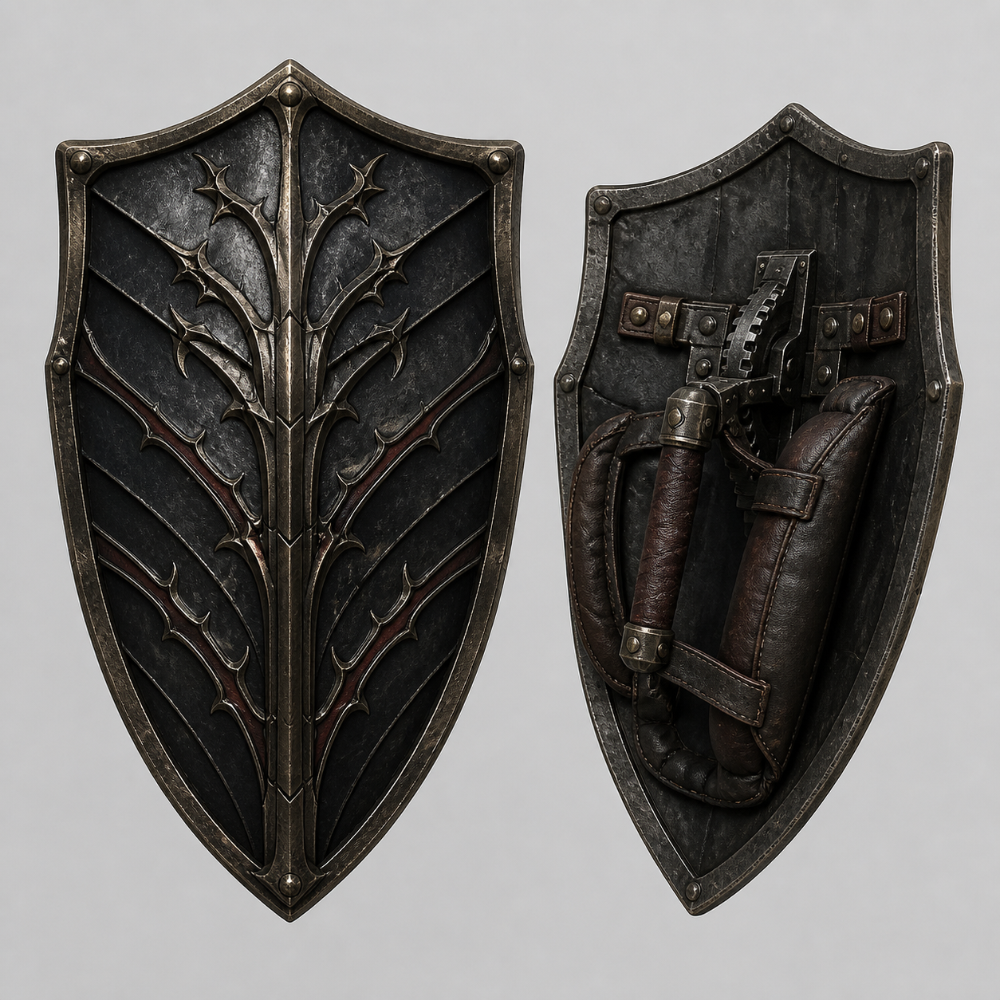
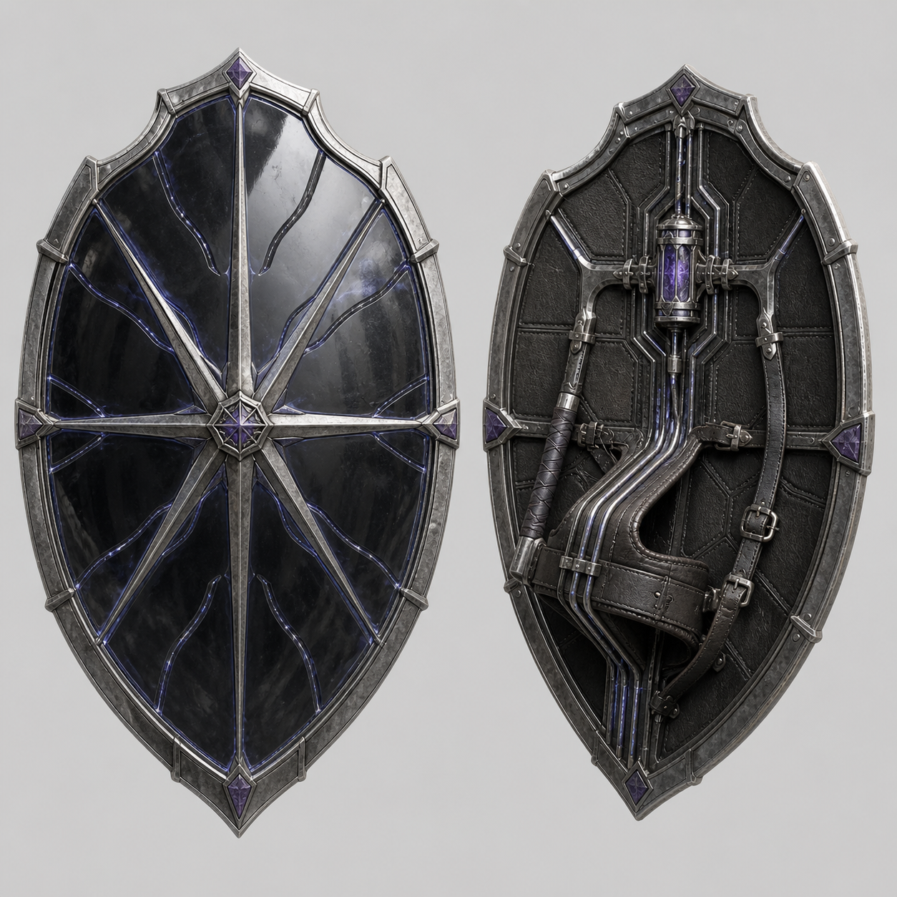
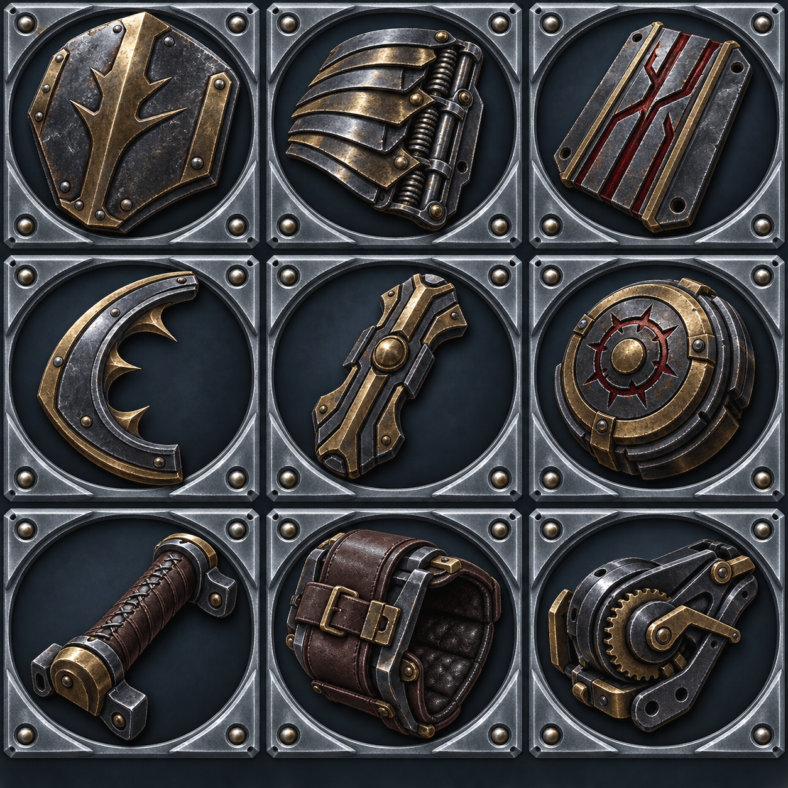
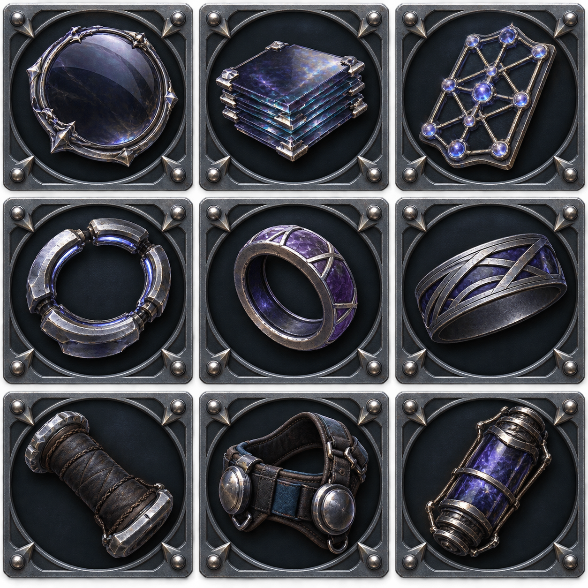

# 两款史诗盾牌与改造项目设计（2026-09-02）

## 状态与范围

- 本文完成两款史诗盾牌的玩法身份、基础数值、伤害公式、18项三槽互斥改造、正式素材与运行时映射。
- 正式装备位：`weapon60`、`weapon61`；装备ID：`thorn_oath_reprisal_shield`、`star_eater_arcane_mirror_shield`。
- 当前状态为`runtimeIntegrationActive`：装备真源、战斗消费者、改造注册表、正式运行时素材、主商店、双份装备与改造数据均已静态接入；尚未进行游戏运行时验收。
- 数值沿用现有盾牌的“正面/外沿/背面”三槽互斥规则。史诗机制必须进入现有防御公式、`ShieldSystem` 和伤害上下文，不新建第二条格挡管线。

## 共同定位

| 项目 | 荆棘誓返盾 | 蚀星法镜盾 |
|---|---:|---:|
| 稀有度 / 等级 / 价格 | 史诗 / 15 / 800 | 史诗 / 15 / 800 |
| 身份 | 近战弹反反伤、重型决斗盾 | 魔法格挡、奥术还击与魔抗削减 |
| 防御力 / 每强化 | 32 / 3.2 | 28 / 2.8 |
| 常价格挡减伤 | 60% | 52% |
| 魔法/电击格挡减伤 | 60% | 72% |
| 格挡体力消耗 | 19 | 17 |
| 弹反窗口 | 970ms | 1080ms |
| 弹反眩晕 | 1450ms | 1050ms |
| 弹反击退 | 130 | 85 |
| 弹反半角 / 破防眩晕 | 120° / 1500ms | 120° / 1500ms |

两面盾都保留史诗强度，但强项不可无代价叠满：誓返盾的反伤路线会牺牲基础防御或稳定格挡；法镜盾的奥术输出、魔抗削减与冷却路线会互相挤占防护或持续时间。

---

## 史诗盾牌一：荆棘誓返盾



### 核心机制：誓约返击

成功弹反敌方直接近战伤害后，玩家本次承伤归零，并向该攻击者返还一部分`弹反输入伤害`。

```text
parryInputDamage = 玩家物防/魔防和暴击处理后、盾牌减伤前的伤害
rawReflection = floor(parryInputDamage × reflectionRatio)
reflectionCap = floor(player.maxHp × reflectionMaxHpCapRatio)
reflectionDamage = min(rawReflection, reflectionCap)
```

基础参数：

```js
defense.parryReflection = {
  ratio: 0.30,
  maxHpCapRatio: 0.10,
  cooldownMs: 1000
}
```

伤害链合同：

- 仅`有效敌方来源 + 直接命中 + isMelee === true`时触发；持续伤害、地面伤害、环境伤害、自伤、无来源伤害和投射物不得触发。
- 返击是物理伤害，正常经过攻击者物防；不暴击、不吸血、不触发武器命中效果、不加技能经验、不触发连锁，也不能再次触发任何反伤。
- 通过`hitContext.isShieldRetaliation = true`阻断反射递归。目标带`_parryImmune`时只免疫既有眩晕/击退，不免疫已经封顶的返击伤害。
- 顺序固定为：本次玩家承伤归零 → 结算返击 → 若攻击者仍存活，再执行原弹反眩晕和击退。
- 返击冷却只关闭返伤，不关闭弹反本身。冷却检查和消耗都以成功产生有效近战弹反为准。

### 三槽九项改造

| 槽位 | 改造ID | 名称 | 收益 | 代价 |
|---|---|---|---|---|
| 正面 | `oathforged_rebuke_plate` | 誓铸斥击板 | 防御力 +7 | 体力消耗 +2 |
| 正面 | `oathforged_return_lamella` | 回誓弹层 | 常价格挡减伤 +5个百分点 | 弹反窗口 -80ms |
| 正面 | `oathforged_blood_debt_channels` | 血债导流槽 | 返还比例 +12个百分点（30%→42%） | 防御力 -3 |
| 外沿/脊骨 | `oathforged_open_thorn_rim` | 开刃荆环 | 弹反窗口 +150ms | 弹反眩晕 -180ms |
| 外沿/脊骨 | `oathforged_judgment_spine` | 裁决脊梁 | 弹反眩晕 +380ms | 体力消耗 +2 |
| 外沿/脊骨 | `oathforged_debt_seal_weight` | 债印配重 | 返击上限 +4%最大生命（10%→14%） | 常价格挡减伤 -2个百分点 |
| 背面 | `oathforged_counterforce_grip` | 逆力握把 | 体力消耗 -5 | 防御力 -2 |
| 背面 | `oathforged_pivot_harness` | 枢轴背带 | 防御移动倍率 +0.11 | 常价格挡减伤 -3个百分点 |
| 背面 | `oathforged_recoil_ratchet` | 回震棘轮 | 返击冷却 -300ms | 体力消耗 +2 |

建议构筑：

- `血债返击`：血债导流槽 + 债印配重 + 回震棘轮。结果约为防御29、常价格挡58%、体力21、返还42%、上限14%最大生命、冷却700ms。
- `稳守决斗`：回誓弹层 + 开刃荆环 + 逆力握把。结果约为防御30、常价格挡65%、体力14、弹反1040ms、眩晕1270ms、返还30%。

---

## 史诗盾牌二：蚀星法镜盾



### 核心机制一：棱镜魔法格挡

物理伤害继续使用常规`blockReduction`；魔法与电击伤害使用独立的`magicBlockRemainingDamageRatio`。基础值0.28，即主动格挡时减免72%的魔法/电击伤害。该字段只改变盾牌格挡阶段，不修改玩家`mdef`。

### 核心机制二：蚀星还击

成功弹反直接魔法或电击命中时，向施法者发射一次魔法还击，并在伤害结算后施加魔抗削减。

```text
rawRetort = floor(
  48
  + player.matk × 0.55
  + parryInputDamage × 0.45
)
retortCap = floor(80 + player.matk × 1.50)
retortDamage = min(rawRetort, retortCap)
```

基础参数：

```js
defense.arcaneRetort = {
  baseDamage: 48,
  matkRatio: 0.55,
  preventedDamageRatio: 0.45,
  capBaseDamage: 80,
  capMatkRatio: 1.50,
  mdefShredRatio: 0.18,
  mdefShredDurationMs: 5000,
  cooldownMs: 2200
}
```

伤害链合同：

- 仅`damageType === 'magic' || damageType === 'electric'`的直接敌方命中触发；持续伤害、地面伤害、环境伤害、自伤和无来源伤害不得触发。
- 还击按魔法伤害经过目标当前魔防；不暴击、不触发法杖词条/魔法易伤/连锁、不吸血、不加技能经验。
- 先结算还击伤害，再施加魔抗削减；第一发还击不能吃到自己刚施加的削减。
- 魔抗削减作用于计算时的`effectiveMdef`倍率，不得直接改写`target.data.mdef`，也不得复用现有`magicVulnerability`终伤乘区。
- 同源效果不叠层：取更强削减，持续时间刷新。`statusImmune`只阻止削减，不阻止还击伤害。
- 冷却期间仍可正常弹反，只不产生还击与削减。`ShieldSystem.onDamageTaken`接入时必须显式收到`damageType`和`hitContext`，不可从特效或攻击者类型猜测。

### 三槽九项改造

| 槽位 | 改造ID | 名称 | 收益 | 代价 |
|---|---|---|---|---|
| 正面 | `starveil_arcane_glass` | 星幕奥术玻璃 | 防御力 +6 | 体力消耗 +2 |
| 正面 | `starveil_prism_sink_layer` | 棱镜沉降层 | 魔法/电击格挡减伤 +8个百分点（72%→80%） | 常价格挡减伤 -3个百分点 |
| 正面 | `starveil_overload_lattice` | 过载星格 | 还击基础伤害 +36；受击系数 +10个百分点（45%→55%） | 还击冷却 +400ms |
| 外沿 | `starveil_quickphase_ring` | 快相环 | 弹反窗口 +150ms | 弹反眩晕 -180ms |
| 外沿 | `starveil_resistance_etcher` | 蚀抗刻环 | 魔抗削减 +10个百分点（18%→28%） | 持续时间 -1200ms |
| 外沿 | `starveil_long_eclipse_inscription` | 长蚀铭文 | 魔抗削减持续 +2500ms | 还击基础伤害 -18 |
| 背面 | `starveil_aether_cushion_grip` | 以太缓冲握把 | 体力消耗 -4 | 防御力 -2 |
| 背面 | `starveil_orbit_balance_harness` | 轨道平衡背带 | 防御移动倍率 +0.10 | 常价格挡减伤 -3个百分点 |
| 背面 | `starveil_reflux_capacitor` | 回流电容 | 还击冷却 -600ms | 魔法/电击格挡减伤 -4个百分点 |

建议构筑：

- `过载蚀抗`：过载星格 + 蚀抗刻环 + 回流电容。结果为魔法格挡68%、还击`84 + 0.55×matk + 0.55×parryInputDamage`、魔抗削减28%/3.8秒、冷却2000ms。
- `长驻法壁`：棱镜沉降层 + 长蚀铭文 + 以太缓冲握把。结果约为防御26、体力13、常价格挡49%、魔法格挡80%、还击基础伤害30、魔抗削减18%/7.5秒。

---

## 新增效果键合同

改造继续使用标量增量，避免多个`applyMode: override`对象彼此覆盖。

| 效果键 | 单位 | 消费者 |
|---|---:|---|
| `shieldParryReflectRatioDelta` | 比例增量 | `getShieldDefenseValues` / `ShieldSystem` |
| `shieldParryReflectCapRatioDelta` | 最大生命比例增量 | 同上 |
| `shieldParryReflectCooldownDelta` | 毫秒增量 | 同上 |
| `shieldMagicBlockReductionBonus` | 减伤比例增量 | 防御聚合器 / `ShieldSystem` |
| `shieldArcaneRetortBaseDamageDelta` | 点数 | `ShieldSystem` |
| `shieldArcaneRetortMatkRatioDelta` | 比例增量 | `ShieldSystem` |
| `shieldArcaneRetortPreventedRatioDelta` | 比例增量 | `ShieldSystem` |
| `shieldArcaneRetortMdefShredDelta` | 比例增量 | `ShieldSystem` / 魔防公式 |
| `shieldArcaneRetortDurationDelta` | 毫秒增量 | 状态组件 |
| `shieldArcaneRetortCooldownDelta` | 毫秒增量 | `ShieldSystem` |

基础装备字段`defense.parryReflection`、`defense.magicBlockRemainingDamageRatio`和`defense.arcaneRetort`属于盾牌配置，不放入通用效果注册表；改造表只存对这些基础值的增量。

## 改造图标与格子映射





两张候选图均按`3行×3列`固定语义排列：

- 第一行：正面槽，从左至右对应本盾正面三个改造。
- 第二行：外沿/脊骨槽，从左至右对应外沿三个改造。
- 第三行：背面槽，从左至右对应背面三个改造。

两张源表已按固定格位逐格裁切为18个128px正式图标；运行时使用单图标文件，不直接加载整张源表。三槽布局按节点中心、正/背面虚线语义和零交叉人工布局写入双份配置。

## 静态接入结果与运行时验收

1. 两张正式透明外正面、两张128px物品图、两张512px Phaser副本和18枚改造图标已派生并登记；概念背面只作为握把/承带参考。
2. `weapon60/61`已进入装备真源、双份数据模板、主商店、纹理预加载、随机武器池/图鉴共用的`ItemDatabase`入口。
3. 十个新效果键、统一盾值聚合、`ShieldSystem`返击/反噬、魔抗削减和递归阻断已接入同一伤害链。
4. 状态机继续使用同一副手掌点与逐状态姿势表；两块盾有独立`shieldVisual`，所有状态只使用外正面纹理，左右只做水平镜像。
5. 三槽九项节点、`targetSide: back`语义和虚线端点已同步到双份craft配置、默认布局与盾型布局档案。
6. 尚未运行游戏；由用户重点验收待机、21帧步行、防御进出/防御步行、三段攻击/回正、冲刺/冲刺突刺、手枪配盾，以及返击比例/封顶/冷却、秘法反噬顺序、魔抗削减和三槽互斥。
