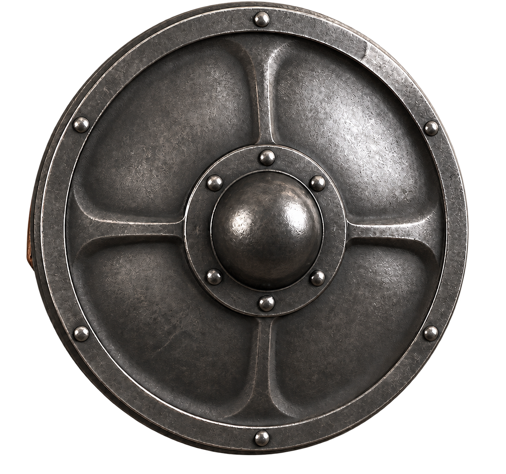
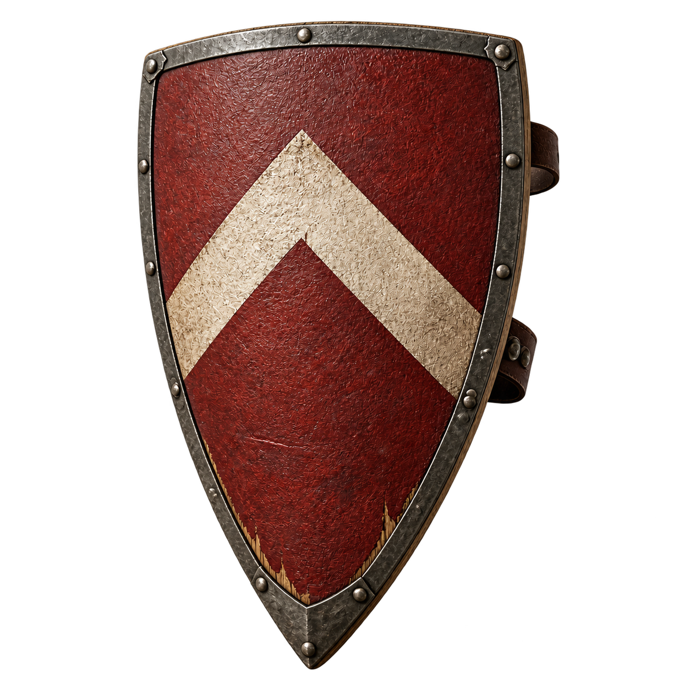

# 两款优质盾牌与改造项目设计

以现有小圆盾为材质与玩法基准，增加“灵巧弹反”和“持续防护”两条路线。两款均为 **优质（uncommon，绿色品质）**，等级建议5，标准售价200。本文数值均为设计提案，尚未登记装备、掉落、商店或改造配置；现有小圆盾保持原样。

## 本轮素材补齐

已补齐两款的**真实透明正面图与独立手持侧图，共4张RGBA母图**。每款背包与装备栏共用同一张正面图，品质边框由UI绘制。保留原始分辨率，未写入游戏资源注册。

[打开素材与栏位预览](../../tools/ai-gen/weapon-gen/uncommon-shields-20260831/prepared/preview.html) · [素材包说明](../../tools/ai-gen/weapon-gen/uncommon-shields-20260831/prepared/README.md)

预览页提供深浅背景、44px背包格、64px装备槽、原盾尺寸对照及握点候选；**这是设计预览，不是游戏截图**。握点还需在正式接入后确认，128/512运行资源压缩版尚未导出。

## 外观与装备素材

### 1. 锻钢拳盾 · Forged Duelist Buckler

[手持侧视透明图](../../tools/ai-gen/weapon-gen/uncommon-shields-20260831/prepared/forged-duelist-buckler-equip.png)

- **轮廓**：紧凑圆形、明显中央盾脐、四道浅加强筋、窄卷边。保留小圆盾容易读懂的圆形结构，但从木盾升级为全钢拳盾。
- **材质**：冷灰锻钢、发黑盾脐、克制铆钉，背面为缠皮短握柄。磨损集中在卷边和盾脐，不做金边、宝石、尖刺或魔法发光。
- **定位**：单手剑/手枪搭配，依靠省体力与成功弹反后的控制争取反击机会。盾本身不新增攻击动作。
- **物品说明**：“一面贴掌握持的锻钢小盾。卷边和隆起的盾脐能拨开兵刃，轻巧的握柄便于连续应对进攻。”
- **显示建议**：可见盾高约49px，约为当前小圆盾的81%；候选图均为展示构图，不代表两款实装大小相同。

### 2. 橡木卫戍盾 · Oak Garrison Shield

[手持侧视透明图](../../tools/ai-gen/weapon-gen/uncommon-shields-20260831/prepared/oak-garrison-shield-equip.png)

- **轮廓**：平缓宽肩、纵长盾面、下端单尖，盾面轻微外凸；没有中央圆盾脐，与拳盾保持明显轮廓差异。
- **材质**：交叠橡木芯、暗赭红覆面、米白宽折线纹、铆接铁边和加固盾尖；边缘少量露木。背面双皮带和前臂衬垫负责承力。
- **定位**：承受重击、守住位置，减伤与物防较高；普通格挡更耗体力，弹反容错略低。
- **物品说明**：“驻防士兵使用的木芯长盾。铁边束住交叠木板，宽大的覆面能够承受重击，但举持和回正并不轻松。”
- **显示建议**：可见盾高约82px，约为当前小圆盾的136%；大小只影响画面，不自动扩大碰撞或格挡角度。

## 基础数值

下表以强化0、持盾技能0、未安装改造为准。“格挡减伤”是护甲结算之后的独立减伤比例。

| 项目 | 现有小圆盾 | 锻钢拳盾 | 橡木卫戍盾 |
|---|---:|---:|---:|
| 品质 | 普通 | 优质 | 优质 |
| 物理防御 | 15 | 18 | 26 |
| 每级强化物防 | +1.5，最终取整 | +1.8，最终取整 | +2.6，最终取整 |
| 普通格挡减伤 | 50% | 50% | 58% |
| `damageReduction`承伤比例 | 0.50 | 0.50 | 0.42 |
| 每次普通格挡体力 | 20 | 16 | 22 |
| 弹反窗口 | 1000ms | 1000ms | 850ms |
| 近战弹反眩晕 | 1000ms | 1200ms | 1000ms |
| 近战弹反击退 | 100 | 90 | 120 |
| 弹反半角 | 120° | 120° | 120° |
| 破防眩晕 | 1500ms | 1500ms | 1500ms |

拳盾省体力并提高近战弹反控制，不进一步扩大基础弹反窗口；卫戍盾以更高护甲和减伤换取耗体力与较短时窗。两款沿用现有弹反零承伤、零耗体力规则，远程弹反只抵消伤害，不额外眩晕或击退攻击者。对反制免疫目标的规则不变，不另加弹反奖励伤害或主手攻击加成。

## 改造规则

每款3个部位，每个部位2选1，共12项配件。采用现有改造券机制：首次安装每槽1张，同槽更换4张；三槽首次装满共3张。全部为普通配件，没有特殊改造槽、随机词条或新增货币。

部位名称用于改造面板，图标展示实际钢板/盾脐/握柄/木芯/铁边/皮带。正面图不可见的握柄、前臂带应在面板中明确标注“背面”，不能把连接线落在不相关的正面装饰上。槽位及连线须按最终改造展示图标定；暂不写入猜测的 `x/y/lineTarget`。

### 锻钢拳盾：盾面 / 盾脐 / 握柄

| 部位 | 配件 | 效果 | 结构与取舍 |
|---|---|---|---|
| 盾面 | 薄锻弧面 | 格挡体力−2，盾牌物防−2 | 较薄弧面减轻负担，牺牲部分护甲 |
| 盾面 | 淬火钢面 | 盾牌物防+4，格挡体力+1 | 更坚固的钢面，举持较费力 |
| 盾脐 | 宽缘盾脐 | 近战弹反击退+30 | 宽缓边缘用于拨开来袭兵刃 |
| 盾脐 | 实心短脐 | 近战弹反眩晕+200ms，格挡体力+1 | 实心短脐强化反制，增加重量；不附加伤害 |
| 握柄 | 贴掌软木握柄 | 格挡体力−2 | 皮革包覆软木衬，改善持续握持 |
| 握柄 | 防脱腕带 | 弹反窗口+80ms，近战弹反击退−10 | 更容易稳住盾面，但向外拨击的幅度受限 |

两套示例（强化/技能均为0）：

- **省力拨挡**：薄锻弧面＋宽缘盾脐＋贴掌软木握柄 → 物防16、50%减伤、格挡12体力、1000ms弹反窗、1200ms眩晕、120击退。
- **稳手反制**：淬火钢面＋实心短脐＋防脱腕带 → 物防22、50%减伤、格挡18体力、1080ms弹反窗、1400ms眩晕、80击退。

### 橡木卫戍盾：盾芯覆面 / 包边 / 背部承带

| 部位 | 配件 | 效果 | 结构与取舍 |
|---|---|---|---|
| 盾芯覆面 | 交错橡木芯 | 盾牌物防+5，格挡体力+1 | 交错木纹和横向加固抵抗劈裂，增加重量 |
| 盾芯覆面 | 加厚生皮覆面 | 格挡减伤+3个百分点，弹反窗口−50ms | 更厚覆面吸收冲击，回正略迟 |
| 包边 | 回卷弹性铁边 | 格挡体力−3，盾牌物防−2 | 轻薄回卷边降低冲击负担，减少厚钢覆盖 |
| 包边 | 加宽包钢 | 盾牌物防+4，格挡体力+1 | 宽铁条与盾尖补强，提高护甲但更沉 |
| 背部承带 | 棉麻缓冲衬 | 格挡体力−3 | 分散前臂承受的冲击 |
| 背部承带 | 双点锁固带 | 格挡减伤+2个百分点，弹反窗口−50ms | 固定盾面抵御重击，快速转腕稍受限制 |

两套示例（强化/技能均为0）：

- **持久驻防**：交错橡木芯＋回卷弹性铁边＋棉麻缓冲衬 → 物防29、58%减伤、格挡17体力、850ms弹反窗。
- **重击防护**：加厚生皮覆面＋加宽包钢＋双点锁固带 → 物防30、63%减伤、格挡23体力、750ms弹反窗。

## 数值口径与上限

- 配件加的是“本盾物防”，不直接乘玩家全部物防。盾牌物防 = `floor(max(0, base + perEnhance × E + shieldDefenseFlat))`；原有持盾技能对总物防的倍率随后照旧应用。
- 格挡承伤 = `max(0.05, min(1, baseDamageRatio − shieldBlockReductionBonus − 持盾技能减伤加成))`。例如+3个百分点把卫戍盾58%减伤变为61%，不是58%×1.03。
- 体力、时窗、眩晕和击退均为本盾基础值加对应配件增量；眩晕再加已有持盾技能效果。只读取当前武器组的配对盾牌，不叠加备用盾。
- 以100点**已扣护甲**的伤害示意，未改造时技能0/10/20级分别承受：小圆盾50/30/10，拳盾50/30/10，卫戍盾42/22/5。此示例只解释盾牌独立减伤，不代表完整玩家伤害结算的最终取整。
- 卫戍盾“重击防护”在技能16级触及5%承伤下限，再提升技能不会继续降低该比例。面板应显示已经封顶，不能继续宣称100%减伤；技能的其他既有效果仍正常成长。
- 持有100体力、忽略回体与弹反时，未改造的小圆盾/拳盾/卫戍盾分别可以完整支付5/6/4次普通格挡。破防当击仍减伤、余体力归零、眩晕1500ms的现行规则不变。
- 两款仍沿用普通格挡全方向、弹反总角度240°和已有重举规则。没有新增无敌帧、盾击、反伤、移动速度或碰撞尺寸效果。

## 接入时必须补齐的盾牌专用效果

当前 `craft-config.json` 没有小圆盾 `weapon17` 的改造条目，`getShieldDefenseValues` 也尚未消费盾牌改造。现有 `staminaCostDelta` 指普通攻击耗体力；`defensePercent` 的玩家消费目前读取主手，不能拿这两个字段冒充盾牌改造。

| 拟新增效果键 | 含义 | 使用配件 |
|---|---|---|
| `shieldDefenseFlat` | 本盾物防固定增量 | 薄锻/淬火/木芯/包边 |
| `shieldStaminaCostDelta` | 每次普通格挡体力增量 | 减负、加重、衬垫 |
| `shieldBlockReductionBonus` | 独立格挡减伤的百分点增量 | 生皮覆面、锁固带 |
| `shieldParryWindowDelta` | 弹反窗口增量，ms | 腕带、覆面、锁固带 |
| `shieldParryStunDelta` | 近战弹反眩晕增量，ms | 实心短脐 |
| `shieldParryKnockbackDelta` | 近战弹反击退增量 | 宽缘盾脐、防脱腕带 |

效果先登记 `src/config/craft-effect-registry.js`，在 `getShieldDefenseValues` 统一合成，再让盾系统、玩家盾物防汇总、强化/装备提示和改造预览共用结果。不要只添加JSON文案而漏掉实际消费。

装备静态定义沿用 `EquipDataManager`，模板与改造配置按 `data/`、`public/data/` 双份同步。两款暂用设计键 `forged_duelist_buckler`、`oak_garrison_shield`；正式接入时才分配未占用的 `weaponN`，本轮不抢占并行开发的编号。

## 素材与持盾绑定交付边界

- 初始候选由内置 **image_gen** 生成，参考现有 `assets/icons/woodshied.png`；手持侧视参考 `assets/weapons/woodshied-equip.png`。早期RGB候选与 `generation.json` 保留作为设计历史，不再当作正式透明图。
- 新版文件位于 `tools/ai-gen/weapon-gen/uncommon-shields-20260831/prepared/`。四张母图均为真实RGBA，正面供背包/装备槽共用，侧面供手持。未制作背视图、掉落专图或12张配件图标。
- 本轮生成及抠图全部使用内置 **image_gen**。`prepared/production.json` 保存完整提示词、输入引用、原始输出和最终选择；`asset-package.json` 保存原始尺寸、可见边界和握点候选。没有脚本重绘、拉伸或覆盖旧小圆盾。
- 拳盾握点候选为1023×1538母图中的(669,795)，卫戍盾为1024×1536母图中的(286,352)。这只是图内投影标定，未完成实机精确绑定；不得把小圆盾(578/1024,497/1024)的全局origin直接套入新图。以后裁切、补边、缩放时同步转换握点。
- 当前 `weaponType: shield` 共用 `weapon_shield`，正式接入须为两个 `weaponId` 分别登记纹理映射、尺寸和握点元数据；玩家副手骨链继续提供同一个手掌世界点，盾牌只应用各自的图内握点及等比显示尺寸。
- 本轮交付透明母图、离线栏位预览、显示尺寸与握点候选及更新后的设计文档。128px图标/512px手持运行资源、装备注册、配件图标、正式副手绑定和游戏截图仍未交付；不能以预览代替实机验收。
- 未修改游戏代码、装备数据、现有素材、掉落或商店。只读取图像格式、尺寸与Alpha元数据，没有启动游戏或浏览器。未运行测试或运行时验证，按约定由用户测试。

## 当前依据

- `src/ui/equip-data-manager.js::SMALL_SHIELD_ITEM`：现有小圆盾定义。
- `src/config/shield-config.js`、`src/entities/components/shield-system.js`：盾防/弹反当前口径。
- `src/config/rarity.js`、`src/ui/shop-system.js`：优质品质键与标准价。
- `src/ui/craft-system.js::_getModTicketCost`：改造券安装/替换成本。
- `src/config/craft-effect-registry.js`、`src/entities/player/base.js`：现有改造键与消费范围。
- `src/ui/craft/weapon-image.js`、`src/config/craft-default-slots.js`：面板展示图与槽位布局入口。
