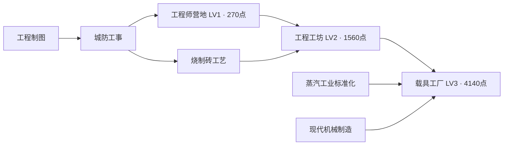

# 工程师建筑支线：LV1—LV3 接入说明

> 发布边界：本工程分支基于远端main隔离提交，公共人口权重与阶梯移动依赖尚待合入。下文“已接入”描述原共享开发源码状态，不表示此分支可独立运行或已完成实机验收。详见 [发布记录](engineering-line-publish-20260830.md)。

状态：2026-08-30 已接入当前源码游戏；三档正式透明素材、光照派生图、建造缩略图、视觉占地缓存、建筑配置和科技节点已落盘。未打包或同步固定EXE，未运行测试或运行时验证，按约定由用户测试。

## 当前可用内容

- 在科技树「军事指挥 → 工程器械」研究工程师营地后，建筑栏「募兵建筑」可建造本系列。统一稳定建筑键 `engineer_camp`，建造费用1800能源、基础生命2000、双防60、出售返还50%；造价对齐靶场，耐久参照骑兵学院。
- 三级都占4×4，名义地面投影512×256。二、三级通过全局科研自动换名称与贴图，已建、新建和读档恢复共用同一等级逻辑；不另造三栋独立建筑，也不改变道路、碰撞或寻路合同。
- 三档分别解锁仓鼠投石组、仓鼠野战炮组、仓鼠榴弹炮组，均已接入当前开发源码。每组2军事人口；招募周期/食物/能源分别75秒/240/90、95秒/360/170、120秒/480/260。科研换代影响后续招募，已有低级部队保留。详见 `docs/hamster-catapult-crew.md` 和工程支线收尾目录。

| 科技 / 建筑 | 实际科研点 | 前置（全部满足） |
| --- | ---: | --- |
| LV1 工程师营地 | 270 | 阵地射击、城防工事 |
| LV2 工程工坊 | 1560 | 工程师营地、烧制砖工艺 |
| LV3 载具工厂 | 4140 | 工程工坊、黑火药、蒸汽工业标准化、现代机械制造 |

支线自身共5970点，配置基础成本180/520/920，沿用现有曲线。节点位于军事页独立lane3、column1/3/6，原后续路线与行标题一并顺延；当前共享源码科技版本56。当前仓库通过模块导入 `data/technology-tree.json`，没有 `public/data/technology-tree.json` 镜像，不创建多余副本。

## 正式素材与代码

- 正式主体：`assets/terrain/engineer_camp.png`、`engineering_workshop.png`、`vehicle_factory.png`；各自四张派生光照图位于 `assets/terrain/lighting/`，只增量登记本系列。
- 营地/工坊/工厂紧裁PNG分别为872×631、866×695、877×725。配置显示尺寸分别512×370、512×411、512×423，脚点偏移183/203/209；每级独立 `visualFootprint` 严格映射到512×256。实体、幽灵和建造预览共用配置，不通过道路填充掩盖外形偏差。
- 真源链：`tools/ai-gen/_engineer_branch_20260830/local-repair-index.json` → 已接受48步局部修正raw → `runtime/*_keyed.png` → 保持Alpha的边缘RGB去污染 → `runtime/*_body.png` → 正式PNG。`runtime/runtime-index.json`记录来源、阈值、地台角点、哈希及逐级元数据。
- 抠图只调用建筑专用工具；各图实测RGB阈值60/110/90，保留封闭主体材质。原Depth与修正后的道具/地台有偏差，未拿它硬裁Alpha。最后按标准冻结Alpha紧裁，透明像素RGB清零。离线预览为 `runtime/engineer-branch-runtime-lineup.png`，不是游戏截图。
- 配置：`data/producer-buildings.json`、`data/technology-tree.json`、`data/structure-ground-fits.json`、`data/environment-lighting-assets.json`；缩略图 `assets/ui/building-thumbnails/engineer_camp.png`。
- 代码：`src/world/producer-building-system.js` 补齐尚无首级兵种时的科研外观刷新、阻止空等级体系覆盖已选外观、关闭空兵种兜底与非法生产，并显示当前待开发编制；`src/world/building-system.js` 把已登记编制但尚未产兵的建筑归入募兵栏；`src/world/technology-system.js`仅同步本次版本号。Boot与资源驻留沿用现有配置驱动加载，未增加专用硬编码。
- 制作脚本：本目录的 `prepare-runtime-assets.py`、`install-runtime-assets.py`；公共 `build-lighting-maps.py`只增加三个资产键。视觉缓存生成器按单建筑模式运行，保留其它建筑条目；一级与基础贴图相同，共用基础缓存，不重复登记。

## 用户重点验收

2026-08-30追加完成三档科技专属徽章：`assets/ui/technology-icons/engineer_camp_level_1.png`、`engineer_camp_level_2.png`、`engineer_camp_level_3.png`，1024×1024 RGBA、冷钢六边形框、固定1/2/3颗蓝水晶。仅替换三个节点的 `iconPath`，科研与招募配置不变；提示词、原始图和收口脚本见 `tools/ai-gen/_engineer_branch_20260830/technology-icons/`。

未运行测试或运行时验证，按约定由用户测试：研究后建造栏解锁；现有建筑二/三级即时换图；放置幽灵、4×4地台、道路及前后遮挡；存读档后的等级保持；三档按研究换代招募对应兵种、已有低级单位保留，载具工厂不能绕过黑火药。只接入源码工作区，固定EXE需要单独发布后才有本次内容。

## 建模与草案阶段历史记录

以下保留最初建模范围与当时科技预算，不代表当前仍未导入；进度以本文上方及 `runtime/runtime-index.json` 为准。

### 当时范围与依据

- 按 `SKILL.md` 定位第02卷建筑最高优先级管线、建筑组件登记表、第07卷科技树/建筑等级/科研成本合同，并查看近期 git log 与 CHANGELOG。
- 新系列固定为“工程师营地 → 工程工坊 → 载具工厂”；本轮交付三档可编辑 Blender 模型、同镜头 Depth、预览、节点草案及科研点预算。
- 不修改 `data/producer-buildings.json`、双份正式科技配置、TechnologySystem、存档、生产/战斗逻辑或正式贴图。不创建空载具实体或无效的单位解锁。
- 只执行建模和离线素材制作，未运行测试或运行时验证，按约定由用户测试。

## 建筑语言与材质演进

三档共用一个长方主厅、朝前开放的维修装配入口、左吊架、右工具台、轮轴备件和可见侧墙齿轮标识。每档均为单栋主体，没有独立附楼、人物或烘焙整车。几何零件分别命名、可单独编辑，复用既有组件库，不复制一套相机/Depth管线。

| 等级 | 名称 | 材质分区 | 升级可读性 |
| --- | --- | --- | --- |
| LV1 | 工程师营地 | 皮革围护、草层双坡顶、木柱梁、暗铁工具；低毛石地台 | 软质皮革卷帘与缝线、手摇木吊架、小型作业棚 |
| LV2 | 工程工坊 | 红砖色陶瓦屋顶、灰石墙、深木门、铁箍；低毛石地台 | 更高的承重墙、开启双门、排烟口、齿轮绞盘 |
| LV3 | 载具工厂 | 混凝土墙、深灰钢架/金属屋面、玻璃采光顶；磨损混凝土地台 | 加宽装配门、升起卷帘、三条附着采光顶、钢制吊架与暗黄安全标记 |

“红砖屋顶”落实为红砖色烧制陶瓦坡顶，墙体保持石材。白模渲染只表达结构和材质区域，皮革、茅草、砖瓦的最终PBR质感不是本轮成品承诺。

### 尺寸与占格

- 拟定三档逻辑占格均为 **4×4**，参考现有骑兵学院的4×4口径；后续目标地面投影为 **512×256**。三级不能升级后扩大占格。
- 白模使用400×400、厚14的统一建模地基。模型单位不是游戏像素，不能把400直接写为运行时碰撞尺寸。
- 正交相机统一30°、根旋转44.8°、1024×1024输出；随等级增长只改变主厅体量和建材，不移动底座及两侧工作站。
- 暂不填写虚构的 `visualFootprint` 比例、displayH或footOffsetY。最终贴图获选后按完整地基逐档标定，必要时用 `strict` 分别匹配X/Y，逻辑放置、碰撞、道路与寻路不随视觉标定改变。
- 4×4是本轮设计选择，尚未登记为运行时建筑；整体占地感是本轮需要用户确认的重点之一。

## 科技支线的位置

放在“工程”页，`subBranch: 工程制造`，现有城防材料线 `lane:3` 下方新增 `lane:4`，不搬动现有节点。以城防施工能力引出工程组织，再由砖石工艺和现有工业科技进入现代载具制造。

所有汇合均为 **AND**，不是任一满足。三级的两项跨页前置在科技详情中逐项显示；不用为了画同页连线复制科技节点。现有“现代机械制造”已要求兵工体系和黑火药，所以该支线不会绕过现有现代工业门槛。

| 等级 / 拟用科技ID | column/lane | 全部直接前置 | 基础researchCost | 玩家实际科研点 | 预计有效科研速率 | 单节点时间 |
| --- | --- | --- | ---: | ---: | ---: | ---: |
| LV1 `engineer_camp_level_1` | 2 / 4 | `fortification_engineering` | 180 | 270 | 1.2点/秒 | 3.75分钟 |
| LV2 `engineer_camp_level_2` | 3 / 4 | LV1 + `wall_brickwork` | 520 | 1560 | 6点/秒 | 4.33分钟 |
| LV3 `engineer_camp_level_3` | 5 / 4 | LV2 + `steam_industry_standardization` + `blacksmith_level_3` | 920 | 4140 | 9点/秒 | 7.67分钟 |

时间为阶段设计估算，不是实测；不含前置研究和经济建设等待。早期仅0.6点/秒时，LV1约7.5分钟。三级虽跨两条产业前置，节点本身仍沿用现有三级建筑的4140点，不额外收一档时代门槛费用。

### 数值来源与预算

基于本轮读取的 `data/technology-tree.json` **v50**；与 `src/world/technology-system.js#resolveResearchCost` 一致，按区间倍率后向上取整至10点。

- 180处于150—299段：180×1.5=270；接近已有城墙塔工程160→240、天气预测120→120的前期设施成本。
- 520处于500—749段：520×3=1560；对齐兵工体系和各类二级编制。
- 920处于750及以上段：920×4.5=4140；对齐现代机械制造和各类三级编制。
- 三档自身合计 **5970点**。前置节点只通过真实依赖图研究一次，不把共享前置费用重复计入这三个节点。

| 分支 | 当前节点 / 折算点数 | 加入草案后的节点 / 折算点数 | 当前占比 → 拟议占比 |
| --- | --- | --- | --- |
| 工程 | 18 / 49180 | 21 / 55150 | 30.53% → 33.02% |
| 军事指挥 | 30 / 38940 | 30 / 38940 | 24.18% → 23.31% |
| 经济与位面 | 44 / 64300 | 44 / 64300 | 39.92% → 38.50% |
| 位面独特科技 | 8 / 8640 | 8 / 8640 | 5.36% → 5.17% |
| 总计 | **100 / 161060** | **103 / 167030** | 新支线占新总量3.57% |

这是配置表内名义科研成本统计，包含默认完成节点；不是从新档到清空科技树的净付费时间审计。现阶段工程占比已高于最终20%—25%长期目标，本次只添加请求的系列，不顺带修改其它线或全局曲线。后续完整科技扩展收口时再统一做全量数值审计。

本系列本轮不设计科研产出：新增科研岗位0、科研住房需求0；现有五/六位面的实际科研能力不变。当前曲线仍为前12点/秒全效、溢出20%、硬上限36点/秒；五或六位面是否达到36取决于原有岗位与设施，未进行全场景极限配置验证。45/60点后期吞吐均未提前启用。

## 后续接入边界

- 建筑族拟用稳定键 `engineer_camp`，三个美术键分别为 `engineer_camp / engineering_workshop / vehicle_factory`，不创建三套独立占地。
- 草案采用 `plannedUnlocks` 标明未来所有权，**不是可直接合并进运行时的配置**。后续用户已指定三档均由两只仓鼠共同操作器械，本轮追加命名“仓鼠投石组 → 仓鼠野战炮组 → 仓鼠榴弹炮组”及母图候选；配方、造价、生产周期、人口和作战行为尚未定案。
- 既已明确为生产友军的工程器械线，正式实现应使用 `recruitmentTiers`；草案原有的`buildingTier`占位需在该阶段转为真实编制，并在完整单位开发后补齐编制与单位所有权。母图阶段不注册空单位、不提前改运行时。母图与提示词索引见`tools/ai-gen/_hamster_engineering_mothers_20260830/task-index.json`。
- 正式接入时同步双份科技配置和 `TechnologySystem.VERSION`；仅新增节点不重放成本迁移，不回锁旧档已完成科技，不改旧兵实体。

## 文件与资产阶段

- 模型尺寸/调色板：`tools/ai-gen/_engineer_branch_20260830/manifest.json`。
- 可重建脚本：`tools/ai-gen/engineer-building-branch-blender.py`，复用标准 pack 的入口、材质、组件、approval preview 和 Depth 渲染。
- 科技草案：`tools/ai-gen/_engineer_branch_20260830/technology-branch.draft.json`。
- 三档 `.blend`、`*_model_preview.png`、`*_model_approval_preview.png`、`*_depth.png`、`render.log`：各自同名目录。
- 总览：`tools/ai-gen/_engineer_branch_20260830/engineer_branch_model_approval_preview.png`。

依据第02卷，提交可见白模供用户确认后才进入12步结构候选；选中12步图后才进入48步精修。后续以届时仓库标准生成器和公共v5画风为准，使用同源Depth，每级分别选稿。当前仓库标准为Dev+Depth，本轮未改动任何模型路由。

本轮未调用远端ComfyUI、未生成AI图片、未上传模型或工程文件、未覆盖正式资产。待确认的是三档结构、4×4体量及支线方案；最终材质效果、地基映射与游戏内遮挡仍未验收。
