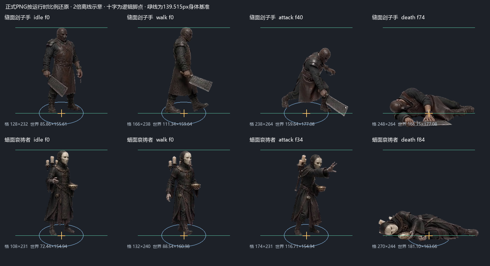
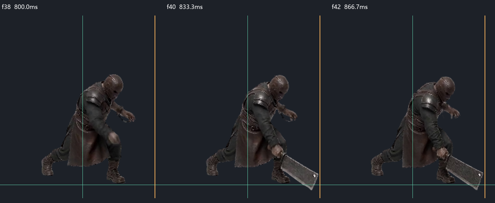
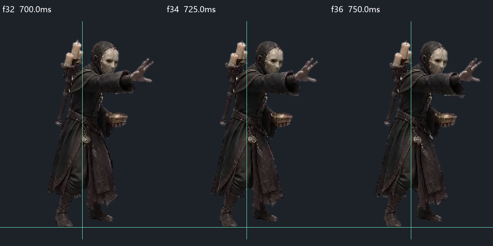

# 恐怖精英：动画大小、根点与攻击复查

2026-08-31。按用户要求复查缝面刽子手、蜡面哀祷者，依据第16卷精灵图生产标准、第16b卷动画对齐/时机合同与第9卷单时钟/控制规则。

本次执行离线素材检查、八组全帧联系图目视阅读、正式PNG尺寸/根点换算及必要局部代码核对。**未运行游戏测试或运行时验证，按约定由用户测试；未构建、未启动游戏、未同步EXE。**

## 结论与修正

- 两角色共492帧：刽子手238帧、哀祷者254帧。无空帧/触边/有效帧数错误，最小透明留边10px；RIFE偶数帧与未插帧关键帧一致，逐帧时长与双份配置一致。全帧联系图均已查看。
- 共用208px制作身体基准、139.515234375世界像素显示身体基准，运行时X/Y缩放均为0.6707463191。各动作帧格不同，但没有按轮廓重新fit，也没有额外放大攻击或死亡。
- 常态各动作根点换算的X/Y代数误差均为0，左右镜像轴相同。源视频固定裁框的横向整数取整误差不超过0.331世界像素。未逐帧居中、脚底拉齐、非等比拉伸或用反向Tween改动认可的步态/倒地轨迹。
- **修复刽子手石化脚点错位**：原取消动作会切待机脚点69.488700，而冻结攻击贴图需要76.011308，存在6.522607世界像素的竖直错位路径。现在作废攻击事件时保留冻结姿势、帧号与脚点。
- 两角色补接已有场景回调 `_syncPetrifiedBodyAnchor()`：石化施加/解除和逻辑换动作同帧时，按实际冻结纹理恢复根点，保留实际缩放、镜像和高度偏移，不把新动作脚点套到旧画面。不改共享渲染器和其他怪物。

正式PNG、源片、帧数、攻击节奏、伤害、射程和站位参数均未修改。已接受的自然转肩、重心移动和轻微源片色度波动保留。

## 大小与根点

真实渲染链：`HorrorNormalEnemy._getPhaserOptions()` 返回“本动作最长边×统一比例”，`GameScene._applyEnemyVisualOptions()` 再除以当前帧最长边，最终每个源像素都乘0.6707463191。首次创建、切换纹理与资源恢复沿用此入口，固定原点0.5/0.5。

`_setAnimation()` 在场景同步坐标前发布脚点：`footOffsetY=(footY-frameHeight/2)×scale`；场景使用 `sprite.y=entity.y-footOffsetY`。这两角色Collider偏移为0，各动作 `footX=frameWidth/2`。下表显示宽高包含透明边，不能当身体高度。

| 角色 / 动作 | 帧格 | 游戏显示宽×高 | footOffsetY |
|---|---|---|---:|
| 刽子手 idle | 128×232 | 85.856×155.613 | 69.489 |
| 刽子手 walk | 166×238 | 111.344×159.638 | 70.670 |
| 刽子手 attack | 238×264 | 159.638×177.077 | 76.011 |
| 刽子手 death | 248×264 | 166.345×177.077 | 57.415 |
| 哀祷者 idle | 108×231 | 72.441×154.942 | 69.720 |
| 哀祷者 walk | 132×240 | 88.539×160.979 | 68.224 |
| 哀祷者 attack | 174×231 | 116.710×154.942 | 69.153 |
| 哀祷者 death | 270×244 | 181.102×163.662 | 64.234 |

正常镜头1倍时身体139.515px，登记的正常最大镜头1.03倍时约143.701px。源视频分别使用固定相机校准系数统一到208px身体；攻击弯腰、迈步、倒地会改变可见轮廓高度，统一的是人体比例。

## 攻击距离与时机

**刽子手**：77帧、1500ms；源f56对应正式0-based f40，累计833.333ms。有效帧40–41对应833.333–866.667ms，只消费一次命中事件。f40刀刃右侧可见轮廓（Alpha≥32）距根点约68.416世界像素，与70前伸相差约1.6px，没有明显过长射程补空挥。起手和命中前伸均70、宽36，目标footprint由矩形相交计入一次。

起手锁原目标和方向，判定随当前Collider重锚但不重新瞄准，命中时复查同层、遮挡和目标有效性。保留表内下劈重心移动，代码没有额外突进/推图。动画和伤害共用 `stepBasicMeleeTimeline`，通用攻击调度关闭；跨窗口只消费一次，控制/死亡作废未命中事件。

**哀祷者**：79帧、1500ms；源f47对应正式0-based f34，累计725ms，处于手掌充分伸出的释放姿势。起手距离340，站位保持至390，释放复查420，未混用停步距离。蜡印固定在目标脚点，900ms预警后一次爆发，即通常起手后1625ms；显示圈与伤害椭圆半轴均72/36，收招或施法者死亡不提前取消已释放蜡印。

蜡印是固定落点法术，无飞行弹体；420是法术落点射程，不能按手臂长度衡量。命中取决于目标Collider与预警圈、承载面和遮挡。未释放可被控制/死亡取消，已释放由EffectManager独立计时并只结算一次，切场或战斗结束取消。

## 证据、改动文件与实机边界

- [尺寸/根点逐帧数据](../tools/ai-gen/_horror_elite_mothers_20260831/animations/alignment-review-20260831/measurements.json)与[离线测量脚本](../tools/ai-gen/_horror_elite_mothers_20260831/animations/alignment-review-20260831/inspect-alignment.py)。图只复现静态渲染公式，不是游戏截图。
- 本轮重新执行两角色 `review-assets.py`，检查PNG/Alpha、有效帧、原关键帧、GIF时钟及预算：[刽子手报告](../tools/ai-gen/_horror_elite_mothers_20260831/animations/stitchface-headsman/sprite-build-v01/review-20260831/asset-review.json)、[哀祷者报告](../tools/ai-gen/_horror_elite_mothers_20260831/animations/waxface-mourner/sprite-build-v01/review-20260831/asset-review.json)。GIF累计量化误差至多3.334ms。未重建PNG或重跑RIFE。
- 正式GIF、MP4及来源沿用原交付：[刽子手](../tools/ai-gen/_horror_elite_mothers_20260831/animations/stitchface-headsman/SPRITE_DELIVERY.md)、[哀祷者](../tools/ai-gen/_horror_elite_mothers_20260831/animations/waxface-mourner/SPRITE_DELIVERY.md)。
- 游戏代码只改 `src/entities/enemy-types/stitchface-headsman.js` 和 `src/entities/enemy-types/waxface-mourner.js` 的石化姿势/锚点；已对比本轮编辑前后真实差异，未处理其他会话内容。
- **待用户实机确认**：极限距离、横向擦边、目标后撤、隔墙/换层、长帧跨窗口、石化施加/解除/死亡以及真实相机下的切动作。素材只有左右镜像，上下/斜向不能声称达到独立方向的像素级接触；本轮仅确认判定沿用地面透视与锁定方向合同。
