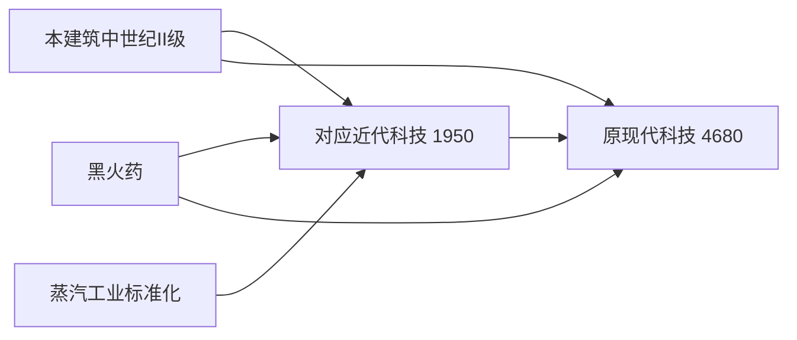

# 近代工业科技与七栋建筑接入（v63）

采用“中世纪维持、近代适中、现代小幅上调”的节奏，而不是整体抬高后续科技成本。七个建筑系列在原中世纪与现代之间插入近代形态；已有现代科技ID、解锁单位和原图保留，显示等级后移为IV。

这次实现了科技、外观与数值接入，没有制作九种近代单位。近代科技可正常研究，完成后立即换建筑外观；该级所有兵种仍明确标记待开发，继续招募最近一档完整可玩编制。现代科技仍可继续研究并开放现有现代兵种，不会被近代兵种占位阻断。

## 数值决策

以下为成本曲线折算后的实际科研点，不是JSON里的基础值。

| 项目 | 原实际点数 | 新实际点数 | 基础值 |
|---|---:|---:|---:|
| 五条募兵线的中世纪II级 | 1560 | 1560，保持 | 520 |
| 中世纪兵工体系 | 1560 | 1560，保持 | 520 |
| 五项近代募兵科技，各项 | 无 | 1950 | 650 |
| 近代军工制造 | 无 | 1950 | 650 |
| 五条现代募兵线，各项 | 4140 | 4680，约+13% | 920→1040 |
| 现代机械制造 | 4140 | 4680，约+13% | 920→1040 |
| 近代市政治理 | 无 | 840 | 420 |
| 现代住宅体系 | 1500 | 1800，+20% | 500→600 |
| 生态垂直都市 | 3380 | 3830，约+13% | 750→850 |

近代军备比中世纪高25%，但显著低于原现代4140点，形成可停留的过渡阶段。原现代只增540点，避免叠加新增时代后再大幅抬价。没有修改全局成本倍率、科研产出阈值、12点/秒全效、超额20%效率或36点/秒上限，也没有普涨其他经济、科研设施、位面、教会或指挥科技。

铁匠铺科研增效为中世纪115% → 近代122% → 现代130%。继续使用现有 `effects.researchSpeedMultiplier` 和最高累计倍率逻辑，在有效科研速率曲线之前应用；不是1.15×1.22×1.30。

## 路线和布局

军事各行保留原纵向建造骨架，横向排列中世纪column3、近代column4、现代column6；工程器械现代端位于column7，以便位于现代军工前置之后。没有改原军事建造入口、三农场OR接续或教堂路线。

五条募兵线和铁匠铺是并行分支。玩家只需支付一次共享黑火药/蒸汽工业前置，再推进所选路线；不必研究完其他近代军营。工程器械现代端继续保留原先对现代机械制造、蒸汽工业标准化及黑火药的显式要求，不删除这些既有条件。

| 新科技ID | 科技名 | 完成后的建筑 |
|---|---|---|
| `thatch_hut_industrial` | 近代侦察编制 | 近代侦察营地 |
| `hamster_barracks_industrial` | 近代步兵编制 | 近代步兵军营 |
| `shooting_range_industrial` | 近代射击训练 | 近代射击学校 |
| `cavalry_school_industrial` | 近代骑兵编制 | 近代骑兵学院 |
| `engineer_camp_industrial` | 近代炮兵制造 | 近代炮兵工坊 |
| `blacksmith_industrial` | 近代军工制造 | 蒸汽军工厂，累计科研+22% |
| `industrial_civic_administration` | 近代市政治理 | 近代市政大厅 |

民用线保持在经济页住房行：蒸汽住宅工程（column7）→近代市政治理（column8）→现代住宅体系（column9）→生态垂直都市（column11）。市政治理只依赖蒸汽住宅，不强制军事或矿业/电站支线；现代住宅保留蒸汽住宅原前置并追加市政治理。

按当前配置从空白状态计算必需前置，去除重复节点、初始完成节点，不计可选升级或动态科研速度：

| 首次到达目标 | 原必需科研总量 | 新必需科研总量 |
|---|---:|---:|
| 特战基地 | 8000 | 11890 |
| 载具工厂 | 15660 | 20640 |
| 现代住宅体系 | 2620 | 3760 |

这反映的是增加整个过渡时代后的总量，不应将“现代单项+13%”误读为整条路线只增加13%。后续推进其他军备路线会复用已完成的蒸汽和黑火药前置。数值是配置计算，不是实测通关时间。

## 建筑与兵种边界

五类募兵建筑增加level3近代条目，原现代条目改为level4。原有 `*_level_3` ID继续指向现代，不改名为新ID；新近代使用独立 `*_industrial` ID。因此已完成科技、研究目标和现代单位解锁所有权不丢失。铁匠铺、市政厅使用 `buildingTiers`，不伪装成出兵建筑。

九种未来近代兵种只登记在相应等级的路线说明，全部 `placeholder:true`；没有加入 `unitTypes`、单位解锁、实体工厂、预载或战斗配置。复用现有完整编制判定，近代建筑继续使用II级部队，直到将来整档开发完成；现代IV级的已有完整编制正常生效。既有部队、混编快照、军团和军事人口不就地转换。

七张已选透明图作为独立 `assets/terrain/*_industrial.png` 接入，未更改任何源PNG像素，也未覆盖中世纪/现代文件。各张按自身地台端点配置 `visualFootprint.scaleMode:"strict"`、显示尺寸及脚点，逻辑占格、碰撞、道路和寻路不改。地台端点是图上人工标定，存在非对称原画的近似误差，仍需在游戏内查看大小、落点与遮挡。

七套环境光辅助图通过既有离线生产器生成，仅更新这七项；未批量重建其他素材。已有建筑资源登记器会从两类tier的visual字段收集和切换新纹理，不新增第二套预载代码。

## 旧档与未完成进度

- 科技数据与系统版本同步63。旧档已完成的八个受影响后段节点保持完成，并递归补齐它们的必需前置；只处理这些路线，不补齐兄弟军备分支，不任取OR候选。
- 旧档已有现代等级仍解析为原现代科技ID，对应显示IV级，不会降为新近代III级。补齐节点不重放完成奖励、通知或实体生成。
- 未完成的六项现代军工科技按4140→4680换算百分比；现代住宅按1500→1800，生态都市按3380→3830。旧版本已有的成本与骑兵临时ID迁移继续保留。
- 例如现代军备投入2070点（50%）会转为2340点（50%），而不是清零或被稀释为44.2%。未完成现代节点不赠送近代科技，目标队列沿新前置补研；已完成现代节点不补收费用。

## 本轮文件与验收边界

- `data/technology-tree.json`：七项新节点、八项调价、前置/列位置/解锁与v63。
- `data/producer-buildings.json`：七项近代tier、原现代显示IV级、规划兵种及各档独立视觉参数。
- `src/world/technology-system.js`：版本、分版本成本换算、已完成现代路线的前置继承。
- `assets/terrain/*_industrial.png`及对应 `lighting/` 文件、`data/environment-lighting-assets.json`：七栋新纹理与辅助图。
- `tools/ai-gen/build-lighting-maps.py`：七项定向生产登记；`tools/ai-gen/_industrial_transition_collection_20260831/`：逐图来源、安装脚本、视觉参数与本轮记录。
- `TODO.md`：九种近代兵种待办；`CHANGELOG.md`和本说明：当前实施结果。

已阅读本轮真实差异及科研、编制选择、建筑换形与资源登记的必要调用链。未运行测试、lint、类型检查、构建、浏览器/CDP或游戏，也未发布EXE；按约定由用户测试。重点查看近代科技完成后的换形与II级募兵、现代后续可研究、旧档仍保持现代、研究百分比和每栋地台对齐。
