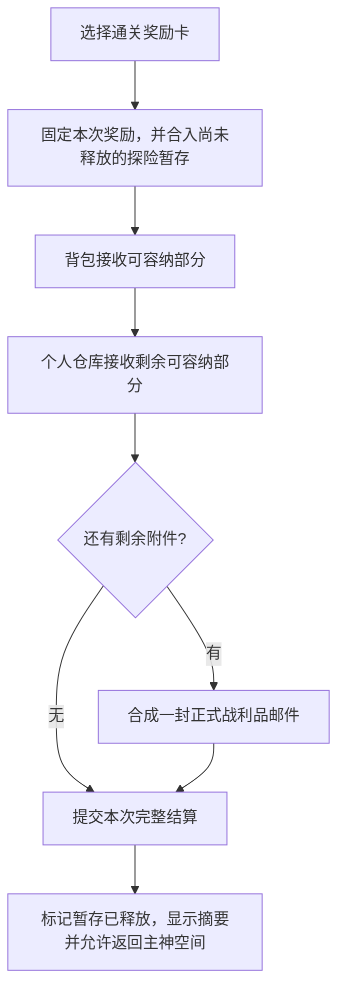

# 小鼠大王信箱系统设计

日期：2026-08-31。状态：已接入开发源码，尚未运行测试或运行时验证；固定 EXE 未同步。实施结果与限制见第10节。

本次修订：补齐地牢暂存与退出惩罚、玩家丢弃物的来源限制、领取时整理背包/仓库的往返交互。下列分场景规则取代旧版“任意场景直接入仓寄信”。

## 1. 定位与默认规则

小鼠大王新增「查看信箱」服务，代管玩家已经获得、但背包和主神空间个人仓库放不下的物品。信箱是奖励保管处，不需要新增 NPC 或改动小鼠大王素材。

| 项目 | 建议规则 |
|---|---|
| 已结算奖励投递 | 玩家背包 → 主神空间个人仓库 → 正式信箱，仅投递剩余部分 |
| 地牢途中投递 | 玩家背包 → 本次探险暂存；途中不通过新投递接口直接送回个人仓库或正式信箱 |
| 容量 | 不设邮件数、附件格数和总件数的游戏内上限；不收费、不需要扩容 |
| 保管期限 | 未领取附件永久保管，不自动过期、不因邮件过多淘汰 |
| 使用地点 | 已结算奖励可自动收件；地牢途中只暂存，回主神空间找小鼠大王领取正式邮件 |
| 领取顺序 | 默认背包 → 个人仓库；放不下的仍留在原信中 |
| 资源效力 | 未领附件不能装备、出售、制作或自动扣费；邮件金币不计入可支配金币 |
| 存档归属 | 跟随当前角色存档，不是跨存档共享资产；读旧档时一并回到旧状态 |
| 玩家操作 | 不支持手动寄存、丢弃再拾取寄存、写信、玩家间交易或远程领取，首期不增加常驻 HUD 按钮 |

“无限容量”指没有玩法配额，不代表磁盘或浏览器存储没有物理限制。存储写入失败必须明确提示，不能假装邮件已经持久保存。

这里的仓库明确指 `WarehouseSystem` 管理的个人仓库，不是位面内建筑的粮食、能源或物流库存。

本次探险暂存不设游戏内条目上限，但不属于永久保管的正式邮件；不能领取、使用或参与材料/金币扣款。它与本次地牢的战利品承担相同退出风险，不能通过填满背包获得额外保险。

## 2. 自动投递范围

建议覆盖玩家直接获得的物品与金币：地牢通关、任务结算、宝箱/Boss 的直接奖励，以及玩家主动拾取的、来源明确的新战利品。保留各来源原来的获得条件、掉率和奖励数量，依据结算状态选择正式投递或本次探险暂存。击败一个房间 Boss 或打开途中宝箱，不等于整次地牢已经安全结算。

- 地上尚未拾取的东西不自动回收；未开宝箱、未选择的奖励卡也不自动邮寄。拾取完成且投递成功后才移除对应掉落物。
- 玩家从背包、装备栏或其他个人容器主动丢出的物品，再拾取时走原拾取规则；背包放不下的余量继续留地，不进入仓库、暂存或邮件。不能依靠先丢弃、填满空位、再拾取绕过手动寄存限制。
- 商店购买、强化/改造材料返还等付费或转换流程首期不顺带改变容量规则，后续接入时需要同时纳入扣费与返还事务。
- 建筑生产、银行产出、军团后勤和位面仓储首期不进入信箱，避免无限保管绕过经济与物流容量。
- 经验、属性、解锁资格等即时效果仍走原结算，不转成虚构的邮件物品。

投递按一次结算合成一封信，避免每件装备单独一封。连续拾取产生的通知可以合并，但各次发放记录仍独立；不同结算的随机装备不能因为名称相同而合并。

### 2.1 掉落来源资格

- 由实际奖励/掉落创建入口登记来源类型、唯一来源编号与可投递资格，不根据物品名称、品质或“当前在地上”推断它是新奖励。
- 主动丢弃必须标记为 `player_drop` 并撤销自动投递资格，即使该物品最初来自怪物；拆分、复制物品数据和再次拾取不能把资格改回新战利品。
- 历史或未知来源掉落保留原拾取能力，但不默认授予自动寄存资格；实现时补齐各个本轮接入的新战利品创建入口。
- 部分拾取保留原来源编号与准确余量；投递成功才扣减原掉落，不能重新生成一份带新编号的剩余物品。

## 3. 直接解决地牢结算卡死

这里的“提交结算”指背包、仓库、正式邮件、暂存余量与领取状态在当前游戏会话中一起成功，不等同于已经写入持久存档。已在背包中的战利品不再次加入投递清单。

原来的金币容量预检和满仓抛错路径已由统一投递替换。`RewardSystem`固定所选奖励后调用`PlayerRewardDelivery.deliver()`，容量不足只决定去向，不再阻止领奖完成。

建议结算页文案：

> 奖励已领取：背包 3 项，仓库 2 项，信箱 4 项。剩余战利品由小鼠大王保管。

“项”按附件条目统计；金币和材料的实际数量在明细内完整显示。玩家仍使用原来的「继续 / 返回主神空间」，无需先进入信箱，也不需要放弃部分奖励。

只有实际发放异常才阻止结束，并保留原选择、原随机结果和重试入口。容量不足本身不再是失败。

### 3.1 暂存的退出结算

| 退出结果 | 本次探险暂存如何处理 |
|---|---|
| 通关 | 与最终奖励一起按背包→个人仓库→正式邮件投递，只提交一次 |
| 起点安全撤离 | 只投递已实际获得的暂存，不额外发放通关奖励 |
| 死亡 / 强制放弃 | 随既有背包损失规则处理本次暂存，不将其转成正式邮件；不触碰探险前的仓库与正式邮件 |
| 资源加载故障等既有保留背包退出 | 保留并投递已实际获得的暂存，不追加通关奖励或成功资格，不把系统故障当作死亡 |
| 场景切换失败、重试、普通 shutdown | 本身不是新的结算结果；保留既有结算状态，不能重复释放或重复施加损失 |

暂存属于独立 `runId`，在出征初始化时建立。结算记录区分“进行中 / 已保留并释放 / 已按惩罚处理”，由原退出入口明确传入结果；不能只凭场景离开、NPC不存在或 `shutdown()` 判定胜负。

先完成这次投递或惩罚及状态提交，再进入原切场流程；切场失败保留返回重试入口，重试只负责切场。任何投递失败都保留原暂存与原奖励结果，不能先清空暂存再尝试寄信。这里的“保留”只适用于原本不丢背包的退出路径，不新增玩家可随意使用的免费撤离入口。

途中提示必须写明“已暂存 N 项，通关或安全撤离后领取；死亡或强制放弃会损失”，不显示“已永久寄存”。正式邮件徽标不统计仍在探险中的暂存。

## 4. 信件与领取交互

一封信展示：来源标题、寄件人小鼠大王、投递时间、简短说明、附件图标/名称/品质/数量，以及「未领取 / 部分领取 / 已领完」。打开信仅改变阅读状态，不代表领走附件。

操作保留三种：领取单个附件、领取本封、全部领取。全部领取按最早投递优先尝试；某件装备放不下时仍继续尝试后面的可堆叠材料，不因为一项失败而中断整批。

| 情形 | 结果 |
|---|---|
| 两处都有空位 | 优先装入背包，多余放仓库 |
| 材料可领取一部分 | 只扣除成功存入的数量，余量留信 |
| 背包和仓库都满 | 显示“暂时没有可领取的空间，附件继续保管”，不删信、不重寄 |
| 仅剩无法容纳的独立装备 | 原件保留，词条、品质、强化与改造数据不变 |
| 全部领取成功 | 标记已领完，允许清理该空信 |
| 信中仍有附件 | 不提供删除操作；清理已领邮件不能触及它 |

批量领取显示实际结果，例如「已领取 6 项，仍有 3 项待领」。处理中禁用重复提交；关闭面板不应产生半次扣减。一键领取按小批次让出界面执行时间，避免大量邮件时长时间冻结。

### 4.1 整理空间后返回

- 附件操作区显示背包/个人仓库剩余格数和本次实际可领取数量；有空格不代表整批都放得下，无空格也不代表不能合并堆叠。
- 提供「打开背包」「打开仓库」和整理面板中的「返回信箱」。沿用现有容器打开入口与访问条件，不通过信箱解锁远程仓库；若当前不满足仓库访问条件，显示需要靠近的位置提示。
- 往返保留信件编号、筛选条件、页码和列表/附件滚动位置，不保留过时的物品对象引用。返回时重新计算容量、附件余量和按钮状态，不自动重新执行上一次领取。
- 同位置面板通过现有 `BasePanel / UIState` 切换，不能把仓库 DOM 嵌进邮件详情。正常关闭不会改动附件；已在执行的领取先完成或回滚当前批次，再允许切换面板。
- ESC 只关闭当前前台面板，不同时触发领取、移动或攻击。角色离开小鼠大王交互范围、切场或读档后取消自动返回，不能由迟到的回调重新打开信箱；再次交互时从有效状态恢复。

## 5. 小鼠大王入口与冷钢 UI

- 小鼠大王当前是 `npc_mouse_king / npcType:ruler`，对话中补充「查看信箱（待领 N 封）」；徽标统计有附件的信，而不是未读信。
- 问候语可加入：“放不下的战利品，我替你收好了。腾出地方再来领。”新邮件用现有通知队列汇总提示，避免逐件刷屏。
- 信箱为标准右侧抽屉，复用 `BasePanel`、`UIState` 和右栏挂载层，遵循 `45vw × 100%` 及既有滑入动画。宽屏列表/详情双栏，窄屏在同一面板内切换并提供返回。
- 顶部固定「战利品信箱」、待领数量及关闭按钮；中部为「待领取 / 全部」筛选、信件列表和附件详情；底部固定领取操作、空间说明及背包/仓库入口。列表与详情内部滚动，不能挤走操作按钮。
- 标题/分区/正文/辅助文字使用冷钢主题的 20/16/14/12 档，数字使用既有数字字体。深灰底、银灰文字、浅银主按钮；品质色只用于附件品质，不把整封信染成亮色。
- 物品图标与 tooltip 复用背包，完整展示原装备数据。打开信箱应立即结束 NPC 对话的旧延迟回调，避免稍后误关新面板。
- ESC 关闭当前面板并恢复输入；鼠标与键盘操作不穿透到角色攻击、移动或地牢快捷键。首期不新增占用现有键位的信箱快捷键。

## 6. 数据与防重复规则

建议每封信保存 `mailId`、来源类型及发放编号、标题、投递时间、阅读状态和附件；每个附件保存独立编号、完整物品实例快照和剩余数量。不要保存 DOM、实体对象或临时贴图对象。

探险暂存独立保存 `runId`、结算状态、退出结果及来源/附件余量，不伪装成一封已经送达的信。掉落来源资格随物品转移保持准确；邮件阅读状态与暂存结算状态不能共用一个布尔值。

必须满足以下约束：

1. **随机只生成一次。** 发放编号在首次生成奖励时建立，失败重试复用；不能每次点按钮重新滚装备。
2. **按实际数量结算。** 现有背包入库可能先合并一部分再返回失败，不能把 `false` 当作“完全没放进去”。统一发放接口应明确返回背包接收、仓库接收和剩余数量。
3. **整次一致。** 发奖异常时一起回滚背包、仓库、邮件、暂存余量及结算/领取标记；奖励页成功状态只在整次完成后更新。
4. **领取只转移一次。** 附件扣减与目的地入库处于同一操作中；同一附件重复点击、同一来源重复回调均不能复制物品。
5. **邮件不自我投递。** 领取接口只尝试背包和仓库，剩余保留原信，不再调用会生成新邮件的溢出入口。
6. **不按物品名去重。** 不同装备实例可以同名；按来源发放编号去重，清理空信也不能使尚可重试的来源重新发奖。
7. **身份跟随整个生命周期。** 暂存释放沿用原来源和物品实例，不因换房、返回失败、重复结算或读档创建第二次发放。新探险不能继承旧 `runId` 或未处理的旧暂存。

示例：邮件有 100 个材料，背包还能放 20、仓库还能放 30，则领取 50、邮件剩 50；不能把原 100 个再次寄出。

## 7. 存档与无限容量的落地建议

原存档位于`localStorage.infiniteLoop_save`。新保存/读取经`GameSaveStorage`使用IndexedDB；新存档不存在时才读取旧档，旧档保留不删除。

存储适配层保留当前单槽和原保存/读取入口，不开发多存档、云同步或账号系统。

- 保存时先按现有规则结算后台状态，再将角色快照、背包、仓库、邮件变更、探险暂存/结算状态与发放记录绑定到同一存档版本，在同一次事务中提交；只有提交完成才显示保存成功。
- 邮件在IndexedDB中分记录存放，读档时载入当前信箱；信件列表和附件各按20项分页创建DOM。容量无游戏内上限，但总数据仍占用内存与磁盘，大规模性能尚未实测。
- 读档按同一版本一起恢复；不把旧背包与最新邮件/暂存拼接。旧档无信箱字段时恢复为空，不能继承读档前的现场邮件或暂存。只有匹配且可恢复的探险会话才能继续处理其暂存，不能因读档回到主城就判作安全撤离。
- 首次迁移保留现有 localStorage 旧档，只有新存档事务成功后才使用新版本；迁移失败不覆盖旧档、不静默清空邮箱。新版本存在却读取失败时明确报错，不悄悄退回旧档造成回档误解。
- 浏览器开发端和固定 EXE 沿用各自隔离的存档环境，不跨端搬运；不修改已经发布的 EXE。
- 存储不足时保留上一次成功存档及当前会话数据，显示失败原因；不得靠自动删除未领附件腾空间。

**首期保持现有手动存档语义。** “永久保管”表示保存下来的未领取附件不会过期；没有保存就强退，仍可能回到上一次存档，不能宣传为强退也绝不丢失。若以后加入结算自动保存，必须保存同一次完整角色/世界/邮件快照，不能只自动保存邮箱而让背包停留在旧版。

## 8. 建议实施边界

| 模块 | 建议工作 |
|---|---|
| 新增邮件数据模块 | 管理信件、附件余量、来源去重、序列化与恢复，不依赖 NPC 是否在场 |
| 新增玩家奖励投递模块 | 按进行中/已结算分流为背包→探险暂存或背包→个人仓库→正式邮件；数量返回与失败回滚一致，领取不再寄信 |
| 地牢暂存与原退出入口 | `runId` 与明确退出结果控制释放/惩罚，只处理当前探险；切场重试不重复结算 |
| `src/ui/reward-system.js` | 去掉容量不足的硬阻断，固定随机结果，显示三处奖励去向 |
| 各直接奖励/掉落创建/主动拾取入口 | 明确来源编号和资格后接统一投递，主动丢弃撤销资格；不全局替换所有背包入库调用 |
| `src/ui/npc-dialogue.js` 与新增信箱面板 | 小鼠大王入口、列表、详情、领取、整理容器后返回与输入生命周期 |
| `src/ui/game-ui-manager.js` 与新增存储适配层 | 同版本保存/读档与旧 localStorage 存档迁移 |
| `ui/panel-theme-backpack.css` | 仅添加信箱专属布局，复用冷钢变量与公共组件 |

`src/world/economy-gold-routing.js` 的 `routeProducedGold()` 还承载银行产出，因此不能直接把它改成所有来源自动寄信。玩家奖励需要带来源的投递入口，邮件金币也不能混入 `getPlayerTotalGold()`。

实施顺序建议：先确定数据/存档事务与投递接口，再接地牢通关闭环，然后接其余已列明奖励来源与 NPC 面板。不能把只有界面的版本当作容量兜底已经完成。

地牢途中投递接入的前置条件是：通关、安全撤离、死亡、放弃、非惩罚故障退出和现有读档入口都能明确处理同一次探险。若现有存档无法恢复活动地牢，须先明确保存边界，不能只把暂存存下来、再默认为可领取；本设计不授权顺带开发完整地牢断点续玩。

## 9. 后续验收清单（本轮未执行）

- 背包、个人仓库全满，含固定金币与随机装备的通关奖励仍可完成，余量进入邮件并正常返回主神空间。
- 地牢途中即使个人仓库有空位，也不能通过新溢出接口提前转移战利品；暂存不能在途中领取或用于扣费。
- 相同战利品分别走通关/安全撤离与死亡/强制放弃，前者仅释放一次、后者按原规则损失；旧仓库和旧邮件都不受影响。资源故障保留退出不能误罚，切场重试不能再发一份。
- 丢弃背包物品、占满空位再拾取，不触发仓库/暂存/邮件；部分拾取、拆分和未知来源不会恢复自动寄存资格。
- 背包和仓库只够容纳部分堆叠时，三处数量之和与发放数量完全一致。
- 双击、失败重试、部分领取、保存读档不会多发或吞附件；随机装备的实例数据不变。
- 全部领取遇到装不下的装备仍尝试后续可合并材料，且不会产生新的溢出邮件。
- 未领取金币不能在商店/制作/经济扣款中使用，生产与物流的满仓规则不变。
- 从邮件打开背包/仓库、整理后返回，保留筛选/页码/当前信件并刷新容量；离开交互范围、切场或读档不会被延迟回调重新打开。
- 旧档迁移、无信箱旧档恢复、写入失败和浏览器/EXE存档隔离行为符合第7节。
- 大量邮件分页、窄窗布局、长装备名称、ESC与输入拦截由用户实测；未获明确授权不运行测试、构建或浏览器验证。

## 10. 本轮实际接入（2026-08-31）

- 数据层：`src/systems/mail-store.js`独立持有正式邮件、发放回执与runId暂存；`player-reward-delivery.js`先在容器副本上计算接收数量，再同步提交背包/仓库/邮件。金币遵守既有容器安全整数总额，超出继续保管，不用第二金币堆绕过上限。
- 已接来源：通关卡牌、任务卡牌及后备奖励、Boss直接金币/物品、房间清剿金币、随机事件奖励；怪物和宝箱掉落显式登记新战利品来源，原单件点击/范围拾取/金币自动拾取共用投递。未拾取的地面物品仍不自动收走。
- 丢弃与经济边界：`Game.dropItem()`默认不具备邮寄资格，仅明确的新战利品创建点启用；装备/背包丢弃、制作返还、银行产出、能源等沿用原规则。邮件与暂存不参与原有金币/材料查询和扣款。
- 退出：进行中溢出不入主城仓库。通关/安全撤离释放暂存，死亡/放弃仅损失当次暂存；原资源故障保留退出释放已得物品但不授予通关资格。回执和暂存状态阻止切场重试二次发奖。背包惩罚在切场前同步完成，不留异步导入回调清空新领取物品。
- UI：小鼠大王新增待领封数按钮；冷钢面板有未领/全部、已读/部分领取/已领完、物品属性提示、单附件/本封/全部领取与清理空信。批量每10封让出一帧，关闭即取消后续批次；信件和附件均20项一页。打开背包/仓库整理后可返回当前信件，离开NPC范围或读档取消往返会话。
- 存档：玩家/世界快照、背包、仓库、邮件及回执在同一IndexedDB事务中保存，写入失败不覆盖上一次成功版本；仍为手动保存，不承诺未保存强退保留。由于现有存档不能恢复完整地牢路线，活动地牢中禁止保存和读档，提示先结束探险；不新增断点续玩。
- 仍需用户验收：满包通关返回、途中奖励的暂存/损失分流、部分领取计数、丢弃重拾、NPC整理往返、窄窗字体/滚动与旧档首次迁移。未运行测试、lint、构建、浏览器/CDP、游戏或EXE发布；只查看本轮差异及必要调用链。
