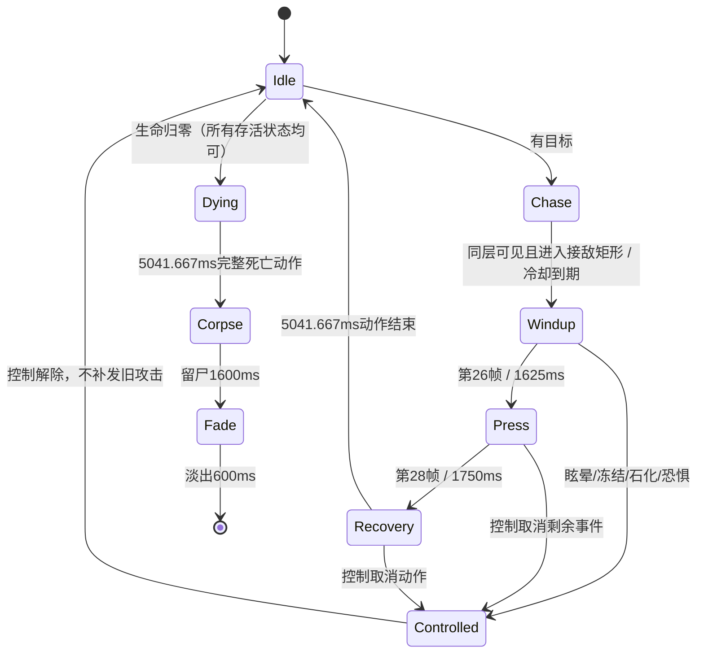

# 百褶噬团：恐怖地牢领主接入

2026-09-01，按用户“导入游戏设计状态机和数值”接入现有四动作。代码和资源接入完成，**未运行测试或运行时验证，按约定由用户测试**。本文只记录百褶噬团；空腔之卵随后已沿同一抽象单位合同完成动作与运行接入，详见其制作目录manifest。未发布EXE。

## 定位与数值

低伏、宽体、缓慢逼近的重压领主。高生命与褶甲补偿慢动作；玩家通过侧移躲开压击，再利用长收势反击。没有额外突进、吸附、召唤、阶段变身或死亡爆炸。

基础配置：`rank=lord`、配置等级12、生命2100、速度100（当前全局×0.6后为60）；力量78、敏捷26、体质70、智力8、感知26、幸运8。六维经现有公式得到物攻52、物防128、魔防33；没有再写一份不会被消费的直接物防覆盖。

| 恐怖地牢 | 有效怪物等级 | 出生生命 | 物攻 | 物防 | 重压输入伤害 |
|---|---:|---:|---:|---:|---:|
| C 初级 | 21 | 4001 | 111 | 191 | 333 |
| B 中级 | 24 | 4855 | 143 | 217 | 429 |
| A 高级 | 27 | 6090 | 177 | 246 | 531 |

以上按当前`combat-formulas.json`锚点12/15/18计算：有效等级=锚点+(配置等级−3)，相对配置等级的成长差为9/12/15。先使用生命每级3%、物攻8%、物防4%的既有成长并取整，再使用恐怖地牢C/B/A倍率。无额外场景Buff、祭品、暴击或目标减伤；重压列是物攻×3的输入攻击量，不是扣血保证值。推荐玩家等级40–85与此内部怪物等级不是同一字段。

褶甲在待机、移动、蓄力和压击期间将进入常规防御结算前的伤害乘0.8；第28帧起的收势乘1.25。两者是输入倍率，不宣称最终伤害固定减免20%/提高25%。硬控与恐惧期间不享受褶甲，仍经正常伤害和死亡入口。

## 状态机与攻击时钟

- 重压归类为自管矩形范围攻击，沿用已有有向矩形/地面透视/目标footprint/同层/墙体复查；只复用解析器几何，不触发通用单体普攻。
- 起手固定目标方向，停止主动移动；实际伤害区长200、宽96，围绕Collider地面根点，屏幕投影宽度按项目透视处理。没有目标半径二次叠加或逻辑突进。
- 源视频f39对应RIFE成品f26，1625ms触发一次；有效姿态为f26–27。前缘在f24/25/26/27/28距离固定根点约146.625/177.625/208.625/201.625/193.625，因此废弃早期f34的暂定接触候选。200前伸保留少量边缘余量。
- 动画、事件与收势弱点共用动作时钟；跨过命中窗口的长帧仍只处理一次，先消费命中标记，再调用伤害链。每目标独立处理正常近战格挡/弹反；同步反伤致死或控制打断后停止后续目标结算。
- 主目标离开可以空压；锁定区域内的其他敌对目标可被命中。目标死亡后不重新转向找人。被外力推移时只重锚根点，不重新瞄准。
- 起手到下次起手5600ms；动作5041.667ms，正常剩余等待约558ms，不另叠加整轮冷却。现有攻击频率效果仅推进一次冷却，不加速素材、死亡或硬控计时。
- 精英/领主红色轮廓与1625ms动画蓄力重叠，取消动作/控制/死亡统一清理。石化保留实际可见纹理和帧的锚点，解除后不补伤害。

## 动画标准工作流

使用`SKILL.md`索引定位第9卷、第16b卷§1.1/§2–7和`WORKFLOW.md`§3.6，以及`game-dev-lessons`的近战接触/单时钟合同。重蓄力领主保留用户接受的约5秒动作，不机械套用普通攻击1.5秒目标。

源片仍是idle-v01、crawling-v01、attack-v04、dying-v02-fold-settle。沿用已完成的BiRefNet透明源帧、准确选段、固定0.35源缩放与RIFE2×；未逐帧居中、重拉脚线、拉直轨迹、倒放或放大尸体。

| 运行时状态 | 有效帧 | 帧格 | 列×行 | 固定footX/footY | 时长 |
|---|---:|---|---|---|---:|
| idle | 60 | 339×149 | 5×12 | 169.375 / 141.6 | 3750ms循环 |
| walk | 52 | 429×152 | 4×13 | 214.375 / 133.6 | 2166.667ms循环 |
| attack | 81 | 433×142 | 3×27 | 216.375 / 134.6 | 5041.667ms单次 |
| death | 81 | 353×135 | 9×9 | 176.375 / 125.6 | 5041.667ms单次 |

四张PNG正式位于`assets/enemies/pleat_devourer/`，共274有效帧、58.22MiB RGBA解码，少量特殊角色目标64MiB/上限128MiB。没有新弹体、召唤物或独立特效贴图；通用红色轮廓复用身体纹理。该预算不是场景显存或性能实测。

`referenceCell=448`、`render.spriteSize=448`，运行时缩放1，源到世界总比例0.35。以idle f0量得主体约310×124，普通地牢镜头1倍下约124像素高；现有最大开火推镜1.03倍下约127.72像素。各动作共用倍率和腹面根点，首次创建/换表仍按各自裁框还原，不会以不同帧格长边把身体重新fit。

Collider为半径90、高130的既有圆柱口径，投射物受击框300×130；长体视觉、地面占位和攻击区分开。左右翻转使用`frameAnchorX`；上下/斜向仍共用左右源图，不声称全方向像素级接触已验收。

真实动作参考已查看：僵尸犬walk f0/9/18、缝面刽子手walk f0/19/38及百褶噬团walk f0/17/34。百褶无人体关节，以前褶、中段、后囊确认身体向右与左右运动轴，延续已认可的轻俯视侧向视角。

- [实际动作方向与体量离线对照](../tools/ai-gen/_horror_abstract_lord_mothers_20260831/integration-20260901/direction-reference-plate.png)
- [左右压击姿态与地面判定离线示意](../tools/ai-gen/_horror_abstract_lord_mothers_20260831/integration-20260901/attack-contact-plate.png)
- [完整四动作GIF](../tools/ai-gen/_horror_abstract_lord_mothers_20260831/animations-pleat-v03-20260831/sprite-production-v01/preview.md)
- [发布记录与源帧对应](../tools/ai-gen/_horror_abstract_lord_mothers_20260831/animations-pleat-v03-20260831/sprite-production-v01/runtime-integration.json)

这些是离线素材，不是游戏截图。蠕行原片有明显前端张合和循环接缝，死亡塌伏幅度较轻，沿用已确认来源；没有靠处理脚点或拉伸掩盖。

## 刷怪、奖励与文件边界

`poolWhitelistOnly=true`；仅加入恐怖三档精英遭遇的领主候选以及C/B终点的领主候选。原巫婆、手脑、蝇手保留，四种领主等概率候选；普通遭遇池、波次阶级和数量不变。精英战末波实际保留1领主，普通怪仍按竞技场现有规则补到10。A终点仍是既有最终Boss，矿洞、沼泽和来袭均未增加本怪。

怪物加入恐怖`monsterStatProfiles.horror.enemyKeys`，只在相应地牢享受一次C/B/A倍率。经验读取统一领主rank权重，金币/掉落读取现有领主与地牢奖励规则；不新增第二份自定义奖励、不改事件概率或清场奖。

必要接入文件：新实体`src/entities/enemy-types/pleat-devourer.js`、导出`src/entities/enemy-types.js`、`BootScene.js`、双份`enemy-config.json`和`dungeon-config.json`、四张PNG及本任务素材记录。通过现有`entityClass → enemy-registry → ZOMBIE_FACTORY_MAP`自动工厂接入，不再抄一份地牢构造器。现有按波预载从池反查配置，Boot按目录族登记四纹理和四动画；手动选帧与Phaser播放不会同时推进，死亡/留尸/淡出沿用已有驻留生命周期。`animation-config.json`当前仅管理其他特定怪物，本怪的帧布局真源是双份enemy配置，不另造重复动画表。

制作脚本`install-runtime.py`是显式素材发布工具，`record-publication.py`维护任务记录；`runtime-config.json`是本次快照，不是第三份运行时真源。后续参数修改直接维护双份游戏配置。重打包由`finish-sprites.py`保留本素材版本的发布记录；改变源片/选段/尺寸须新建版本，重新接入，不能静默覆盖已接受版本。

已查看本次真实修改范围和上述局部调用关系。**未运行测试、lint、构建、浏览器/CDP或游戏验证，未同步EXE。** 用户重点验收：贴脸与极限距离、侧移/后撤、墙门/高台、左右及斜向、控制打断/石化冻结、反伤死亡后的停止、完整留尸淡出，以及C/B/A实战手感。
