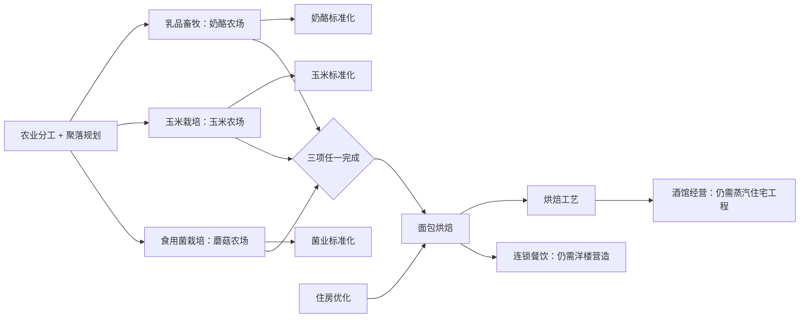

# 科技树布局与三农场接续审计

日期：2026-08-31。初次审计基于v59共享工作区，三农场调整为v60；后续四项布局修复在共享工作区v61基础上提升为v62。初次审计快照共108个节点：工程18、军事指挥36、经济与位面46、位面独特科技8；此数为该次快照，不代表后续其他会话新增内容的最新统计。节点总数包含初始完成节点，不等同于待研发数量。

第一次交付修改三农场关系、其必要研究计划与经济页布局；用户确认后，第二次交付继续修复A05～A08四项布局/导航问题，不改变研发条件。两轮均未运行测试或运行时验证，按约定由用户测试；下述几何依据来自配置坐标和SVG路径代码，不是游戏截图验收。

## 1. 已落实的农业关系

- 三种农场同级、互不依赖。均要求农业分工与聚落规划，均为基础170/实际260科研点；各自标准化仍为基础220/实际330点。
- 面包烘焙的条件是 `住房优化 AND (乳品畜牧 OR 玉米栽培 OR 食用菌栽培)`。标准化只开放对应农场本栋升级，不是继续农业主线的条件。
- 任选接续不等于互斥选择：研究一种后仍可研究另外两种；不会因为选择蘑菇而关闭奶酪或玉米。
- 面包后的住房、餐饮与酒馆前置保持原样，没有把整棵树改成“任意前置即可”。

经济页采用以下网格（column/lane均从0开始）：

| 内容 | 列 | 行 |
| --- | --- | --- |
| 住房时代线 | 原1/3/5/7/9/11 | 0 |
| 农业分工 | 0 | 2，作为三农场的共同入口 |
| 奶酪/玉米/蘑菇 | 全部1 | 分别1/2/3 |
| 三类标准化 | 全部2 | 分别1/2/3，和自己的农场对齐 |
| 面包、烘焙、连锁餐饮及中央厨房 | 保留原列 | 2，共同后续居中 |
| 酒馆与宴饮 | 保留原列 | 3 |
| 金币、能源、仓储 | 保留原列 | 分别4～5、6～8、9 |

农业扩成三行后，只顺延下方区块，保留原来的住房时代列和成本。经济页行间隙从22扩大到44px，让长线能够从卡片底部绕行，并避开下一行卡片顶部的条件徽标；画布相应增高，仍沿用原双轴拖拽和滚动条。长线使用不同目标入线通道，不再通过中途的标准化卡片。

## 2. 审计发现与处理状态

| 编号/级别 | 问题及修复前源码依据 | 影响 | 处理状态 |
| --- | --- | --- | --- |
| A01 / P1 | v59的`mushroom_cultivation`依赖`dairy_husbandry`，放在column3；另两种农场在column1 | 实际比同级农场多一层研发，布局也表现为后继 | 已改成三者共享前置、同列三行 |
| A02 / P1 | v59的`bakery_baking`只接受奶酪；系统与界面均只理解AND | 只研究玉米或蘑菇无法接续；只修改线条不能修复业务 | 已加入显式任选组，接通状态、目标队列、ETA、瞬间研发和详情显示 |
| A03 / P2 | 经济页原先按两端平均X生成折线；如奶酪→面包的中间段穿过奶酪标准化卡 | 视觉上把可选升级误读为必经路线 | 已让经济页跨列长线、跨多行同列线走卡片间通道；未宣称所有交叉/共线都已消除 |
| A04 / P2 | `ECONOMY_SUB_BRANCH_ROWS`农业只覆盖lane1～2；能源只覆盖5～6，深层钻头在7；仓储lane8无标题 | 新增内容脱离分区，扩行后还会误标其他区块 | 已同步三行农业、三行能源与仓储标题 |
| A05 / P2 | 军事页`military_organization`在(2,0)，后继`tactical_command`原在(1,6)；旧非经济页绘线固定从源右侧到目标左侧 | 研究方向向左折返，端点路径经过卡片内部；“仓鼠草屋军备→战术指挥”难以顺读 | v62已修复：指挥线改为column3/4/5/6，指挥中枢改为4/6/7；原前置、成本与所在行不变 |
| A06 / P2 | 军事页`shield_formation`(1,1)→`field_medicine`(3,8)原使用平均X折线；竖段落在column2卡片范围 | 连线经过黑火药、常备军令、军械保障等无关卡片，容易误读为相互依赖 | v62已修复：军事长线走行列间通道，行间距44px；同列无卡阻挡时保留直连，纵向建筑骨架和黑火药条件不变 |
| A07 / P2 | 非当前页前置不绘线；原卡片只显示“跨分支”，详情只列名称/状态 | 例如工程页义务教育依赖经济页蒸汽住宅工程，用户要自行寻找前置所在页 | v62已修复：详情前置显示分支/子分支，原生按钮支持点击、Enter或Space定位；切页后居中选中卡片，未知位面仍不展示名称 |
| A08 / P2 | 原`.technology-prerequisite-legend`绝对定位到画布`right:34px`；经济页画布由13列计算为3998px | 常见桌面宽度下，滚动到左侧时图例位于视口外，关键AND/OR解释不常驻 | v62已修复：图例放在页签下方、滚动区外，允许窄窗换行；单前置连线也统一未完成虚线/完成实线 |

另一个可读性取舍：经济页已有13列，新增三农场并没有增加横向列数，但增加了一行和连线留白。缩放、搜索、定位当前研发会有帮助；这属于后续导航改进，不通过强行压小210×88卡片或缩小字体来解决。

## 3. 保留的合理结构

- 住房在经济页顶部，以时代门槛连接产业；产业解锁和本栋升级保持独立，不为填空添加新科技。
- 军事基础建筑纵向展开、每类编制横向换代是当前明确合同；黑火药即使已经是二级的祖先，三级仍保留显式AND，不按普通“冗余边”删掉。
- 位面独特科技保持按世界分列的二级纵链，继续执行位面资格与未开放遮蔽。本轮没有修改位面资格或传送门生命周期。
- 不同主分支的column不是全游戏统一时代编号；工程科研依赖较晚住房时，用明确跨页条件表达，不随意降低住房门槛来追求列号相等。

## 4. 实现与兼容边界

`data/technology-tree.json`保留顶层`prerequisiteMode:"all"`。原`prerequisites`数组仍须全部完成；新增可选字段`anyPrerequisites`表示额外的一组选一条件。本轮只有面包烘焙使用该字段。此前“只有AND”的协议据本次明确需求扩展，不能把所有多前置节点统一切成OR。

`src/world/technology-system.js`的配置校验、存在性/环/可达性检查、占位阻断识别都纳入任选边；业务状态仍通过`getPrerequisiteStatus()/arePrerequisitesMet()`统一供给。运行时校验代码已修改，但本轮没有运行该校验。

研究计划先处理必需前置；任选组优先使用已完成项，否则选择剩余科研量最少的可行路线，同成本沿配置顺序（奶酪、玉米、蘑菇）。已有进度计入剩余量。用户想指定农场时，可先将该农场设为目标，完成后再选后续产业。其他可选农场不会被强制塞进当前目标队列，目标完成后的自动随机研究规则不变，届时仍可能研究其他农场。

卡片按“满足的条件组”计数：面包烘焙显示`AND+OR 0/2～2/2`，表示住房条件和三农场任选组；不会显示成必须完成4项。详情分别列出AND必需条件、OR候选及已满足状态，未选候选在任选组已满足时标记“无需补研”。

三农场调整将两份科技版本常量同步为60；四项布局修复在随后共享工作区v61基础上同步提升为62，独立成本迁移版本不变。没有改节点ID、研究量、建筑产出、资产、已有完成项或进度字段；旧档完成科技仍按原ID保留，未完成目标读档后按新条件重建队列。本轮无需新增奖励或补发科技迁移。

后续布局修复只改变指挥/中枢七个节点的column、军事页行间距与SVG走线。不同列的长连线分别从源侧离开，在行间横向移动，再沿目标列间通道进入；同列有其他卡片阻挡才绕行，第一列绕行时避开左侧分区标题。方向由列差决定，不再把向左的边硬画成源右出/目标左入。这里只解决穿卡与阅读方向，不宣称整页所有交叉或共线都已消除。

`_locateNode()`仅更新查看分支/选中节点、画布滚动和焦点，并把新详情滚回顶部；不调用设置研究目标、清空队列或瞬间研发接口。定位条目复用原AND/OR状态和条件清单，保留未开放位面的名称遮蔽。图例成为面板正常布局中的独立行，不位于画布内，不随画布横向或纵向滚走。

修改文件：

- `data/technology-tree.json`：三农场/后续条件、经济页行列、军事指挥/中枢列位置与版本。
- `src/world/technology-system.js`：任选前置、研究计划、配置语义与版本。
- `src/ui/technology-tree-panel.js`：分组、连线、条件徽标、详情与计划文字、前置定位及固定图例。
- `ui/technology-tree.css`：固定图例、可操作前置条目、焦点状态与实虚线；继续消费原冷钢主题变量。
- `docs/mushroom-farm-technology-and-economy.md`、本报告、`CHANGELOG.md`：同步本轮结果与验收边界。

## 5. 用户手动验收重点

1. 分别以“住房优化完成，仅奶酪/仅玉米/仅蘑菇完成”的三种状态查看面包烘焙：均应可研究，另外两项及三项标准化无需补研。
2. 只完成任一农场但未完成住房优化时，面包仍锁定；完成住房但三个农场都没完成时也锁定。
3. 直接选择面包、连锁餐饮或酒馆为远端目标，任选组最多排入一条农场路线；对应后段既有必需条件继续有效。已有进度、瞬间研发与读档后队列重点确认。
4. 三农场和标准化是否各自对齐、农业/金币/能源/仓储标题是否匹配；经济页长线应从卡片间穿过，拖拽后短按选择仍正常。
5. 军事三级科技仍要求原有全部前置；旧档已完成项目和建筑权限不回收。
6. “军备→战术指挥→常备军令→集结网络→远征后勤”向右展开，指挥所/司令部/国防部位于相应前置之后；靶场→骑兵学院的纵向主干仍直接贯通。
7. 查看盾阵学→战地医疗及黑火药跨行连线：不得穿过中间卡片；完成状态与线条实虚对应。
8. 从义务教育详情点击蒸汽住宅工程，应切到经济页并定位高亮；键盘也可激活。只定位时当前研发、队列和进度不改变。
9. 横向及纵向拖动画布，图例保持在页签下方；窄窗可换行，原拖拽和短按选卡保持可用。

两轮均查看了本轮真实diff与必要调用链。未运行测试、lint、类型检查、构建、浏览器/CDP或游戏，没有同步或启动固定EXE。A01～A08已落实代码修改，仍待用户游戏内验收。
