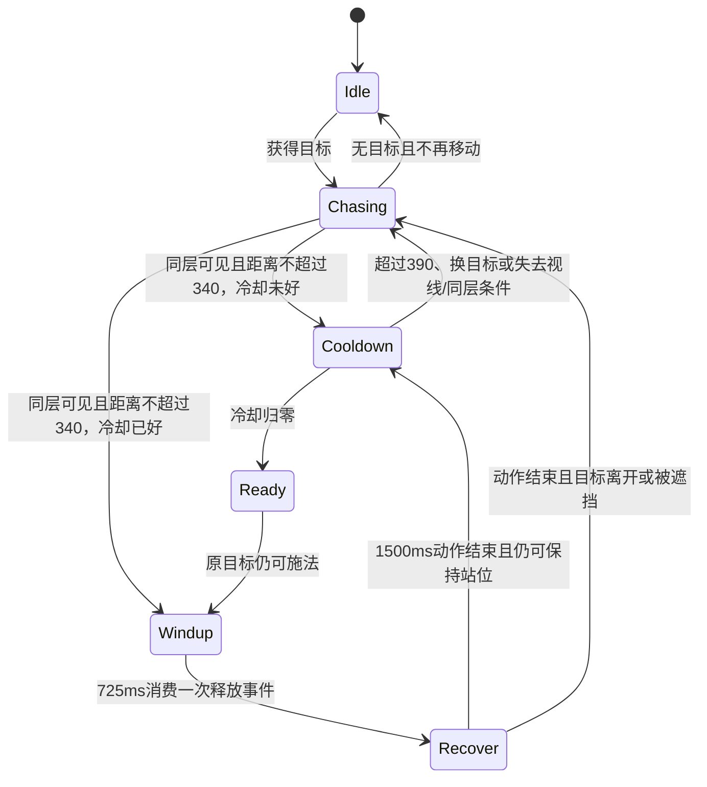

# 蜡面哀祷者：数值与状态机

2026-08-31。用户已认可四动作，本轮完善 `waxfaceMourner` 的远程站位与状态切换。保留豆包四动作、原逐帧时钟、身体高度、脚点和左右镜像，不重生素材。缝面刽子手维持原接入与数值。

## 定位与基础数值

恐怖地牢专属远程精英：以可躲避的固定落点蜡印封路，配合近战精英；无突进、后跳、召唤或追踪弹。贴近后仍停步施法，不新增近战招式。

| 项目 | 配置/基础值 |
|---|---:|
| ID / rank / 成长配置等级 | waxfaceMourner / elite / 6 |
| 生命 / 最大生命 | 560 / 560 |
| 力量 / 敏捷 / 体质 | 12 / 18 / 28 |
| 智力 / 感知 / 幸运 | 46 / 30 / 8 |
| 物攻 / 物防 | 15 / 45 |
| 魔攻 / 魔防 | 38 / 49 |
| 暴击率 / 暴击抵抗 | 10% / 28 |
| 配置移速 | 115 |
| 当前全局怪物移速倍率 | 0.6 |
| 无额外修正的移动速度基准 | 69世界像素/秒 |
| 有效身体高度 | 139.515世界像素 |
| 停步距离 / 重新追击距离 | 340 / 超过390 |
| 出掌允许的最大距离 | 420 |

基础战斗值仍由 `deriveEnemyBaseStats` 和公共公式计算，不另外直写一套。等级6是成长/经验配置等级，不覆盖图鉴的综合战斗等级。地牢成长、增减益、道路、接近目标时的减速和攻频修正仍走现有系统；表内数值不是任意难度下的最终结果。刽子手对照为生命780、配置移速110（同倍率下66），本轮不修改。

## 封蜡诅咒

| 参数 | 基础值与规则 |
|---|---|
| 出生首次冷却 | 900ms，从出生开始推进；不会在每次重新索敌时重置 |
| 施法周期 | 1500ms，播放79帧的原攻击时间表 |
| 释放 | 正式0-based f34，起手后725ms |
| 落点 | 出掌时原目标的脚底位置，之后固定 |
| 预警 / 爆发 | 释放后900ms预警；起手后1625ms爆发一次 |
| 范围 | 地面半径72；画面椭圆X/Y半轴72/36，沿用Collider相交判定 |
| 伤害 | 魔攻×1.4，基础 `round(38×1.4)=53`，再走公共伤害管线 |
| 附加效果 | 实际受伤且存活者减速20%，持续2000ms；重复刷新，不叠层 |
| 击退 / 爆发残留 | 额外击退0 / 350ms纯视觉消散 |
| 冷却 | 4200ms，从起手计；通常收招后还剩2700ms |

冷却继续使用公共攻击间隔时钟，现有攻频修正只改变冷却，不改725ms出掌、900ms预警或动画帧时长。基础伤害53未计地牢成长、暴击、目标防御/格挡和其他增减益。

起手锁定原目标与方向；出掌复查目标存活、同承载面、视线、420射程和背后容差24。目标从340内圈移到390之外但仍在420以内时，当前动作仍按完整释放射程判断，不能误用停步距离取消。判定失败会空施法并保留本次冷却，不临时转打另一目标。

## 状态与转换

| 运行状态 | 动画与行为 |
|---|---|
| `idle` | 无移动时循环待机；感知与出生冷却继续 |
| `chasing` | 沿既有寻路追击/搜索，循环移动；不另设瞬移或位移补偿 |
| `cooldown` / `ready` | 在可施法位置停步，循环待机并面向当前目标；冷却好后起手 |
| `windup` | 攻击前0–725ms，停步并锁定方向、目标；尚未释放可被控制取消 |
| `recover` | 725–1500ms继续播放攻击收招，不重新转向、不重复释放 |
| `controlled` | 眩晕、冻结、石化、冲刺眩晕中断未释放事件并停步；不退还或重置冷却。石化保留当前姿势，状态/DOT与冷却继续更新 |
| `fleeing` | 恐惧取消未释放动作，由既有移动系统逃跑；保留连续移动动画，不逐帧重置 |
| `dying` → `corpse` → `fading` | 死亡3541.667ms → 尸体1000ms → 淡出300ms；沿用一次奖励/掉落入口，随后清理 |

任何存活状态都可被硬控或死亡打断；解除控制后重新判断目标和站位，不恢复旧施法。束缚沿用项目合同：禁止移动，但不额外禁止原地施法。

340/390组成保持距离的滞回区间：停步后只有超过390才重新追击，之后要回到340以内才能再次站定，避免距离边界反复切动画。换目标重新判断内圈，不继承上一目标的站位资格。

控制、恐惧、击退、出生离口与承载面导航保持优先。等待冷却不用 `_frozenForCast`；只有真正施法使用该锁，避免原地等冷却阻止恐惧逃跑。移动系统在感知和承载面导航之后调用本角色的 `shouldHoldCombatPosition()`，其他怪物没有实现该钩子，行为不变。

蜡印有独立的“预警 → 一次爆发 → 消散 → 销毁”生命周期。已释放的蜡印在战斗中继续，即使施法者受控或死亡；切场、结束战斗时取消。爆发再次复查固定落点与目标的墙体/表面条件。减速支持原圣光/圣域净化及到期移除，不改旧50%减速。

## 接线与交付边界

- 角色导出、Boot四纹理族、地牢工厂已接入；`poolWhitelistOnly`保留，只进入现有8处恐怖地牢候选池的精英筛选，不增加波次精英比例。
- 本轮修改 `src/entities/enemy-types/waxface-mourner.js`、`src/systems/movement-system.js` 的可选站位钩子，以及 `data/enemy-config.json` / `public/data/enemy-config.json` 的本角色字段。
- 同步本角色 `install-runtime.py`、`sprite-build-v01/runtime-config.json`、`sprite-build-v01/manifest.json` 与 `SPRITE_DELIVERY.md`，防止后续安装沿用旧参数。未运行安装器、未改正式PNG及动画帧表。
- 仅查看本轮真实差异与必要局部调用链；未运行测试或运行时验证，按约定由用户测试。未构建、未启动/重启游戏、未同步EXE。

用户重点体验：340停步/390追击是否自然，出掌与预警是否一致，出圈/隔墙能否躲避，控制前后是否有残留攻击，恐惧能否逃跑，石化/死亡姿势以及减速到期/净化。仅左右镜像，没有新增独立八方向动画。
