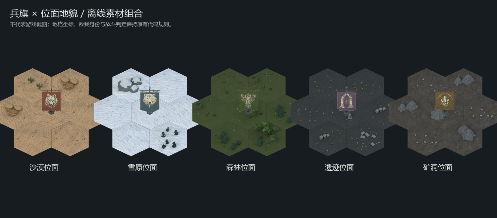

# 世界地图视角与素材投影规范

**Git发布边界**：下文接入状态指本地开发工作区；本次仅归档正式素材/来源与知识库，完整玩法代码受未合入公共协议阻断，详见[发布记录](world-strategy-publication.md)。

适用于 O 键打开的战略六边格世界地图、地图上的地貌/城镇/据点/军团棋子。它是独立的战略表现层，不改变位面内战斗场景、建筑占格、道路投影或碰撞计算。

**当前选择（2026-08-30）**：用户比较后选择V2原版旗面，认为展示更直观、全面。保留55°地图相机与共享光向，但旗布优先完整展示纹章；不再把V3的竖直旗布当作强制标准。正式图集已恢复V2原文件，V3仅保留未选用决策元数据，废案图和模型已清理。

## 固定标准

| 项目 | 统一口径 |
|---|---|
| 投影 | 正交投影；没有近大远小，也没有透视相机的 FOV 参数 |
| 相机俯角 | **55°，从水平 XY 地面向相机视线量起**；相当于偏离竖直俯视 35° |
| 世界坐标 | +X 向右/东，+Y 向北，+Z 竖直向上；这些是战略地图自身坐标 |
| 相机方位 | 在目标的 -Y（南）侧，朝 +Y（北）看；方位角 0° 的基准是 -Y，正向转往 +X |
| 画面滚转 | 0°，地平基准不歪斜；相机无玩家控制的旋转/俯仰 |
| 平移/缩放 | 只平移和等比缩放已烘焙画面；不随滚轮改变相机俯角 |
| 兵旗姿态 | 根朝向0°、旗杆沿+Z；旗布保留V2约16.7°的整体前倾与完整展开，作为已选定的战略辨识姿态 |
| 光照 | 左上柔光 `(-3,-4,7)`，冷色填光 `(4,1,5)`；地貌与地图棋子使用相同灯组口径 |

**55°不是六边格边线在屏幕上的倾角，也不是素材根节点的旋转角。** 当前六边格短斜边的屏幕角度约25.31°。不要把战斗场景的2:1地面斜率26.565°、旧地牢边线30°、道路小物的根朝向44.8°套到这张战略地图上。

相机高度角的数值真源为 `data/world-map-layout.json` 的 `cameraElevationDegrees`。`public/data/world-map-layout.json`是已有布局镜像，当前值均为55；本轮未改布局或重排格子。固定坐标、方位与滚转由 `tools/ai-gen/world-map-camera.py` 和本规范明确。

## 建模与画布共用的投影

`tools/ai-gen/world-map-camera.py` 从上述布局读取俯角，并提供地貌、兵旗共同调用的 `create_camera()`。当前相机相对目标位置为：

```text
camera = target + 12 × (0, -cos55°, sin55°)
```

相机本地 -Z 对准目标，本地 Y 朝屏幕上方；在当前坐标约定下，Blender相机欧拉 X 约35°，Y/Z为0°。不要直接把欧拉 X 写成55°。

对相对目标的三维点 `(X,Y,Z)`，忽略屏幕偏移、采用等比缩放 `s`：

```text
screenX = s × X
screenY = -s × (Y × sin55° + Z × cos55°)
```

地格中心 `X=√3(q+r/2), Y=1.5r, Z=0`，正是 `src/ui/world-map-view.js` 的 `project()`。地面南北方向的投影分量为 `sin55°≈0.819152`；竖直高度为 `cos55°≈0.573576`。这是投影关系，不意味着旗布必须竖直；旗布的形状与朝向可以服务于辨识，而相机、地面与接地点仍保持统一。

地貌使用 `orthoScale=2.6, target=(0,0,0.22)`；兵旗使用 `orthoScale=2.1, target=(0,0,1.20)`。这些只决定画幅和构图，不改变视角。棋子的战略显示尺寸是符号比例，不代表和地貌有相同的真实世界尺寸。

## 兵旗的辨识与匹配规则

V2的 `cloth_y()` 使用 `0.30×(z-2.2)`，使旗布整体向相机倾斜 `atan(0.30)≈16.7°`。这一姿态增大了旗布的屏幕展示面积，便于看清纹章和旗形；相机本身仍是55°。这是用户选定的战略标识取舍，不再作为必须纠正的错误。

V3曾取消这一倾斜，旗布与纹章随之显得更扁。用户比较后选择恢复V2，故本轮直接恢复原PNG及配套帧数据，没有重渲染、拉伸、旋转、镜像或重画旗面。原六种纹章、PBR材质、旗冠、显示尺寸、画幅、脚点均保留。

- **地面统一**：地貌、旗座、竖直旗杆和光向仍使用55°正交相机。当前脚底阵营圈改为`ry=rx×sin55°`，与地图地面投影一致；原圈的`5/13`与`7/18`比例较扁。保留横向半径、颜色和选择反馈，不改变脚点、点击区域、实际军团坐标或同格错开逻辑。
- **旗面清楚**：保留V2的展开幅度、约16.7°前倾、纹章大小和差异化旗形。不要为了更接近竖直物体的投影，再把旗面或纹章压矮。
- **材质协调**：旗杆、铁件和石座已经复用世界地貌材质库。细节层级应保持纹章优先，布纹、缝线、磨损服务于材质感，避免在小图上堆叠高反差噪点；不以整张降亮或去饱和换取统一，避免损失位面区分。这是后续精修边界，本轮没有再次修改这些贴图或材质。
- 地貌与当前V2兵旗的建模脚本通过共享相机函数创建相机。现有原图的数值已经相同，本轮只统一重建入口，没有重渲染地貌或兵旗；后续重建记录完整相机合同与旗面展示姿态。
- V2元数据补充相机基准、方位、滚转、上轴、根朝向和旗布前倾/辨识优先说明。导出时若烘焙俯角与地图布局不一致则拒绝安装；相机保持一致不等于要求所有模型表面朝向一致。
- 名称、身份字标、选中圈等屏幕UI仍正向显示，它们不是三维模型。若以后要显示行军朝向，应在模型阶段旋转根并用同一相机重渲染各方向，不能旋转已经带有光影的PNG来冒充转身。
- 后续城镇/据点若制作三维地图模型，也从本相机入口渲染；不能直接拿战斗场景建筑成品缩小后充当地图模型。本轮未新增这些模型。

当前可编辑源与预览：`tools/ai-gen/_world_army_flags_v2_20260830/README.md`。V1/V3仅保留历史决策元数据，旧导出器已移除；V2重建不依赖旧版本渲染。

## 离线说明与交付边界



本图是已有的离线素材组合，不含本轮脚底圈变化，不是游戏截图或实机测试。未运行测试或运行时验证，按约定由用户测试；需要重点查看游戏中的原版旗面、脚底圈比例及同格点选。本轮只更新开发源码与素材，不发布或替换固定EXE。
