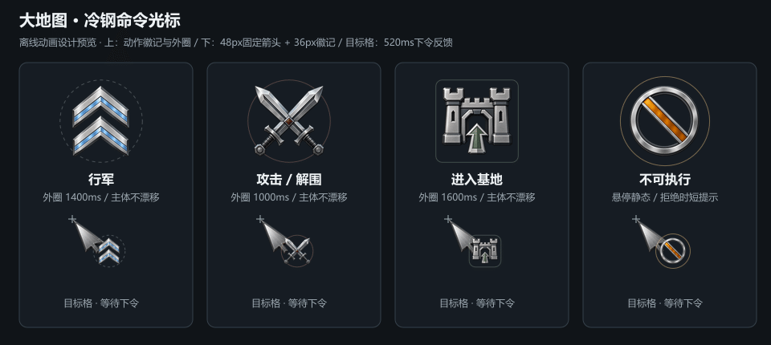

# 大地图操作框架与命令光标

2026-08-31。按用户“帮我处理，特别是光标等美术资产，帮我生成并设计动画”实施首批交互优化。前序移动、寻路与自动入营规则见 [控制与入营方案](world-map-control-and-garrison-plan.md)。本轮接入本地开发源码，未同步固定 EXE。

## 本轮已实施

| 操作 | 表现 |
|---|---|
| 悬停地格、敌军或基地 | 停留80ms后展示情境徽记、地形耗时、预计格数与游戏时间；不可执行时显示禁止徽记和原因 |
| 悬停可下令目标 | 虚线预览候选路线，原命令路线淡化；鼠标移开后恢复，不写入军团命令 |
| 行军中改令、停止 | 当前已开始的路段用白色粗线和端点强调；预估包含其剩余时间，先走完本段再执行后续变化 |
| 左键查看敌军、基地或地格 | 只更换查看目标，当前我军仍以实圈标识；查看敌军用虚圈，底部控制栏保持 |
| 右键普通格 / 敌军 / 敌城与战事 / 己方建设基地 | 沿现有命令分发执行行军、追击、攻占或解围、行军入营，并在目标格短暂显示动作反馈；右键我军兵旗只查看我军 |
| 底部固定指令栏 | 展示当前状态、士兵/伤员/队友数、命令目的地与预计时间、当前路段进度；保留主动作、停止、定位我军、返回出发基地/撤回四个入口 |

“伤员”统计沿现有军团士兵记录的血量比例小于1计数，队友单独计数，没有新增伤兵系统。军团不存在时隐藏固定栏；战斗、切场或战败时沿现有准入禁用命令。查看目标与当前命令目的地分别显示。

预览调用 `previewMapOrder()`，复用 `mapOrder()`、`estimateTravel()` 和原基地准入；最终点击仍由原命令入口重新检查。没有更改地形、行军速度、部队容量、战斗、人口、兵线迁移或存档格式。地图兵旗仍沿现有1.2秒显示刷新，没有为徽记启动全图逐帧循环。

## 光标美术与动画

四张徽记由本轮 Codex 内置 Image Gen 生成，采用银灰冷钢主体，以双箭、交叉剑、基地入口、禁止符号区分动作。色彩只是辅助，形状与文字共同表达含义。

- 每张运行时 PNG 为96×96、真实透明背景；生成源图、精确提示词及裁切参数均保留。
- 原48×48箭头、热点(3,2)与指向/抓取手型不变；在鼠标位置偏移(28,22)处附加36px徽记，靠边时只约束徽记。悬停我军仍用原指向手型，拖动仍用原抓取手型。
- 主体和箭头不摆动、不缩放；仅外圈轻微呼吸：行军1400ms、攻击1000ms、入营1600ms。禁止徽记悬停静止。
- 下令结果在目标格显示44px徽记，外圈扩散、整体淡出，共520ms；拒绝指令使用禁止徽记，原因由文字同时提供。
- 系统开启“减少动态效果”时取消呼吸及扩散，只显示180ms静态命令结果。
- 图像加载失败时仍保留原光标与文字；关闭面板会清理徽记节点、计时器和动画。

该 GIF 是根据本轮素材与共享动画参数制作的离线设计预览，不是游戏录屏；缓动曲线采用离线近似。图像已人工查看，游戏内遮挡、缩放与操作手感仍待用户验收。

## 文件与证据

| 文件 | 职责 |
|---|---|
| `src/world/world-strategy-system.js` | 只读命令预览和现有士兵记录摘要 |
| `src/ui/world-map-view.js` | 统一命中目标、悬停指针回调、虚线路线和控制/查看标识 |
| `src/ui/world-switch-panel.js` | 情境提示、独立控制状态、底部指令栏与反馈接线 |
| `src/ui/world-map-command-feedback.js` | 透明徽记、悬停/下令动画及销毁 |
| `data/world-map-command-feedback.json` | 尺寸、偏移、时长等共享参数 |
| `ui/panel-theme-backpack.css` | 仅大地图范围的布局、主题与减少动态效果样式 |
| `assets/ui/world-map/command-badges/*.png` | 四类运行时徽记，PNG合计61,836字节，基础RGBA约144KiB |
| `tools/ai-gen/world-map-command-badges-20260831/` | 四张生成源图、manifest、导出脚本、静态对照图、GIF、导出记录 |

本轮只查看自身真实差异与必要局部接线。共享主题文件、CHANGELOG及工作区中的并行任务改动保留，未审计、回退或提交。素材导出是本轮请求的资产生产，未运行测试、lint、构建、浏览器探针或游戏。

## 用户重点验收

1. 出征后依次悬停普通地格、敌军、敌城、围城基地、可入营基地和不可达地格，核对符号、文字、路线与右键结果一致。
2. 悬停与左键查看不会改变原行军命令；查看敌军/基地后，我军实圈和底部控制栏仍保留。
3. 行军半途改令与停止，确认白色当前段不倒退、不重置；查看当前命令目的地和所选目标能分清。
4. 右键拖动、拖动后松开、移出画布、失焦或关闭地图不误下令；重复开关地图没有残留徽记。
5. 在实际分辨率与系统缩放下确认36px徽记清楚、不会挡住箭尖，按钮和禁行原因可读；减少动态效果设置下不持续呼吸。
6. 前序自动入营仍需连带验收：抵达有效己方基地后兵旗收起，本体和幸存部队在基地落点附近恢复；加载失败不丢兵、不反复自动切场。

未运行测试或运行时验证，按约定由用户测试。战事事件队列、地图图层、多段路点、外交和更多经营功能没有加入本批。
