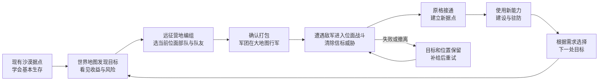

# 世界地图、位面远征与新手流程调整草案

日期：2026-08-30；2026-09-02 按新方向更新。当前已经落地的主线是“仅 F 级起步 → 废弃矿洞初级成功 → 返回主神空间与小鼠大王对话 → 随机永久位面首城（赠送市政厅与首座传送门）→ 世界地图经营与扩张”。地牢使用全局 F-A 与系列初/中/高双门槛；后续传送门受中期科技和资源约束；位面由传送门/市政厅双锚点维持，完全崩塌后只能由移民在旧城址恢复。本文后面保留的“遗迹优先短教学远征”“移除传送科技”等旧提案已被本次决策取代，只作为历史分析，不再是当前实施依据。

## 2026-09-02 当前实现合同

1. 新档只开放 F 级；任意已开放地牢成功后只推进下一个全局等级，同系列仍必须按 `unlockAfter` 依次成功。失败、撤离和放弃不解锁。
2. 废弃矿洞初级首次成功只登记“等待小鼠大王授予”；城址在接受对话时抽取并持久化，首城同时获得市政厅与免费传送门，之后不再赠送。
3. 后续新门需要“位面门工程”和建造费。门毁、厅存时修旧门；厅毁、门存时重建厅；两者全毁才清空该位面。
4. 完全崩塌后，移民队必须到原城址恢复市政厅；恢复动作不赠送传送门，玩家需要另行完成科技并建门。普通移民新城仍只生成市政厅型战略城市，不自动附送传送门。
5. 下一阶段只补任务追踪和新手提示，不再新增一套平行的通关、位面或建造状态。

## 设计结论

让玩家先知道“我需要哪个位面、那里能带来什么”，再在建筑中准备亲征军团。军团清除目标格守军后获得接通资格，玩家利用新据点和现有建筑/兵种能力准备下一次行动。普通地牢作为独立成长玩法保留，已有通关资格继续兼容。

推荐将首次拓荒与重复探索分开：首次拓荒是一项有明确战略结果的远征；重复地牢继续承担装备、资源和战斗成长。第一轮教学使用短远征，不要求玩家先完成一轮常规地牢才理解经营扩张。

后续功能设计都先回答四个问题：玩家为什么现在做这件事？从哪里开始？完成后世界发生什么变化？下一步有什么值得做的选择？

六边格承载军团位置与六邻格路径，只有接敌时物化一处独立战场；地块所有权与城池战争仍未实现。图中箭头表示成长关系，不是额外的地图道路。

## 调整前的流程为什么容易脱节

以下记录第一阶段实施前读取的实现状态，作为调整依据，不是游戏实测。

| 当前行为 | 对玩家理解的影响 | 依据 |
|---|---|---|
| 地牢成功记入通关次数；位面要求读取这些次数；首次构造传送门免费，但仍需另行操作 | 玩家容易只记住“刷完某个本获得资格”，不清楚自己正在开拓哪个目标 | `src/world/world-progression-system.js` 的 `recordDungeonRun/requirementsMetFor/getConstructableWorlds/constructPortal`；`data/world-system.json` |
| 世界面板提供概览、观察、返回、支援和应急重建，没有目标远征入口 | 选战略目标与选地牢是两次独立操作 | `src/ui/world-switch-panel.js`；`src/ui/expedition-system.js` |
| 出征准备按首个可用地牢选默认项，普通准入主要检查前置通关与钥匙；推荐等级不是硬门槛 | 地牢列表顺序在替玩家安排成长路线 | `ExpeditionSystem.open/isDungeonUnlocked/depart` |
| 已读取的任务定义只有“探索时空裂隙”：前往雪原任务实例，调查三处裂隙并撤离 | 没有带玩家完整走过“发现—远征—接通—建设—防守”；任务雪原与永久雪原容易混淆 | `data/quests.json`；`src/ui/quest-system.js`；任务实例隔离合同 |
| `requiredWorldId` 当前检查位面是否具备解锁资格，而非是否已经构造传送门 | 部分科技在通关后即可研究，接通本身的能力反馈不够集中 | `src/world/technology-system.js#isWorldRequirementMet` |
| 普通地牢成功、失败、撤离、放弃均会额外推进入侵周期；F 为完整周期的 10%，C 为 40% | 新手可能尚未理解防守，连续尝试就加快了入侵 | `src/world/dungeon-map-system.js#_recordRunResult`；`src/world/world-invasion-system.js#recordDungeonRun` |

“初级”只表示某个地牢系列内部的第一档，不能当作全游戏的新手难度：

| 对应位面 | 当前首次资格 | 当前评级 / 推荐等级 | 推荐在新流程中的位置 |
|---|---|---|---|
| 沙漠 `scene8` | 开局已有传送门 | 不需通关地牢 | 已有立足点，学习基本经营和防守 |
| 遗迹 `scene11` | `zombieBeginner` | F / 1–10 级 | 推荐的首次开拓目标；已有探险家营地与科技可承接后续反馈 |
| 矿洞 `scene12` | `abandonedMineBeginner` | F / 1–10 级 | 早期可选目标，正式远征仍保留 |
| 林地 `scene10` | `swampBeginner` | E / 10–25 级 | 早中期目标，已有丛林神庙及兵种科技 |
| 雪原 `scene9` | `frozenBeginner` | C / 40–55 级 | 中后期高危目标，不作为新手永久位面开拓任务 |

推荐等级来自 `data/dungeon-config.json#dungeonList`，不是已确认的平衡结果。列表中的节点数量也不是玩家必须依次打完的房间数，不能据此推算时长。

## 首轮体验：用一段完整经历教会核心循环

建议第一章暂名“建立第一条位面通路”。只固定这一段教学顺序，之后允许按原有解锁条件和自己的需要自由选择。

| 阶段 | 玩家实际行动 | 教什么 | 完成后的可见变化 |
|---|---|---|---|
| 1. 找到立足点 | 在主神空间完成移动、装备和基础攻击；利用已有训练目标，再认识已经接通的沙漠据点 | 本体所在世界、生命与基本操作；主神空间与可建设位面的区别 | 一个明确的当前目标，不同时弹出所有系统教程 |
| 2. 看见扩张目的 | 打开世界面板，选择遗迹区域中已发现的信标格 | 这是要开拓的位面；收益、难度和准备条件在哪里看 | 地图选中该格，显示“打通后可建立据点，并接触探险家营地相关能力” |
| 3. 为目标出征 | 从目标详情进入同一套出征准备，检查装备、补给及队友；执行短开拓任务 | 远征目的、战斗、拾取、撤离；普通驻军与正式队友有区别 | 准备页、任务追踪、结算页始终显示同一目标位面 |
| 4. 看见世界变化 | 成功后从结算页返回目标，点击“接通位面” | 地牢行动怎样改变世界；首次接通免费，但接通后需要经营和防守 | 原格由“待打通”变为“已接通”；展示可进入的据点与现有特色建筑/科技 |
| 5. 让据点发挥作用 | 经合法传送进入据点，完成一项基本生产或驻防任务，再使用一项该位面的特色能力 | 建造、资源消耗和驻军；位面收益不是抽象解锁通知 | 实际产生一批资源、一个单位或完成一次对应研究，不能只要求打开面板 |
| 6. 学会防守与离场 | 看懂入侵预告、准备防线，经历一次受控的教学防守；了解观察、返回本体与支援 | 地图中的据点会受到威胁，玩家可管理离场后的世界 | 世界地图上能识别安全、待建设和受威胁的节点 |
| 7. 自主选择 | 根据当前能力，从矿洞等可用目标中选择下一步；林地、雪原展示真实难度与收益 | 做战略选择，而非继续照抄提示 | 教学退居提示层，玩家能自己完成第二次目标选择 |

阶段 1 只教必要操作，不要求先建完一整套经济。阶段 5 的具体建筑、研究与资源数额应引用正式配置，并在实施前核算开局购买、补给、首次建设的总预算；目前没有证据证明现有初始资源足够覆盖这一整段。

遗迹作为首个目标是本提案的推荐，不是当前已经生效的唯一入口。第一章之后不额外增加“必须先打遗迹才能去矿洞”的门槛。

### 短开拓任务与普通地牢必须有真实区别

- 短开拓任务建议包含 2–3 个教学战斗节点、一次简单路线选择和一次明确的锚点目标；这是待制作的配置，不是现有地牢已经具备的流程。
- 优先复用现有 F 级丧尸生态与房间资产，单独配置教学长度、遭遇和收益，不整体压缩常规地牢，也不在正常地牢中途假装通关。
- 教学短任务成功只产生“该目标已稳定”的开拓结果；不能伪造 `zombieBeginner` 普通通关、自动开放中级地牢，或直接套用完整普通本的奖励。
- 正常地牢仍能完成对应首次开拓资格；愿意直接挑战普通本的玩家不必再补一遍教学短任务。老通关记录继续有效。
- 已接通后的目标详情提供“再次探索”，继续走普通地牢等级、钥匙、装备和资源规则；界面明确本次不会再解锁一座位面。
- 本轮不新增“位面碎片”等强制货币，也不恢复已经移除的传送门前置科技。

## 地图上的目标，要贯穿整个行动

### 随机位置在发现时确定

新流程需要将“随机分配入口格”提前到发现信标时。玩家接受远征前就知道自己正在打通哪一格，失败、重试、接通后都保持相同位置。

当前实现使用位面种子、世代和独立随机流计算已接通入口，不持久化发现点；未接通区域没有预先占格。新增发现阶段时必须明确增加权威的目标绑定，不能只在 UI 中临时随机。

- 一次发现绑定目标位面、区域中的有效格、布局版本以及预期位面世代；构造成功认领这处绑定，不能因 `worldEpoch` 从 0 变为 1 又抽一格。
- 旧档已接通/已毁位面按现有算法计算当前位置并补记，不让更新造成地图搬家。
- 被毁时保留断线地标。沿用当前重建进入新世代的规则时，明确提示重建可能重新选址；教学失败与普通撤离不等于重建，不触发换格。
- 初版每个现有位面仍对应一个节点。其它六边格仍可只作地貌，不以假数据冒充未实现的城池、资源点或路线。

### 分开表达“发现进度”和“传送门状态”

对玩家可以显示“信号未明 → 已发现 → 待打通 → 可接通 → 已接通 → 已建立据点”。内部不要将这些文案全部塞进现有传送门生命周期。

`WorldProgressionSystem` 保留 `LOCKED / AVAILABLE / ACTIVE / DESTROYED / REBUILDING`。发现位置和开拓结果属于该系统的战略事实；任务是否完成、奖励是否领取属于 `QuestStore`。据点是否可进入依然由真实传送门状态决定。

### 每个入口只承诺它真正会做的事

| 地图操作 | 行为约定 |
|---|---|
| 追踪目标 | 记录当前目的地并展示收益、危险、条件，不移动角色 |
| 准备远征 | 绑定目标进入现有准备流程；必须满足合法出征地点及本体状态要求 |
| 接通位面 | 调用统一的首次构造逻辑，保留费用、快照、保护期和重复点击处理；不只改变地图颜色 |
| 观察位面 | 切换观察与指挥视角，不让本体瞬移，不消耗或转移远征队伍 |
| 前往位面 | 使用真实传送流程与已有随行限制；条件不足时引导去传送入口 |
| 支援 / 返回本体 | 沿用现有入侵、本体和地牢隔离契约，不能当作任何位置都能免费出征的旁路 |

世界面板成为选目标和查看反馈的主入口；NPC 与祭坛可以继续承担剧情和现场入口，但必须调用同一套目标与准备逻辑。

## 新手引导的呈现与失败处理

### 按目的提示，不逐个介绍按钮

只同时追踪一个主要目标，并给出一个可直接执行的下一步。例如：“遗迹信标仍不稳定。前往准备远征，成功后可在此建立据点。”高亮实际入口，不让玩家在任务档案、NPC、地牢列表和传送门详情间猜路线。

完成条件以真实事件或持久状态为准：完成一次生产，而不是点击生产按钮；接通目标，而不是打开传送门面板。对已经提前完成的建设/通关进行补认，不要求拆掉重建。提示可关闭、稍后继续；关闭提示不等于任务完成。

面板首次只讲当前需要的信息。普通地牢准备页始终显著显示 F–A 评级、推荐等级、钥匙消耗、目标位面、当前防守风险；“初级/中级/高级”仅作为系列内层级。推荐等级继续是提示，不在这一版偷偷变成强制等级锁。

### 失败后必须清楚还能做什么

| 情况 | 推荐处理 |
|---|---|
| 短教学远征失败/撤离 | 信标原位保留，解释失败原因，提供补给后重试；不消耗普通地牢钥匙，不额外增加地牢入侵推进量 |
| 重复教学任务 | 不重复发放可积累的金钱、装备或建设补助；必要训练用品采用受限补给，不能出售套利 |
| 普通地牢失败/撤离 | 保留现有消耗与损失规则，出征前明确显示影响；不因为打开了教学提示就自动减免 |
| 缺少出征或建设资源 | 告诉玩家具体缺什么、从哪个现有渠道获得；核算后仍无法继续的教学步骤必须有一次性、记账的补助，不能依赖碰运气掉落 |
| 教学中关闭面板或退出读档 | 从已完成的真实步骤继续，不重发奖励、不重抽目标格 |
| 直接挑战正常地牢 | 合法成功记录仍能授予原有资格并补认相应教学目标，不强制倒回短任务 |
| 不想看教学 | 可关闭提示；不能借此伪造战斗胜利。老档无需强制重跑第一章 |
| 传送门被毁 | 按原规则保留通关/全局成长并清理该世代世界资产，显示断线与重建代价；不能把所有成长进度一起清零 |

### 入侵教学需要有边界的保护

当前传送门已有配置化保护期，不能假设新增教学天然安全，也不能让世界面板永久暂停所有位面。

建议短教学远征不额外推进入侵进度，但全局自然时间仍按原规则流逝。首个教学防守可配置较低威胁与清楚的预警，仍交给现有单场入侵管理器执行。教学保护必须有有限的游戏时间上限；达到准备条件或保护到期都能恢复正常规则，不能靠不点“完成教学”无限免战生产。

保护时长、首波强度以及保护期内能获得的经济收益属于实施前需要一起确定的平衡表，不在本草案冒充已经验证的数值。正常地牢和老存档入侵不得无提示减速、清零或改写正在进行的波次。

## 让每个位面的收益和主线接得上

首次接通的结果页应同时展示：新据点在哪里、已有配置会生成什么、哪些科技变得有意义、现在可以做哪件事。正式配置中没有的独特资源或兵种不提前写成既有收益。

遗迹已有 `explorer_camp` 特色建筑与探险团科技，林地已有 `jungle_temple` 及后续兵种科技，可以先围绕这些真实能力安排“接通后的第一件事”。矿洞的专属经济优势需要另行设计并落地，当前不把“矿洞”美术主题当成产量加成。雪原科技有现成线路，但不把它的 C 级入口包装成早期新手内容。

推荐新增流程将“首次接通过该位面”作为新获得对应科技研究资格的节点，形成“开拓—接通—学习当地能力”的关系；这会改变当前仅看通关资格的规则，属于待实施的实质调整。已研究科技、已获得单位权限及旧档已有资格都应保留；传送门之后被毁也不抹掉已经学会的知识。实际部署建筑仍遵循地点、费用与建造条件。

现有“探索时空裂隙”建议保留为独立调查任务，并明确标记“临时调查区域，不等于永久接通雪原”。新第一章由新的任务定义承担，不直接覆盖该任务的 ID、进行中会话或已领奖状态。其新玩家推荐位置后移，避免同时把永久雪原和临时雪原当作同一条解锁主线。

## 落地边界与实施顺序

优先做通一段可玩的完整循环，再增加远征种类和大战略内容。下表第一阶段已完成代码接线（未运行时验证），其余阶段继续登记 TODO。

| 顺序 | 交付结果 | 主要涉及文件/模块 | 不能破坏的边界 |
|---|---|---|---|
| 1. 打通目标链 | 地图发现并固定落格 → 带目标进入普通远征准备 → 成功返回原格 → 首次接通及收益反馈 | `world-progression-system.js`、`world-map-view.js`、`world-switch-panel.js`、`expedition-system.js`、`dungeon-map-system.js`；对应配置与存档入口 | 旧通关有效；普通钥匙、队伍、加载和传送规则有效；先不改常规地牢数值 |
| 2. 完成第一章 | 加入短开拓任务、真实任务目标、一次性补给、接通后建设/驻防引导及有限保护 | `data/public` 的任务与地牢配置镜像；`QuestRegistry/QuestStore`；任务/结算 UI；既有生产与入侵系统的事件接口 | 教学胜利不冒充普通通关；奖励不重复；不产生无限保护或资源循环 |
| 3. 扩展成长路线 | 衔接矿洞、林地、雪原的用途和科技提示；整理旧裂隙任务推荐时机 | 世界、科技、任务配置及目标详情 | 不移除旧档能力；不增加多余的强制货币或传送门研发门槛 |
| 后续战略阶段 | 城池、军团路线与独立战事调度 | 另行设计的战略数据及战争调度层 | 不在本次新手流程中顺便复制 `state.active`、新增常驻战场或假造行军功能 |

### 实施所需的最小状态与接口

1. 发现与开拓结果写入 `WorldProgressionSystem`，任务进度和奖励写入 `QuestStore`；面板只订阅和展示。现有任务活动会话偏向裂隙玩法，新增生产/接通/防守目标需要真实事件适配，不能只加任务 JSON 就宣称可运行。
2. 发起远征时明确绑定目标位面、格子、预期世代、远征目的和本次运行标识。运行结果只认发起时的绑定，不读取结算时可能已经切换的 UI 选中项；结算命令重复到达不得重复领奖或构造。
3. 新增短任务开拓资格与旧 `completedDungeons` 分开记录，但最终由同一资格查询和构造入口消费。普通地牢既有成功记录继续开放原位面；短任务不意外开放中高级刷本。
4. `ExpeditionSystem.depart()` 有独立的实体清理、友军暂存和地牢初始化流程，不只调用 `SceneManager.switchScene()`。新地图入口必须接通合法准备链，不能从观察位面或正在进行的地牢直接调用 `depart()`。
5. 接通仍完成基础快照、世代与保护期初始化。同步更新旧传送门建筑入口和新地图入口，禁止两套资格或收费判断。
6. 旧档按已发生的事实补认：已通关保留资格、已接通保留位置、已研究保留拥有权、正在进行的地牢/裂隙任务继续旧结算。缺失新教学字段不应把成熟存档判成刚开局。
7. 配置改动保持 `data/` 与 `public/data/` 镜像。奖励、费用、教学时长与门槛不硬编码在地图或任务按钮中。

这些改动主要增加少量持久状态和事件响应，设计上不需要为每个六边格启动模拟，不需要多场实时战斗。性能影响尚未测量，不能在此承诺具体内存或帧率；避免逐帧扫描所有任务、全位面快照和地图格即可保持实现范围可控。

## 后续交付时由用户重点体验

- 第一次出征前，能否说清“我打的是哪一格、为什么去、成功能获得什么”。
- 成功后是否在同一格看到变化，并能直接找到接通和进入据点的下一步。
- 失败后是否有清楚、可负担的重试路径，且不会莫名加快教学入侵。
- 第一处据点能否在当前初始经济下完成必要建设，实际使用一次新能力。
- 第二次目标选择能否脱离箭头独立完成，并看懂不同地牢的真实难度。
- 读档、关闭提示、提前完成步骤、已有通关/科技、传送门被毁与重建时是否延续原有权益和状态。

草案之后已按用户授权实现第一阶段，尚未制作教学短本或调整常规地牢、科技、奖励和入侵数值。未运行测试、构建、浏览器/游戏、截图或性能验证；实际流程与数值效果按约定由用户测试。
