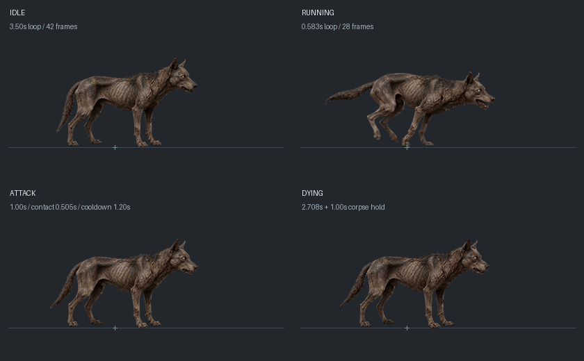
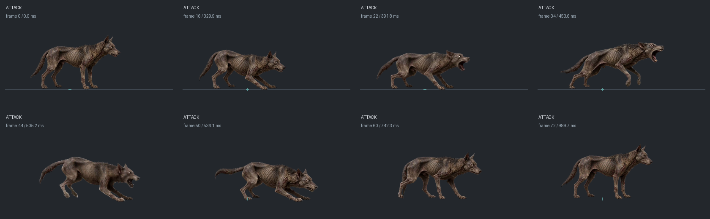

# 僵尸犬 v3 动画接入与普攻调整（2026-08-31）

后续大小/位移/命中专项检查见[2026-08-31对齐记录](../docs/zombie-dog-v3-scale-hit-alignment-2026-08-31.md)。已补修石化锚点和纹理修复后的缩放重算，接触判定按当前脚点重锚；横向咬合已标定，但正上/正下方向素材尚缺，不能将本文横向98px标定理解为全方向逐像素吻合。

已把用户确认的 v04 母图和四段豆包视频制成透明精灵图，接入开发端的僵尸犬。苍蝇群、黑狼、红狼王及其他怪物没有改动；旧 v2 贴图保留。

以下是按配置时钟制作的素材预览，不是游戏运行截图。未运行测试或运行时验证，按约定由用户测试；未构建、启动游戏或同步 EXE。

## 动作与来源

| 动作 | 有效帧数 | 播放设置 | GIF | 原始视频 | 正式精灵图 |
| --- | ---: | --- | --- | --- | --- |
| 待机 | 42 | 12fps，3.50秒循环 | [待机](../tools/ai-gen/_horror_flyswarm_zombie_dog_20260831/animations-v04-doubao-20260831/sprite-production-v01/previews/runtime-speed/zombie-dog-idle-runtime.gif) | [MP4](../tools/ai-gen/_horror_flyswarm_zombie_dog_20260831/animations-v04-doubao-20260831/videos/zombie-dog-idle-doubao-v01.mp4) | [PNG](../assets/enemies/zombie_dog/v3/idle.png) |
| 奔跑 | 28 | 48fps，约0.583秒循环 | [奔跑](../tools/ai-gen/_horror_flyswarm_zombie_dog_20260831/animations-v04-doubao-20260831/sprite-production-v01/previews/runtime-speed/zombie-dog-running-runtime.gif) | [MP4](../tools/ai-gen/_horror_flyswarm_zombie_dog_20260831/animations-v04-doubao-20260831/videos/zombie-dog-running-doubao-v01.mp4) | [PNG](../assets/enemies/zombie_dog/v3/running.png) |
| 慢移 | 复用28帧 | 同一奔跑纹理以24fps播放，不重复加载 | [慢移](../tools/ai-gen/_horror_flyswarm_zombie_dog_20260831/animations-v04-doubao-20260831/sprite-production-v01/previews/runtime-speed/zombie-dog-walk-runtime.gif) | 共用奔跑来源 | 共用奔跑PNG |
| 攻击 | 73 | 1秒，逐帧时长，单次播放 | [扑咬](../tools/ai-gen/_horror_flyswarm_zombie_dog_20260831/animations-v04-doubao-20260831/sprite-production-v01/previews/runtime-speed/zombie-dog-attack-runtime.gif) | [MP4](../tools/ai-gen/_horror_flyswarm_zombie_dog_20260831/animations-v04-doubao-20260831/videos/zombie-dog-attack-doubao-v01.mp4) | [PNG](../assets/enemies/zombie_dog/v3/attacking.png) |
| 死亡 | 65 | 约2.708秒，随后保尸1秒 | [死亡](../tools/ai-gen/_horror_flyswarm_zombie_dog_20260831/animations-v04-doubao-20260831/sprite-production-v01/previews/runtime-speed/zombie-dog-dying-runtime.gif) | [MP4](../tools/ai-gen/_horror_flyswarm_zombie_dog_20260831/animations-v04-doubao-20260831/videos/zombie-dog-dying-doubao-v01.mp4) | [PNG](../assets/enemies/zombie_dog/v3/dying.png) |

待机取源帧[24,108)，奔跑取[39,53)完整步态；没有把起跑前、跑完后的站立段塞进循环。攻击取源帧12—108，扑咬快速段48—64保留全部原始帧，其余每4帧取关键帧，再进行 RIFE v4.6 2倍插帧。死亡取0—62的动作过程，末关键帧使用真正的视频末帧120，避免多存一段静止尸体。

四动作共用源图固定缩放及脚点(601.5,605)，不逐帧缩放、拉直或重心归零。新参考格256、spriteSize151，基准有效身高约76.4世界像素，与旧资源对齐。使用动作级紧凑裁框及 anchorX，保留腾空和扑咬的原始轨迹，场景只镜像对应固定锚点。

所有插帧均来自透明原始关键帧；原始关键帧保留在成品偶数帧。禁止把第一版插帧结果再次送入RIFE。待机原始关键帧21张，奔跑14张，攻击37张，死亡33张。

四张实际加载纹理合计 **31.648 MiB RGBA**，低于 crowd 32MiB目标；最大边2250像素。包括网格空格在内计费，walk/run共用同一 texture key。PNG文件体积不作为显存体积。

## 攻击节奏

依据同期逐怪战斗调整、普通攻击提速记录及普通近战共享时间轴接入；前两份内部记录尚未随本批归档，本文只引用其结论，不建立失效链接。

| 参数 | 原值 | 新值 |
| --- | ---: | ---: |
| AI决策间隔 | 1500ms | 100ms |
| 普攻起手冷却 | 1500ms | 1200ms |
| 动画/逻辑总时长 | 旧17帧动画700ms | 新73帧动画1000ms |
| 标定接触时刻 | 旧第8帧，约329ms | 新第44帧，约505ms |
| 起手范围 | 92px | 98px |
| 命中范围 | 82px | 98px |
| 前向判定宽度 | 24px | 24px |

新攻击从所选源视频约4.04秒压缩到1秒，约4倍速；不是声称比旧700ms动画更短。起手冷却缩短20%，同时消除动作结束后的长AI等待。实际连击间隔仍取决于目标距离、冷却、受控状态和寻路，不保证每1.2秒必定命中。

源视频第61帧开始落地咬合，对应最终第44帧；有效窗口44—48帧，约505—531ms。画面、接触回调与伤害共用 basicMelee 逐帧时钟，保留跨帧窗口判定，避免掉帧漏结算或按另一套等速帧号提前扣血。精英变体的250ms预警与动作蓄力重叠，普通怪没有额外串行预警。

## 距离与状态边界

新母图咬合帧嘴尖相对固定脚点前伸约98.39世界像素，据此把 approachReach、impactReach、attackRange、attackDistance、attack.range及dynamicRange统一到98px，取消旧92/82px不一致。判定宽度保持24px，没有额外扩大侧面伤害。

继续复用共享近战判定：按目标脚下占地求接近与命中；攻击开始锁定目标/方向，接触窗口复查当前目标位置；保留同层、视线遮挡、控制打断和弹反链。目标可以离开范围躲开攻击，不添加自动追踪、第二段世界位移或额外伤害。

慢移/奔跑保持原状态滞后与最短保持时间，避免临界速度频繁重启动画。紧凑裁框对应的脚点偏移在状态变化时提前更新，避免场景先定位、后换偏移造成首帧上下跳。攻击按共享普攻时钟手动选帧；死亡按死亡计时选帧，计时归零后固定末帧，再交由既有保尸/清理链。

HP、伤害、移动速度250、碰撞半径40、碰撞及投射物受击尺寸、击退5、致残减速50%/3秒均保持。新死亡动作保留原素材完整倒地过程，因此播放时长从1.8秒调整到约2.708秒，保尸仍为1秒。

## 本轮涉及文件

- [敌人类](../src/entities/enemy-types.js)：仅 ZombieDogEnemy 的动画时钟、固定脚点、纹理键及兜底时长。
- [实体自管入口](../src/entities/enemy.js)与[集中式战斗入口](../src/systems/combat-system.js)：在两条既有近战时间线推进路径中调用同一个可选视觉时钟钩子。
- [资源注册](../src/phaser/scenes/BootScene.js)：四张v3纹理、五个播放状态、精确endFrame/逐帧时长。
- [开发配置](../data/enemy-config.json)与[公开配置](../public/data/enemy-config.json)：仅 zombieDog 节点。
- [正式资源清单](../assets/enemies/zombie_dog/v3/manifest.json)：来源、裁框、时钟、帧映射、显存预算。
- [制作脚本](../tools/ai-gen/_horror_flyswarm_zombie_dog_20260831/animations-v04-doubao-20260831/sprite-production-v01/build-sprites.py)、[接入脚本](../tools/ai-gen/_horror_flyswarm_zombie_dog_20260831/animations-v04-doubao-20260831/sprite-production-v01/integrate-sprites.py)及来源/关键帧/RIFE/运行速度预览留档。
- 本记录；本次补归档未另改 CHANGELOG.md。

已查看本轮实际差异和必要接线，没有修改共享近战解析器或其他怪物。待用户重点体验：奔跑循环接缝、左右翻转和切动作脚点、近身扑咬时机、退开/隔墙时是否落空、受控打断和死亡末帧。GIF以50fps从实际配置时钟采样，单循环最多10ms取整误差；四格总览为4.2秒展示片，死亡最后一帧延长展示，不代表额外游戏保尸时长。
