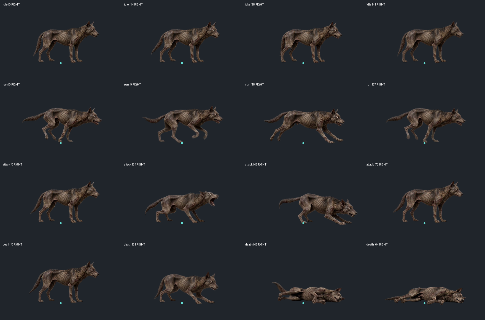
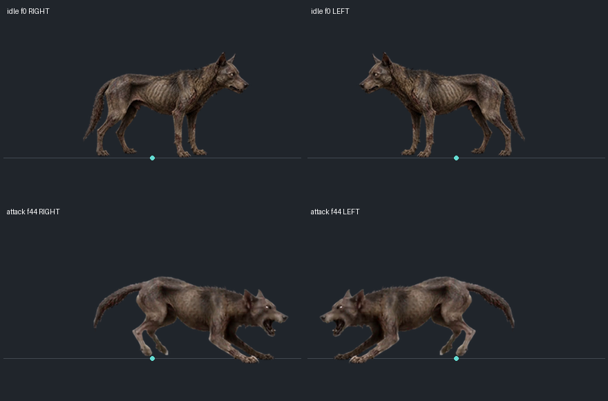
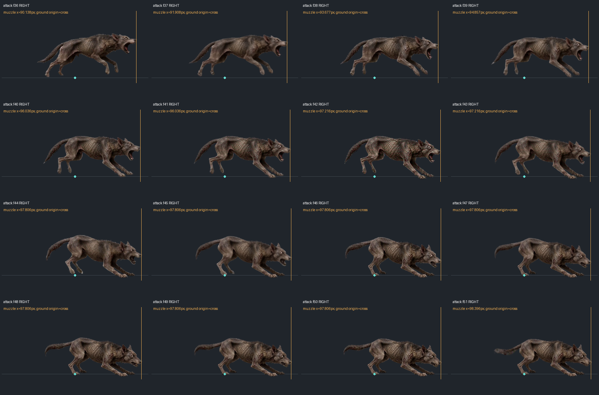

# 僵尸犬 v3：大小、锚点与咬合对齐检查（2026-08-31）

本轮仅检查僵尸犬，修正其渲染/判定接线；没有重新生成或修改四张正式PNG，也没有重排用户确认的动作轨迹。证据来自正式PNG像素、配置和必要调用链，不是实机测试。

**结论有边界：横向扑咬的距离和时刻已按贴图标定；现有素材只有左右镜像，没有正上、正下方向的扑咬，因此不能宣称全方向逐像素贴合。**

## 尺寸与固定锚点

共读取待机42、奔跑28、攻击73、死亡65帧，合计208个有效帧；慢移共用奔跑的28帧。各动作世界像素比例均为 **scaleX = scaleY = 151/256 = 0.58984375**，不随动作或帧号变化。不同帧格的displaySize不同，是透明裁框大小不同，不是主体放大。

| 动作 | 单帧格 | 世界显示帧格 | 裁框还原后的固定锚点 | 最小透明安全边 |
| --- | --- | --- | --- | ---: |
| 待机 | 233×143 | 137.43×84.35 | (161.1832,162.1736) | 4px |
| 奔跑/慢移 | 266×130 | 156.90×76.68 | 同上 | 4px |
| 攻击 | 298×150 | 175.77×88.48 | 同上 | 4px |
| 死亡 | 266×149 | 156.90×87.89 | 同上 | 4px |

还原裁框后，四动作锚点相对待机的横向/纵向偏移均为0。源视频中立站姿Alpha高度分别为483、483、484、487源像素，最大差异约0.83%；不使用动作伸腿、低头或倒地后的Alpha外框逐帧缩放身体。自然腾空、前扑和倒地保留。

## 找到并修复的接线问题

- **石化锚点遗漏**：GameScene每帧先将精灵放回实体脚点，石化分支随后跳过普通frameAnchorX接线。僵尸犬没有冻结姿态锚点钩子，待机可能横跳约7.85世界像素，攻击可能横跳约15.82世界像素。新增 _syncPetrifiedBodyAnchor，读取实际冻结纹理/实际scale/flip，同时补回横向锚点与纵向脚线，不切换冻结帧。
- **纹理修复后可能保留上一格的缩放**：RuntimeAssetManager修复坏帧时可能先切纹理，后续“纹理键发生变化”的判断不再进入重算尺寸。僵尸犬启用现有 dynamicSpriteSize 接线，每帧按当前动作格恢复同一像素比例；没有修改公共资产管理器。
- **左右朝向的真源不一致**：原先按target.x选左右，命中则按目标Collider和攻击快照计算。现在优先使用本次锁定的worldAngle选左右，纯纵向保留上一水平朝向；攻击途中不追踪转向。
- **攻击者被推移后的旧位置判定**：僵尸犬启用已有 rebaseOnImpact，接触时把判定框移到攻击者当前脚点，方向仍使用起手快照。不添加新突进，也不改变角色位置；保留控制打断、目标离开/隔墙落空和单次命中。

## 咬合时刻与范围

逐帧查看最终攻击36—51帧。44帧开始落地闭合，46—48帧继续收颚；有效窗口44—48帧对应 **505.154640—530.927835ms**。动画选帧和命中推进器读取同一frameDurations，总时长仍为1000ms。

在正式精灵图上，以Alpha>128且排除地面爪部区域测量，44—48帧嘴尖均前伸 **97.806003世界像素**。现有前伸98px相差约 **0.194px**，因此保持98px，不重新扩大范围或挪动咬合时刻。此前98.39px数字来自原分辨率源图边缘，本轮以实际运行贴图为准。

判定仍使用源脚点发出的有向地面矩形及目标footprint，宽度24，地面Y透视系数0.5；这不是屏幕上从鼻尖到目标贴图边缘的二维矩形。保持同层、遮挡、锁定目标/方向和累计dt跨窗口逻辑。没有运行长帧、隔墙、贴脸等游戏场景，不能把源码确认当作这些场景已实测通过。

## 方向素材缺口

现有贴图只支持朝右及水平镜像朝左。普通近战快照则支持完整二维目标方向；例如目标正上方时，逻辑攻击框朝上，而画面仍是左右扑咬。上轮横向鼻尖标定不能覆盖这个问题。

本轮没有把整只犬旋转、纵向压扁，或把伤害改成360度来掩盖差异。要满足正上、正下也有严格的嘴部接触，需要补充对应方向素材及方向选择接线。该项尚未完成，不能标为“全方向动画和判定完全契合”。

## 文件与验证边界

- [ZombieDogEnemy](../src/entities/enemy-types.js)：冻结锚点、锁定朝向、纹理恢复尺寸重算。
- [开发配置](../data/enemy-config.json)、[公开配置](../public/data/enemy-config.json)：仅增加zombieDog.basicMelee.timeline.rebaseOnImpact。
- [制作接入脚本](../tools/ai-gen/_horror_flyswarm_zombie_dog_20260831/animations-v04-doubao-20260831/sprite-production-v01/integrate-sprites.py)、[正式manifest](../assets/enemies/zombie_dog/v3/manifest.json)、制作integration.json：同步重锚配置，防止重跑丢失。
- [像素测量数据](../tools/ai-gen/_horror_flyswarm_zombie_dog_20260831/animations-v04-doubao-20260831/sprite-production-v01/inspection-20260831/artwork-measurements.json)及[素材联系图制作脚本](../tools/ai-gen/_horror_flyswarm_zombie_dog_20260831/animations-v04-doubao-20260831/sprite-production-v01/inspection-20260831/measure-artwork.py)。
- [原视频/正式精灵图/实际时钟GIF](../docs/zombie-dog-v3-animation-integration-2026-08-31.md)：PNG与动画时钟本轮没有改变。

已查看本轮真实差异及必要调用链。**未运行测试或运行时验证，按约定由用户测试。** 未启动游戏、浏览器探针、构建或同步EXE。待实机重点确认左右切换、石化/解除、资源卸载后重返画面、受推移期间的咬合和退开/隔墙落空。
