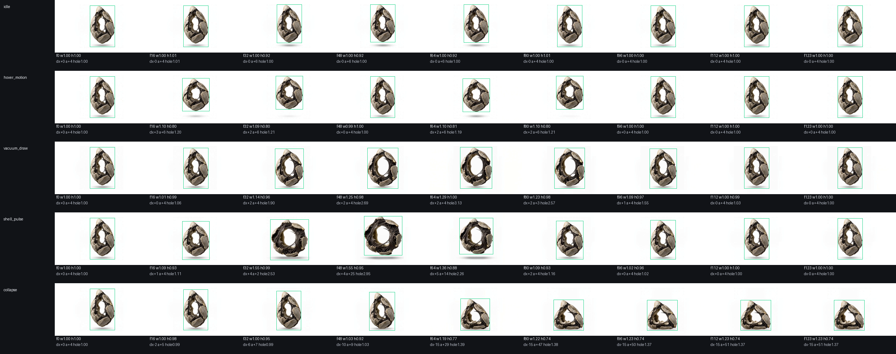
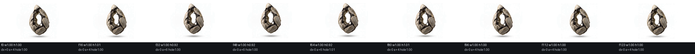
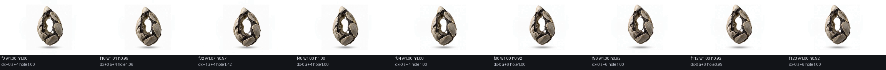

# 空腔之卵朝向、大小与模型形变复查

原始H3候选和调整版均逐帧解码全部124帧。白底前景包围框排除地面阴影；数值判断再用原尺寸异常关键帧和24点联系图人工确认。正式源片未被覆盖；判退视频在最终接入后删除，提示词、供应方JSON、统计数据和判退原因继续保留。

| 首轮动作 | 朝向与根点 | 大小变化 | 模型/空洞 | 结论 |
|---|---|---|---|---|
| 待机 | 主轴3.75°～5.62°；水平漂移≤0.6px | 宽度-0.4%；高度最低91.59% | 孔洞99.97%～100.66%，壳片连续 | 可用；有轻微纵向收缩 |
| 悬浮移动v01 | 主轴3.51°～6.23°；水平漂移≤2.7px | 宽度最高110.74%；高度最低79.20% | 孔洞保持，但出现明显俯仰压扁 | 判退 |
| 空腔牵引v02 | 主轴3.45°～4.18°；水平漂移≤2.1px | 宽度最高129.26%；高度最低96.46% | 孔洞扩大至312.82%，壳片沿横向开合 | 可用；属于设计形变 |
| 壳震脉冲v01 | 主轴最高偏到27.74°；水平漂移≤5.5px | 宽度165.56%；面积164.82%；高度最低74.50% | 第27帧孔洞归零，峰值由竖卵变成横向圆环 | 判退 |
| 失能坍塌 | 落地主轴偏转50.73°；末姿左移约15px | 宽度122.96%；高度73.67%；面积最低92.70% | 孔洞最低98.52%，壳片与终姿稳定 | 可用；变化属于单向倒地 |

## 重抽与调整结果

悬浮移动H3 v02虽锁定刚性位移，仍在第68帧压矮至77.61%，第52帧增宽至113.70%，竖直卵体变成圆团，因此继续判退。为避免重复生成同类形变，最终两条动作改从已通过的H3源帧做结构安全调整。

### 悬浮移动 adjusted v03

- 来源：待机H3 v01全部124帧。
- 操作：整帧整数垂直位移0至-8px；没有缩放、旋转、插值或生成重绘。
- 结果：宽度全程100%；高度91.59%至101.33%只继承已通过待机的自然收缩；水平中心漂移≤0.5px；主轴3.73°至5.63°；孔洞99.94%至100.69%。
- 结论：可用。新增移动没有产生朝向、大小或拓扑形变。

### 壳震脉冲 adjusted v02

- 来源：空腔牵引H3 v02第0至28帧沿原轨迹开壳，再精确反放第27至0帧恢复，随后接待机H3第1至67帧。
- 结果：峰值宽度111.11%、面积104.90%；主轴3.81°至5.62°；中央孔全程不低于99.48%，峰值扩大至168.06%，未封孔。
- 接点：第28帧峰值，第56帧恢复；第56至57帧接入待机的全画布MAE为1.905，低于全片相邻帧最大2.451，联系图未见跳变。
- 结论：可用。保留自然壳片开合轨迹，没有横环、镜头推近或模型换形。

## 最终判定

- 已进入正式图集和运行时：待机、悬浮移动adjusted v03、空腔牵引v02、壳震脉冲adjusted v02、失能坍塌。
- 不得进入精灵图制作：牵引v01、移动v01/v02、壳震v01；对应视频已按清理清单删除，审查数据和拒绝原因保留。
- 正式图集与状态机已经接入，但没有启动游戏或进行运行时验证。
