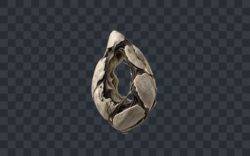
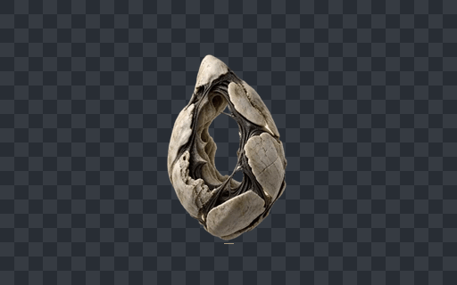
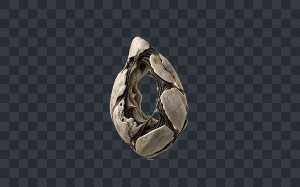

# 空腔之卵五动作透明预览

五动作已完成截段、BiRefNet透明处理、按动作需要执行2×RIFE并接入游戏。全部使用固定源比例0.5、共同中心根点和原动作时钟；没有拉直悬浮轨迹。完整数据见[朝向/大小/形变报告](audit/report.md)与[精灵图清单](sprite-production-v01/sprite-manifest.json)。

## 待机 · 62帧

[透明图集](sprite-production-v01/final/idle.png) · [正式源片](videos/hollow-ovum-idle-v01.mp4)

## 悬浮移动 · 62帧

[透明图集](sprite-production-v01/final/walk.png) · [结构安全派生源片](videos/hollow-ovum-hover-motion-adjusted-v03.mp4) · [派生记录](videos/structure-safe-derived-videos.json)

移动源片只在获准待机帧上做0至-8px整帧整数垂直位移，没有缩放、旋转、插值或重绘。

## 真空汲引 · 83帧

[透明图集](sprite-production-v01/final/vacuum.png) · [正式源片](videos/hollow-ovum-vacuum-draw-v02.mp4)

## 壳脉冲 · 61帧

[透明图集](sprite-production-v01/final/pulse.png) · [结构安全派生源片](videos/hollow-ovum-shell-pulse-adjusted-v02.mp4) · [派生记录](videos/structure-safe-derived-videos.json)

壳脉冲取牵引v02的0至28帧开壳，再沿原轨迹精确反放恢复并接待机，没有几何形变或生成重绘。

## 失能坍塌 · 83帧

[透明图集](sprite-production-v01/final/death.png) · [正式源片](videos/hollow-ovum-collapse-v01.mp4)

## 清理与验证边界

移动v01/v02、牵引v01和壳震v01共四条判退视频，以及逐帧缓存和重复原视频预览已删除；提示词、供应方JSON、逐帧统计、调整来源和判退原因继续保留。逐文件记录见[清理清单](../cleanup-manifest-20260901.json)。

正式图集0空帧、0触边、0透明区脏RGB，原关键帧位于偶数帧并逐帧保留。未运行测试、构建、浏览器或游戏运行时验证，按约定由用户测试。
