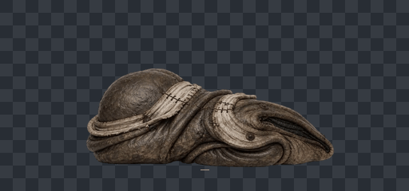
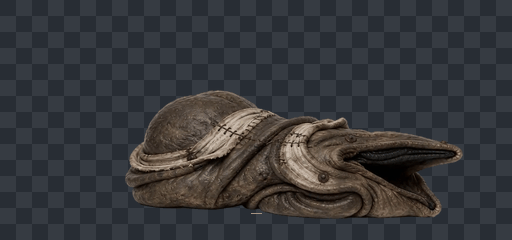
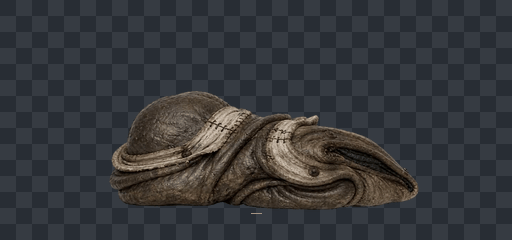
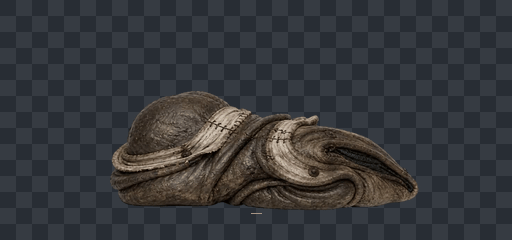

# 百褶噬团透明动画预览

四动作已于2026-09-01按用户请求接入游戏，尚未实机验收。全部使用同一缩放和根点；棋盘格及黄色短线只是离线预览背景/根点标记，不在PNG素材内。攻击采用已认可v04，保持原片节拍，命中在第26帧/1625ms。总RGBA解码58.22MiB；未运行测试或运行时验证，按约定由用户测试。

## 待机 · 60帧 / 3.75秒

[透明图集](final/idle.png) · [原片](../videos/idle-v01.mp4)

## 蠕行 · 52帧 / 约2.167秒

[透明图集](final/crawling.png) · [原片](../videos/crawling-v01.mp4)

保留原片前端张合。循环接缝仍需重点看，未逐帧挪动或缩放来掩盖源片姿态差异。

## 攻击v04 · 81帧 / 约5.042秒

[透明图集](final/attack.png) · [原片](../videos/attack-v04.mp4)

保留已认可的闭合推压和完整复位，没有自动套用1.5秒攻击；个别源帧轻微色边保留。单次GIF播完停在末帧，重新打开可重播。

## 收拢 · 81帧 / 约5.042秒

[透明图集](final/dying.png) · [原片](../videos/dying-v02-fold-settle.mp4)

保持原片自然降低和末尾完整造型，幅度仍偏轻，不拉伸恢复高度。

[制作说明、尺寸和预算](README.md) · [最终清单](sprite-manifest.json)

未运行测试或运行时验证，按约定由用户测试。图集、世界体型、碰撞和伤害时机已接入，仍需实机验收。
