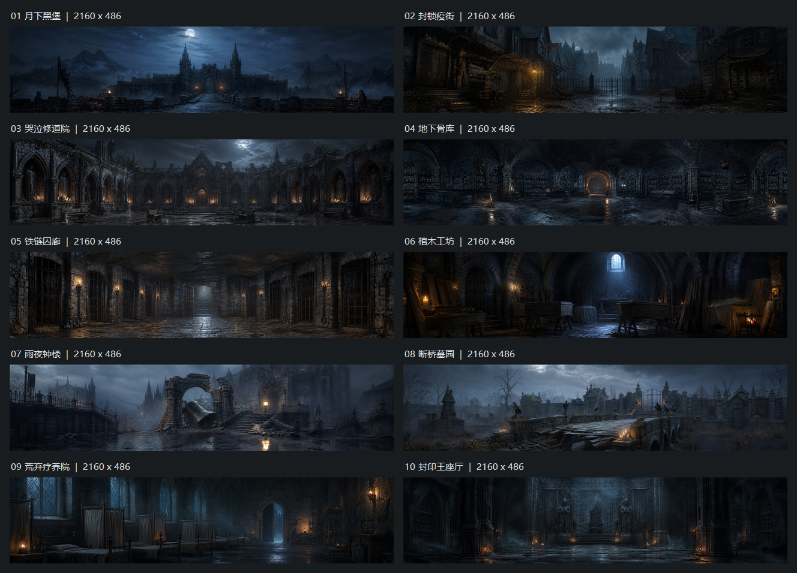

# 恐怖地牢十张探索背景（2026-08-30）

> Git归档说明（2026-08-31）：下文接入状态指当前开发目录。本次只发布正式素材、裁剪来源与重建资料；远端基线尚缺mapExplorationBackgroundVariants随机选择器，因此没有夹带双份dungeon-config或其他会话框架。发布范围见../../../docs/dungeon-backgrounds-publication-20260831.md。

用户要求生成10张并导入恐怖地牢；沿用本任务已确认的40:9居中裁剪流程，10张正式图已接入初级、中级和高级恐怖地牢的探索背景随机池。

## 生成与裁剪

- Codex内置image_gen，10次独立生成；未使用CLI/API后备。本批调用未附带参考图，制作前查看`assets/scenes/dungeon-exploration-horror-v9.png`以确定冷蓝黑石、哥特建筑与克制烛光方向。
- 每张请求3072×1024，实际原图均2172×724。原始PNG保存在本目录`source/`；完整提示词为prompt-01.txt至prompt-10.txt，外部生成源路径和项目内来源见[manifest.json](manifest.json)。
- 默认16:9窗口的上方40vh对应40:9。按原像素取最大的40:9整数矩形：每张`left=6, top=119, width=2160, height=486`，居中裁剪，不拉伸、不重绘、不调色、不重采样。
- 正式10张共19,991,598字节（约19.07MiB）；10张源图共22,401,004字节。下方总览的缩放仅用于预览，正式PNG保留原像素。

## 预览与文件



| 编号 | 主题/正式PNG | 原图 | 提示词 |
|---|---|---|---|
| 01 | [月下黑堡](../../../assets/scenes/dungeon-exploration-horror/horror-banner-01-moonlit-citadel.png) | [2172×724](source/horror-banner-01-moonlit-citadel.png) | [prompt-01.txt](prompt-01.txt) |
| 02 | [封锁疫街](../../../assets/scenes/dungeon-exploration-horror/horror-banner-02-quarantine-street.png) | [2172×724](source/horror-banner-02-quarantine-street.png) | [prompt-02.txt](prompt-02.txt) |
| 03 | [哭泣修道院](../../../assets/scenes/dungeon-exploration-horror/horror-banner-03-weeping-abbey.png) | [2172×724](source/horror-banner-03-weeping-abbey.png) | [prompt-03.txt](prompt-03.txt) |
| 04 | [地下骨库](../../../assets/scenes/dungeon-exploration-horror/horror-banner-04-ossuary-vault.png) | [2172×724](source/horror-banner-04-ossuary-vault.png) | [prompt-04.txt](prompt-04.txt) |
| 05 | [铁链囚廊](../../../assets/scenes/dungeon-exploration-horror/horror-banner-05-chained-cellblock.png) | [2172×724](source/horror-banner-05-chained-cellblock.png) | [prompt-05.txt](prompt-05.txt) |
| 06 | [棺木工坊](../../../assets/scenes/dungeon-exploration-horror/horror-banner-06-coffin-workshop.png) | [2172×724](source/horror-banner-06-coffin-workshop.png) | [prompt-06.txt](prompt-06.txt) |
| 07 | [雨夜钟楼](../../../assets/scenes/dungeon-exploration-horror/horror-banner-07-bell-courtyard.png) | [2172×724](source/horror-banner-07-bell-courtyard.png) | [prompt-07.txt](prompt-07.txt) |
| 08 | [断桥墓园](../../../assets/scenes/dungeon-exploration-horror/horror-banner-08-necropolis-bridge.png) | [2172×724](source/horror-banner-08-necropolis-bridge.png) | [prompt-08.txt](prompt-08.txt) |
| 09 | [荒弃疗养院](../../../assets/scenes/dungeon-exploration-horror/horror-banner-09-abandoned-infirmary.png) | [2172×724](source/horror-banner-09-abandoned-infirmary.png) | [prompt-09.txt](prompt-09.txt) |
| 10 | [封印王座厅](../../../assets/scenes/dungeon-exploration-horror/horror-banner-10-sealed-throne-hall.png) | [2172×724](source/horror-banner-10-sealed-throne-hall.png) | [prompt-10.txt](prompt-10.txt) |

## 游戏接入

- 正式资源位于`assets/scenes/dungeon-exploration-horror/`，全部2160×486。
- `data/dungeon-config.json`和`public/data/dungeon-config.json`仅更新`zombieDungeon`、`zombieDungeonBeginner`、`zombieDungeonMid`的`mapExplorationBackgroundVariants`。
- 新10图池替换此前探索池中的`dungeon-exploration-horror-v9.png`和`loading/zombie-dungeon-1～3.png`。这些旧文件及其Loading/旧布局引用不删除；原`mapBackground`、`mapBackgroundVariants`保持。
- 复用`DungeonMapSystem._selectExplorationBackground()`：路线生成后、创建探索台前每局等概率抽一次，各1/10，可连续重复；单局房间/战斗往返和布局调整不重抽，退出清理。
- 不修改公共JavaScript/CSS、40%/60%默认布局、94%不透明度、原HUD、路线拓扑、事件、战斗、奖励、Loading或其他地牢。
- 沿用`object-fit: cover; object-position: center`。默认16:9比例吻合；其他窗口比例或分界线高度仍会进一步裁切，已裁掉的上下内容不会随横幅增高重新出现。

## 生产重建

在项目根目录运行：

```powershell
powershell -NoProfile -ExecutionPolicy Bypass -File tools/ai-gen/_horror_exploration_banners_20260830/rebuild-crops.ps1
```

脚本从归档原图重建正式PNG、manifest和总览，不重新生成图，也不对裁剪成品再次裁剪；不修改游戏配置。原图已归档后，重建不依赖外部Codex缓存。

## 交付边界

已查看10张生成图、裁剪总览、本次真实diff与既有配置消费链；仅执行素材生成、裁剪和离线预览制作，未运行测试、构建、游戏/浏览器/CDP或其他运行时验证，按约定由用户测试。未同步固定EXE。

请重点确认三档新开局的10图池、同局保持、分界线拖动及非16:9窗口裁切。少量新局可能连续抽到同一张，不能据此判定随机失效；离线总览不等于游戏验收。
