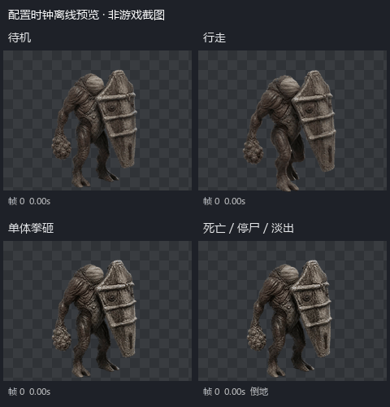

# 棺板卫尸：恐怖地牢普通怪接入

> 最新状态：另外三款现已接入；四款代码审查发现的切动作脚点延迟和尸体淡出门禁均已修复。棺板卫尸素材、数值及攻击时钟不变。当前总交付见[三款接入及四款收尾报告](E:/无尽轮回/长期备份/2026-7-13-1/game-dev/tools/ai-gen/_horror_normal_mothers_20260830/animations/remaining-sprite-build-v01/DELIVERY.md)。以下保留最初棺板卫尸接入阶段记录；未运行测试或运行时验证。

用户在四动作精灵图交付后回复“继续”，本轮按认可本版并继续接入处理。仅棺板卫尸进入运行时；其余三款母图仍为候选，没有生成或接入新动作。

此GIF由正式PNG和当前配置合成，显示原动作时序、统一显示比例和死亡后的停尸/淡出；不是启动游戏得到的截图或运行时验证。

## 行为与出怪

- 身份 `coffinWard`，普通/僵尸，基础240生命、配置移速90、力量22/敏捷6/体质24；实际移动仍应用项目全局移速倍率。
- 定向单体拳砸，完整121帧、5041.667ms；0-based第52帧进入52–53接触窗，锁定起手目标与方向，仅结算一次物攻×1.25伤害及45击退。起手冷却6000ms，起手/命中前伸均80、宽42；后撤、隔墙、绕后或换层可躲避。
- 棺板当前是造型，不提供额外格挡、反射或盾牌耐久。没有增加AOE、冲锋或额外命中特效，也没有伪造声音素材。
- 追击由原感知/移动系统处理。攻击停步；眩晕、冻结、石化、恐惧、冲刺眩晕取消未结算拳砸并保留冷却。通用突刺调度明确关闭，避免第二次隐形命中；伤害走现有DamagePipeline。
- 死亡61帧、5041.667ms（末帧41.667ms），再停尸1000ms、淡出300ms。奖励调用一次，保留源末姿，不循环死亡。
- 双份地牢配置的 `zombieDungeon / zombieDungeonBeginner / zombieDungeonMid` 共8个现有遭遇白名单加入新ID；按 `rank: normal` 只占普通槽，含初/中级首领房的普通随从槽。波数、数量和等级配比不变。
- `poolWhitelistOnly: true` 排除矿洞、通用随机池及未指定它的回退池；未修改召唤物、固定事件怪或其它地牢。

## 素材、显示与时钟

- 正式表在 `assets/enemies/coffin_ward/{idle,walk,attack,death}.png`，分别24/46/121/61帧。与已交付PNG直接复制一致，没有删帧、重新缩放、再次RIFE或改写轨迹。
- 配置保留源逐帧时长。实体手动选择画面帧，与接触时钟一致；Boot也登记同样的逐帧时长和有效帧上限，原资源管理器按 `enemy_coffin_ward_*` / `coffin_ward` 族按需加载。
- 按当前矿工僵尸首帧主体去除细镐柄后的274px高度、260.7/512显示比例，设置站立主体约139.52世界显示像素。棺板卫尸源主体203.35px，运行时比例约0.68608；`referenceCell: 256`、`spriteSize: 175.63757`，不是把全画布当作人体。
- 碰撞半径36.3、碰撞尺寸57.5×158.8、HUD/投射物体积沿用矿工僵尸基准；各动作按各自footY换算贴图中心偏移，统一镜像轴。尚未做同屏实机对齐。
- 四表基础RGBA总量56.84MiB，超过32MiB目标、低于64MiB准入上限；保持现有全局资源预算。没有将额外corpse.png注册成新纹理。
- [素材/GIF/源视频清单](SPRITE_DELIVERY.md)、[当前运行时参数](runtime/manifest.json)、[最终精灵表清单](sprite-build/sprite-manifest.json)。

## 本轮文件范围

- 新类 `src/entities/enemy-types/coffin-ward.js`；实体导出、`src/world/zombie-dungeon.js` 工厂与 `src/phaser/scenes/BootScene.js` 资源登记。
- `data/enemy-config.json` / `public/data/enemy-config.json` 只新增该怪；双份 `dungeon-config.json` 只向指定8个白名单各加一个ID，保留并行会话内容。
- 正式四张PNG、候选目录的状态清单、`install-runtime.py` 和本文。原制作脚本对已接入版本加保护，避免重跑后覆盖认可素材、把状态退回候选或重置配置。

## 待用户验证

已查看本轮实际差异及必要局部调用契约。**未运行测试、构建、lint、预算校验脚本或游戏/浏览器运行时验证，按约定由用户测试。**

重点看普通槽实际出怪、四动作切换与左右翻转脚线、拳头与第52帧伤害是否重合、贴脸/极限距离/后撤/隔墙/长帧跨窗口、各类控制打断，以及死亡奖励一次和停尸淡出。源视频的轻微彩边、姿态漂移仍保留；攻击维持原5秒节奏，未擅自提速。离线GIF不是实机通过证据。
