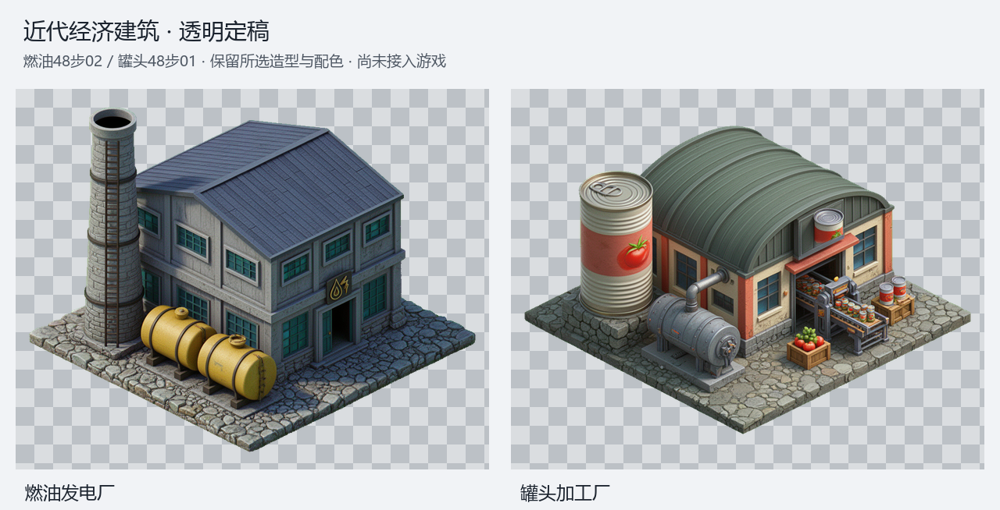

# 燃油发电厂与罐头加工厂：透明定稿

2026-09-01，用户“按你建议继续”接受上一轮推荐的燃油48步02、罐头48步01，继续透明收口。本批仅制作透明素材；没有新生图、修改模型、改色重绘或接入游戏。



| 建筑 | 已选原图 | 透明PNG | 原分辨率紧裁 | 名义显示参考 |
| --- | --- | --- | --- | --- |
| 燃油发电厂 | [48步02，seed133202](../refinement_dev_s48_20260901/oil_power_plant/oil_power_plant_refine_v02_raw.png) | [oil_power_plant.png](oil_power_plant/oil_power_plant.png) | 900×698 | 512×397，footOffsetY196 |
| 罐头加工厂 | [48步01，seed133211](../refinement_dev_s48_20260901/cannery/cannery_refine_v01_raw.png) | [cannery.png](cannery/cannery.png) | 891×619 | 512×356，footOffsetY176 |

名义显示参数只便于后续接入准备，未写入运行时；4×4仍是拟定视觉体量，未校准游戏内占格、接地点或碰撞。PNG没有拉伸或降采样，周边保留4像素透明边。

## 抠图与边缘处理

- 先查看两张完整原图及对应完整Depth。屋顶、地台和小设备轮廓存在已接受的细微生成差别，Alpha以所选原图为准；不使用Depth硬裁、扩张或恢复Alpha。
- 使用现有`key-world122-building-body.py`从画布边界按RGB距离连通去绿：燃油测得背景`61,228,30`、阈值120；罐头背景`83,214,57`、阈值80。外部投影随连通绿幕一起去除，不用全图HSV删绿或封闭孔洞填充。
- `repair-local-green-spill.py`仅处理轮廓内2像素的绿色溢色。燃油地台右下边另以源坐标`504,708,961,934`、边缘4像素处理低亮度绿线；两步都只修RGB，不改Alpha。保留绿色屋顶、玻璃、果蔬、爬梯、设备管线及立体罐头门标。
- `finalize-building-runtime.py --preserve-alpha-exact --nearest-opaque-edge-rgb`保持清理后Alpha紧裁导出。制作元数据显示两张边缘修色/导出Alpha变化均为0，完全透明像素的RGB均为0。
- 所选原图里的油罐配色、石材细纹和罐头小标签纹样保持原样，没有另行全图重绘；这次清理只针对背景与边缘。

## 交付与复现

- [结构细节预览](details-preview.png)与上级合并预览继续保留；每栋重复的黑白底/棋盘预览已在最终归档时清理。两张原图、Depth、初次keyed、透明预览及细节均已离线查看；燃油地台暗绿边局部修正后重新查看最终预览。
- [manifest.json](manifest.json)记录本次选稿与阶段边界；每栋`provenance.json`含所选raw、实际生成参数文件、模型、Depth、12步输入祖先、实际处理命令与制作数据。`edge-clean.png`为1024²完整画布Alpha母版，`export-metadata.json`记录裁框和名义参数。
- 完整Blender模型与编辑祖先、被选raw的直接编辑链均原位保留；贸易公司首版不变。阶段预览与历史候选尚保留，未进行正式入库清理。

从项目根目录重建透明派生，不调用ComfyUI：

```powershell
& 'E:/无尽轮回/长期备份/2026-7-13-1/ComfyUI/.venv/Scripts/python.exe' -B tools/ai-gen/_industrial_economy_buildings_20260831/v02/transparent_final_20260901/finish.py
```

未修改正式assets、科技树、经济结算、占格、碰撞或存档；未制作运行时光照图或缩略图、未构建、同步EXE、提交或推送。未运行测试或运行时验证，按约定由用户测试。后续正式接入时再确定建筑配置、费用/产出、科技与4×4适配，不能把这次透明素材完成等同于玩法已经开发。
