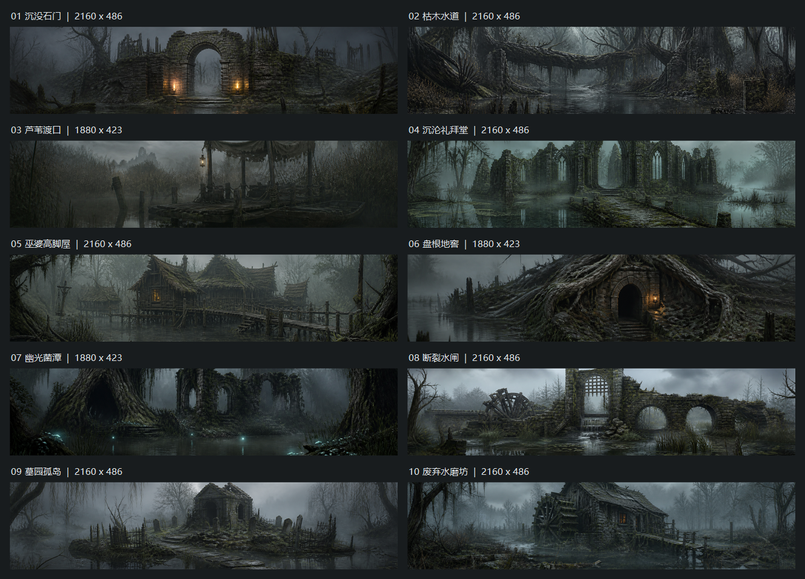

# 沼泽地牢十张探索背景（2026-08-30）

> Git归档说明（2026-08-31）：下文接入状态指当前开发目录。本次只发布正式素材、裁剪来源与重建资料；远端基线尚缺mapExplorationBackgroundVariants随机选择器，因此没有夹带双份dungeon-config或其他会话框架。发布范围见../../../docs/dungeon-backgrounds-publication-20260831.md。

当前状态：按用户后续要求，将10张背景按默认探索台比例裁剪，已原位替换正式PNG；三档沼泽继续使用原有配置路径。生成原图已归档到本目录的`source/`，不依赖Codex外部缓存重建。

## 当前裁剪规则

- 默认16:9窗口，上方背景占40vh，因此目标比例为`(16/9)/0.4 = 40/9`；1920×1080窗口对应1920×432背景槽。
- 延续`object-position: center`：只裁剪、不拉伸、不重绘、不调色、不重采样。按原像素取最大的40:9整数矩形，奇数余量多裁右侧/底部1px。
- 7张2172×724原图裁为2160×486，矩形为`left=6, top=119, width=2160, height=486`。
- 03/06/07三张1881×836原图裁为1880×423，矩形为`left=0, top=206, width=1880, height=423`。
- 正式10张PNG共20,540,679字节（约19.59MiB）；源图共24,241,682字节。预览总览缩放仅用于展示，正式PNG保留原像素。
- 原生成由Codex内置image_gen分别完成10次，未附带参考图；当时请求3072×1024，实际原图尺寸以上述归档为准。完整提示词为prompt-01.txt至prompt-10.txt；[manifest.json](manifest.json)记录生成路径、项目原图、裁剪框及正式尺寸。

## 预览与文件

| 编号 | 主题/正式裁剪图 | 正式尺寸 | 归档原图 | 提示词 |
|---|---|---|---|---|
| 01 | [沉没石门](../../../assets/scenes/dungeon-exploration-swamp/swamp-banner-01-drowned-gate.png) | 2160×486 | [2172×724](source/swamp-banner-01-drowned-gate.png) | [prompt-01.txt](prompt-01.txt) |
| 02 | [枯木水道](../../../assets/scenes/dungeon-exploration-swamp/swamp-banner-02-deadwood-channel.png) | 2160×486 | [2172×724](source/swamp-banner-02-deadwood-channel.png) | [prompt-02.txt](prompt-02.txt) |
| 03 | [芦苇渡口](../../../assets/scenes/dungeon-exploration-swamp/swamp-banner-03-reed-ferry.png) | 1880×423 | [1881×836](source/swamp-banner-03-reed-ferry.png) | [prompt-03.txt](prompt-03.txt) |
| 04 | [沉沦礼拜堂](../../../assets/scenes/dungeon-exploration-swamp/swamp-banner-04-sunken-chapel.png) | 2160×486 | [2172×724](source/swamp-banner-04-sunken-chapel.png) | [prompt-04.txt](prompt-04.txt) |
| 05 | [巫婆高脚屋](../../../assets/scenes/dungeon-exploration-swamp/swamp-banner-05-witch-stilts.png) | 2160×486 | [2172×724](source/swamp-banner-05-witch-stilts.png) | [prompt-05.txt](prompt-05.txt) |
| 06 | [盘根地窖](../../../assets/scenes/dungeon-exploration-swamp/swamp-banner-06-root-cellar.png) | 1880×423 | [1881×836](source/swamp-banner-06-root-cellar.png) | [prompt-06.txt](prompt-06.txt) |
| 07 | [幽光菌潭](../../../assets/scenes/dungeon-exploration-swamp/swamp-banner-07-ghost-fungus-pool.png) | 1880×423 | [1881×836](source/swamp-banner-07-ghost-fungus-pool.png) | [prompt-07.txt](prompt-07.txt) |
| 08 | [断裂水闸](../../../assets/scenes/dungeon-exploration-swamp/swamp-banner-08-broken-sluice.png) | 2160×486 | [2172×724](source/swamp-banner-08-broken-sluice.png) | [prompt-08.txt](prompt-08.txt) |
| 09 | [墓园孤岛](../../../assets/scenes/dungeon-exploration-swamp/swamp-banner-09-graveyard-isle.png) | 2160×486 | [2172×724](source/swamp-banner-09-graveyard-isle.png) | [prompt-09.txt](prompt-09.txt) |
| 10 | [废弃水磨坊](../../../assets/scenes/dungeon-exploration-swamp/swamp-banner-10-abandoned-watermill.png) | 2160×486 | [2172×724](source/swamp-banner-10-abandoned-watermill.png) | [prompt-10.txt](prompt-10.txt) |

## 接入与重建

- 正式目录：`assets/scenes/dungeon-exploration-swamp/`；本次替换其10张PNG，不修改JSON路径或公共JS/CSS。
- `data/dungeon-config.json`和`public/data/dungeon-config.json`中，`swampDungeonBeginner`、`swampDungeonMid`、`swampDungeon`继续共用这10张图，每局等概率抽一次（各1/10、允许重复），同局往返、战斗和布局调整不重抽。
- 原`mapBackground`、事件/Loading图片及配置、其他地牢、原HUD、路线、战斗和奖励均保持。
- 生产重建入口：在项目根目录运行`powershell -NoProfile -ExecutionPolicy Bypass -File tools/ai-gen/_swamp_exploration_banners_20260830/rebuild-crops.ps1`。脚本始终从归档原图裁剪，更新正式PNG、manifest和总览，重复运行不会再次裁剪已裁成品。
- 沿用原40%/60%布局、94%不透明度与`object-fit: cover; object-position: center`；默认16:9比例吻合。改变窗口宽高比或分界线高度时仍会进一步裁切；已经裁掉的上下内容不会随横幅增高重新出现，后续如需改构图应从source原图重新裁剪。

## 交付边界

本次只运行用户授权的素材裁剪及离线预览制作，查看本轮真实差异和既有资源引用；未运行测试、构建或游戏/浏览器/CDP运行时验证，按约定由用户测试。未同步固定EXE。

请在开发端重新进入沼泽地牢查看；若浏览器仍显示已缓存原图，手动刷新后再开局。重点看三档新局抽图、同局保持及分界拖动后的裁切；裁剪总览不代表已完成实机验收。
