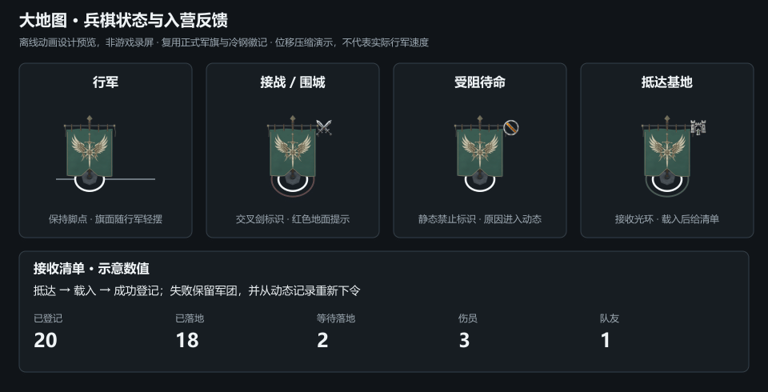

# 兵棋状态动画与接收清单设计预览

本目录是2026-08-31大地图第二批交互实现的离线预览，不是游戏截图或测试结果。

- 复用正式 `assets/ui/world-map/army-flags.png` 的玩家军旗帧，保持纹章、相机和原锚点。
- 复用上一批冷钢 `attack/enter/blocked` 徽记。原生成源图、提示词和工具记录位于 `../world-map-command-badges-20260831/`。
- 动画读取 `src/ui/world-map-army-motion.js` 和 `data/world-map-command-feedback.json`；主题颜色来自公共冷钢CSS，没有改写原图。
- `army-feedback-preview.gif`：960×490、64帧、50ms/帧、3200ms循环；`contact-sheet.png` 为静态参照。
- 行军位移是压缩时间的示意，基地清单中的20/18/2/3/1是明确标注的演示数字，不能用于判断游戏结算是否正确。实际运行中的普通抵达只短暂显示地面圈；基地入口徽记只用于入营阶段。
- `manifest.json` 列出直接来源与共享参数；正式军旗及上一批徽记不复制到本目录，不新增游戏贴图预算。



重建使用已有Node.js和Sharp，不新增项目依赖：

```powershell
node tools/ai-gen/world-map-army-feedback-20260831/export.mjs 'C:/Users/allan/.cache/codex-runtimes/codex-primary-runtime/dependencies/node/node_modules/sharp'
```

Node可能提示自动识别纯动画模块的ES模块语法；导出仍完成，不为此修改项目package.json。该命令只覆盖本目录的预览和manifest，不构建或启动游戏。

实现与用户验收说明：`docs/world-map-events-and-arrival-2026-08-31.md`。未运行测试或运行时验证，未同步EXE。
